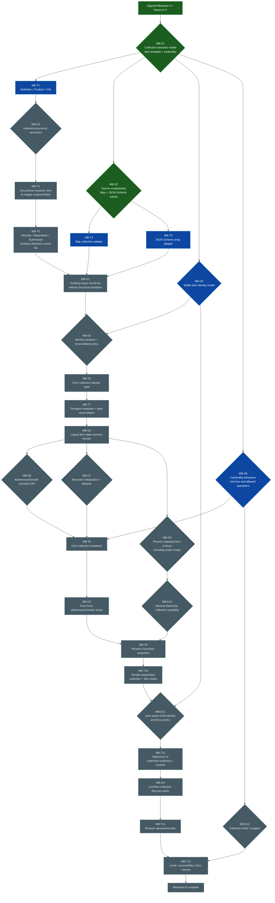

# Phase 1 — Milestone B collections

## Purpose

Milestone B adds the first repeated data shape to Formentation: homogeneous
collections of supported scalar and object values, with stable runtime item
identity and LiveView-friendly add/remove/reorder behaviour.

The short roadmap entry in
[[phase-1-walking-skeleton|Phase 1 — Walking Skeleton]]
remains the scope authority:

- homogeneous arrays of supported scalars/objects;
- stable item identity;
- hidden identity fields;
- add/remove/reorder LiveView helpers.

This document expands that small feature statement into the working development
roadmap for the milestone. It records:

- the foundation already available after aligned Milestone A;
- architectural invariants that collection work must preserve;
- unresolved decisions and when they actually become blocking;
- implementation tasks and their dependencies;
- vertical slices and acceptance gates;
- likely code impact;
- the testing strategy and milestone exit criteria;
- explicit deferrals that must not leak into this milestone.

The goal is not to freeze the implementation in advance. The graph below is
**normative for dependency and sequencing, but provisional in shape**. Nodes may
split, merge, or disappear as implementation teaches us more. Resolved design
questions should be promoted to [[18-decisions|the decision log]]; this roadmap
then records the chosen decision and links to it.

## Baseline

This plan is written against `main` at commit `8a60ade9` on 2026-08-13, after
the supplementary Waves A–C refactors landed.

Milestone A and the [[phase-1-north-star-alignment|north-star alignment]] are
complete. The collection work therefore starts from the intended public and
internal boundaries rather than from the earlier mixed definition tree.

### Foundation already in place

The following are assets Milestone B should extend rather than redesign.

#### Definition and source model

- `Formentation.Definition` is the final source-neutral compiled artifact.
- Semantic structure and presentation layout are separate.
- Source adapters compile through shared build/finalization seams.
- The finalizer runs once at the adapter boundary; adapters do not emit partly
  finalized definitions.
- Map and JSON Schema sources already have differential fixtures proving
  source-equivalent semantics apart from origins.
- Whole-instance validation dispatches through a source-neutral
  `ValidationPlan` rather than naming an adapter from runtime code.

This makes collection cardinality and item-template validation a natural
extension of the finalizer instead of source-specific runtime logic.

#### Template paths, instance paths, and occurrence binding

The distinction collections need is already explicit:

- `TemplatePath` identifies a declared/static location;
- `InstancePath` identifies one concrete runtime occurrence;
- the template path vocabulary already reserves `:item` for repeated item
  templates;
- instance paths already admit non-negative integer segments;
- `NodeId` can encode the `:item` segment without collision;
- `Formentation.Occurrence` owns binding one static semantic template to its
  concrete runtime locations.

In Milestone A that binding is 1:1. Milestone B activates the intended 1:N
case. For example:

```text
TemplatePath ["measurements", :item, "value"]

        │ bind against current data
        ▼

InstancePath ["measurements", 0, "value"]
InstancePath ["measurements", 1, "value"]
InstancePath ["measurements", 2, "value"]
```

This answers **where an item currently is**. It deliberately does not answer
**which logical item it is across reorder**. Stable item identity is a separate
runtime concern and remains a Milestone B decision.

#### Form runtime decomposition

The runtime transition pipeline has already been split at the places
collections are expected to extend:

- `Form.Decoder` enumerates field occurrences over normalized incoming params;
- `Form.Materializer` rebuilds candidate data while preserving unknown and
  unsupported original data and owning nested-object presence semantics;
- `Form.Submission` separately enumerates candidate occurrences to derive
  blockers;
- `Form` keeps public lifecycle, orchestration, validation dispatch and display
  state.

The independent occurrence walks are intentional. Incoming params and candidate
shape may differ once collections and later dynamic schemas exist; Milestone B
must not force them into one shared enumeration merely to reduce traversal.

#### Phoenix boundary

- `%Phoenix.HTML.Form{}` remains the primary projection boundary.
- `Phoenix.HTML.FormData` for `Formentation.Form` is projection only; decoding,
  validation and transitions stay in `Form`.
- `Formentation.Phoenix.StateView` exposes only semantic facts that Phoenix
  cannot provide generically.
- render preparation owns semantic interpretation; UI components consume
  prepared facts and do not traverse `Definition`.
- DOM identity is renderer-owned and already typed/collision-safe.
- the reference UI and browser-real test suite already cover transport,
  accessibility and focus behaviour that unit tests cannot prove.

Collections should extend these contracts only where a repeated runtime shape
requires additional facts.

## Milestone outcome

At the end of Milestone B a Formentation form can:

1. compile a homogeneous collection from both supported declaration sources;
2. represent an item as a static semantic template while materializing any
   number of runtime occurrences;
3. load existing scalar and object arrays;
4. decode, validate, materialize and submit collection values through the same
   lifecycle as scalar/object fields;
5. assign a stable logical identity to each runtime item;
6. preserve an item's raw transport, decoded operation, usage and issues when
   its positional index changes;
7. add, remove and reorder items through explicit pure `Form` operations;
8. expose those operations through thin LiveView-friendly helpers rather than
   generated handlers/framework machinery;
9. render repeated Phoenix forms/controls with unique and appropriately stable
   DOM identities;
10. respect supported cardinality constraints when presenting or executing
    collection mutations;
11. submit ordinary JSON-compatible arrays with no Formentation identity
    metadata leaking into candidate data or source validation.

The user-visible capability is intentionally modest. The architectural test is
more important: repeated runtime state must fit the same definition → form →
projection → prepared UI boundaries without reintroducing interpretation into
components or source-specific runtime code.

## Governing invariants

These are milestone constraints, not optional implementation preferences.

### 1. A collection definition describes an item template, not runtime items

`Definition` owns the static semantic structure and presentation intent of a
collection. It must not accumulate one semantic node per current item or own a
runtime item identity table.

### 2. Template location, runtime location, and logical identity are distinct

For a collection item:

- template path answers “which declared position?”;
- instance path/index answers “where is this occurrence now?”;
- stable item identity answers “which logical item is this across mutation?”.

No one of these should be overloaded to stand in for another.

### 3. Position is not identity

An index may be used to address the current submitted shape, but state must not
be permanently keyed only by an index if reordering is supported.

If item `B` moves from index `1` to index `2`, its raw invalid input, usage and
issues must move with `B`, not remain attached to position `1`.

### 4. Identity metadata is transport/runtime metadata

Opaque collection identity may travel through hidden browser inputs, but it is
not domain data. It must be removed before:

- codec decoding;
- candidate materialization;
- whole-instance validation;
- successful submission.

A schema containing an application field named `id` must not be silently
conflated with Formentation runtime identity.

### 5. Collection mutation is Form behaviour, not UI interpretation

Add/remove/reorder change authoritative runtime form state. The UI may present
controls for those operations, but it does not independently mutate a list and
ask Formentation to infer what happened afterwards.

Phoenix/LiveView integration remains wrappers/helpers plus application-owned
`handle_event` code, consistent with the existing lifecycle decision.

### 6. The UI does not interpret a collection

Before a UI component runs, preparation must already know the concrete facts it
needs, including as applicable:

- current item order;
- stable item identity;
- runtime instance path/index;
- generated field names and DOM IDs;
- current values and visible issues;
- whether add/remove/reorder operations are currently allowed.

Components must not traverse the semantic definition, re-evaluate cardinality,
or invent identity rules.

### 7. Existing transition guarantees survive repetition

Collections must preserve the Milestone A guarantees:

- raw transport never enters candidate data;
- decode failure means no candidate is produced;
- authoritative instance validation waits until decoding succeeds;
- unknown/unsupported original data is not destroyed accidentally;
- read-only participation semantics remain definition-driven;
- issue storage and issue visibility remain separate concerns;
- nested object presence remains content-derived.

### 8. Both declaration sources prove the source-neutral model

A collection feature is not complete when it only works for JSON Schema.
Equivalent Map and JSON Schema fixtures must compile to equivalent semantic and
presentation answers apart from source origins.

## Scope

### Included

Milestone B includes only enough collection semantics to support the end-to-end
runtime capability:

- homogeneous arrays;
- arrays whose items are already-supported scalar values;
- arrays whose items are already-supported object shapes;
- static item templates;
- concrete indexed occurrences;
- stable runtime identity;
- basic cardinality needed by editing behaviour;
- existing-data rendering and round-trip;
- add/remove/reorder;
- Phoenix repeated-form projection and prepared rendering;
- reference-UI controls and LiveView helpers;
- browser-real tests for identity/state preservation.

### Explicitly deferred

Milestone B does **not** pull in:

- `$ref` or remote references;
- `oneOf`, `anyOf`, `allOf`, branch selection or conditionals;
- tuple arrays / JSON Schema `prefixItems`;
- `contains`, `uniqueItems` or other advanced array validation keywords unless
  a concrete B requirement proves one unavoidable;
- dynamic item schemas;
- fingerprints or caching;
- full support/explain/Decision reporting;
- a general custom UI extension API;
- a second substantially different UI;
- stream rendering;
- partial/subtree reprojection as an optimization;
- a generalized branch/collection state machine;
- a broad generic patch language merely because the dormant transition shape
  could support one;
- Ash integration.

Future architecture should not be blocked by these deferrals, but none of them
is a reason to enlarge the B implementation now.

## Working notation

This roadmap uses milestone-local node IDs:

- **MB-Dx** — a design decision/question;
- **MB-Tx** — an implementation task;
- **MB-Gx** — an acceptance gate;
- **MB-Sx** — a vertical implementation slice.

An `MB-D` node is not yet a repository-wide architectural decision. When it is
settled, record the durable answer in [[18-decisions|the decision log]] and link
that `D-0xx` entry back here.

Statuses:

- `open` — needs a decision before its dependent task starts;
- `hypothesis` — recommended starting direction, still deliberately reversible;
- `decided` — resolved and recorded in the decision log;
- `done` — implementation/evidence complete;
- `deferred` — explicitly outside Milestone B.

## Dependency graph



Node colors track current execution state: **green** = done (decisions
recorded, tasks implemented, gates passed), **orange** = in progress,
**blue** = ready (every predecessor is done, work has not started),
**grey** = blocked on a predecessor. When a node's state changes, move its ID
between the `class` lines at the bottom of the graph.

The graph makes one important sequencing claim explicit: **stable identity does
not block proving static collection semantics and indexed round-tripping, but it
must block structural mutations.** We should first prove “one template → N
occurrences” with existing arrays, then solve identity before add/remove/reorder.

## Decision register

### MB-D1 — Collection semantic model

**Status:** decided — recorded as
[[18-decisions#D-053 — Collections are a dedicated semantic node owning one item template|D-053]]
(2026-08-14).

We need the source-neutral semantic representation of a homogeneous
collection. The shape should reflect the north-star rule: a collection owns a
static item template, not concrete runtime children.

The settled answers, in full in D-053:

- a dedicated `Semantic.Collection` struct with its own `Entry` kind;
- the collection node owns `id`/`name`/`template_path`/`required?`/origins/
  cardinality and exactly one anonymous item-template child at `:item`; the
  item template is an ordinary `Field`/`Object`/`Unsupported` node;
- item-level `required?` is meaningless and draws an unconditional compile
  diagnostic pointing at `minItems`;
- collection `required?` (uniform boolean) and cardinality
  (`:min_items`/`:max_items` in a `Field.constraints`-style map) are
  independent axes; the finalizer validates the compiled subset;
- only `minItems`/`maxItems` compile in B; validity-only array keywords flow
  through to authoritative validation, structural keywords make the node
  unsupported;
- unsupported item templates are legal and yield per-item blockers;
- nested collections are legal in the recursive model but deferred by
  compilation: any array below an `:item` segment compiles to
  `Semantic.Unsupported` with a helpful diagnostic in Milestone B;
- origins are per-aspect on the collection node; the item template owns its
  own.

This decision does not choose runtime item identity — that remains MB-D4.

**Unblocks:** MB-T1, MB-D2, MB-D4, MB-D8.

### MB-D2 — Declaration-source vocabularies

**Status:** decided — recorded as
[[18-decisions#D-054 — Collection source vocabularies and the degradation table|D-054]]
(2026-08-14).

The settled answers, in full in D-054:

- Map spelling: `kind: :collection` (matching the semantic model 1:1, like
  every existing Map kind), singular `item:` holding an ordinary spec map,
  `min_items:`/`max_items:` through the existing constraint machinery,
  `title:`/`help:` as usual;
- JSON Schema spelling: `"type": "array"` with a supported homogeneous
  object-form `items` schema plus `minItems`/`maxItems`;
- degradation table: Map stays strict per D-048 (missing/non-map `item:` and
  malformed cardinality are errors); JSON Schema stays tolerant (`items`
  absent, boolean `items`, `prefixItems`, dynamic shapes → `Unsupported` +
  warning with sharper reasons); both sources compile a valid-but-unsupported
  item declaration to a supported collection with an `Unsupported` item
  template, and any array below `:item` to `Unsupported` per D-053;
- item-level boolean `required` is explicitly special-cased in the Map
  adapter so the D-053 diagnostic actually fires despite the permissive
  unknown-key DSL;
- accepted asymmetry: Map forms have no `ValidationPlan`, so their
  `min_items` is compiled cardinality only; differential fixtures assert
  `Info` equivalence apart from origins, never validation equivalence.

**Unblocks:** MB-T2 and MB-T3.

### MB-D3 — Indexed occurrence semantics

**Status:** hypothesis; should be made explicit before MB-T4.

`Occurrence` should enumerate one runtime binding for each current item while
retaining the one static item template. A concrete occurrence path uses the
current non-negative integer index.

Questions:

- What data shapes are accepted by occurrence enumeration while params are in
  browser form?
- Does `Occurrence.occurrences/2` remain the right signature once it must walk
  both maps and lists?
- How are malformed list-like browser params represented before decoding?
- Which order is authoritative during each pipeline stage?

The important ownership remains settled: occurrence binds template **location**
to runtime **location**. Stable logical identity does not move into this module
merely because collection enumeration lands here.

**Unblocks:** MB-T4 and MB-T5.

### MB-D4 — Stable item identity model

**Status:** open; largest Milestone B design decision.

Index is insufficient once reorder exists. Form state needs a stable key for a
logical item so per-item/per-field state can survive positional changes.

Questions:

- Does every collection item receive an opaque Formentation identity, even if
  the domain object contains an application `id` field?
- Can an explicit application identity be adopted, or is a uniform sidecar
  always safer and simpler?
- Which part of `%Form{}` owns the identity table/order?
- When are identities allocated: initialization, first projection, add, or some
  combination?
- How long does an identity live?
- What is the public visibility, if any, of an item identity?
- How do scalar items receive identity without wrapping domain values?

Current open-question direction is an opaque sidecar identity assigned by form
state and stripped before domain decoding. That is the leading hypothesis, not
yet a settled decision.

**Unblocks:** MB-D5, MB-T6, MB-D11.

### MB-D5 — Identity transport and reconciliation

**Status:** open; depends on MB-D4 and the first indexed round-trip gate.

A browser event must tell Form which submitted occurrence corresponds to which
logical item. A hidden transport identifier is the likely mechanism.

Illustrative only:

```text
payload[measurements][0][_formentation_item_id] = A
payload[measurements][1][_formentation_item_id] = C
payload[measurements][2][_formentation_item_id] = B
```

The exact key is undecided.

Questions:

- At what normalization step is identity metadata extracted and stripped?
- How are duplicate IDs handled?
- What happens to a missing ID for an existing item?
- Is an unknown ID interpreted as a client-created item or rejected?
- Can hostile/forged IDs ever cause state from another item to be attached?
- How is reconciliation ordered relative to usage extraction and decoding?
- How are state maps currently keyed by `InstancePath` migrated/rekeyed after
  reorder?

The result must guarantee that runtime metadata never appears in candidate JSON
or reaches the source validator.

**Unblocks:** MB-T6 and MB-T7; MB-G2.

### MB-D6 — Core mutation API

**Status:** defer until MB-G2.

Once identity is correct, choose an explicit pure `Form` API for structural
mutations.

Possible shapes include dedicated operations such as:

```elixir
Form.add_item(form, path, opts)
Form.remove_item(form, path, item_id)
Form.move_item(form, path, item_id, destination)
```

or one collection-mutation envelope. Names above are examples, not decisions.

Requirements:

- no generated LiveView handlers;
- operation targets a collection and stable logical item, not only a stale
  positional index;
- invalid operations fail predictably without corrupting state;
- cardinality policy has one owner;
- successful operations leave ordinary validate/submit behaviour unchanged.

Do not force the dormant generic `:patch` concept into service unless this work
actually demonstrates that it is the clearest contract.

**Unblocks:** MB-T8.

### MB-D7 — New-item initialization and defaults

**Status:** defer until mutation slice.

Milestone A defaults are opt-in and initialization-only. Adding a collection
item creates new runtime data after form initialization, so we must decide
whether “add item” counts as an initialization boundary for item defaults.

Questions:

- Does a newly added item start absent/empty or from semantic defaults?
- Does the existing opt-in defaults flag govern new items?
- How are defaults applied recursively to object items?
- What is the initial transport/usage state of new fields?
- Can the application supply an explicit initial item value through the
  mutation API, and if so how is it validated/decoded?

This must be deliberate; clicking Add must not introduce a second incompatible
default policy.

**Unblocks:** MB-T8.

### MB-D8 — Cardinality semantics and edit permissions

**Status:** open after MB-D1; implementation can wait until MB-T8.

`minItems` and `maxItems` are the most likely initial constraints because they
directly determine whether remove/add controls are legal. We should avoid
supporting unrelated JSON Schema array vocabulary merely because it exists.

Questions:

- Are both `minItems` and `maxItems` included in B?
- Does finalization reject impossible declarations such as min > max?
- Does runtime mutation reject violating operations, hide/disable controls, or
  both?
- Does authoritative JSON Schema validation remain the final owner of data
  validity while Form uses compiled cardinality only to prevent impossible UI
  actions?
- What happens when initial/original data already violates cardinality?

**Unblocks:** MB-T8 and MB-D12.

### MB-D9 — Phoenix repeated-form contract

**Status:** defer until identity is proven.

Object arrays map naturally to repeated nested `%Phoenix.HTML.Form{}` values.
Scalar arrays are less obvious and must not be accidentally modelled as object
forms just to fit `inputs_for` conventions.

Questions:

- How does `Phoenix.HTML.FormData.to_form/4` expose object collection items?
- Which Phoenix collection options remain unsupported versus meaningful?
- Where is the stable hidden identity input attached?
- How does a scalar item project: repeated field occurrence, synthetic item
  form, or another minimal representation?
- Which part of the projection owns current index/name generation?
- What facts can an arbitrary external FormData source provide for collection
  preparation?

**Unblocks:** MB-D10 and MB-T9.

### MB-D10 — Minimal `StateView` collection capability

**Status:** defer until MB-D9 proves it is needed.

`StateView` currently exists only for semantic facts Phoenix cannot express.
Do not pre-design a broad collection protocol.

If generic external FormData preparation cannot recover required facts from
Phoenix alone, add only the smallest capability proven necessary, potentially
facts such as current stable item identity or authoritative collection order.

A predictable refusal/fallback for external sources may be preferable to a
premature generalized mutation/read protocol.

**Unblocks:** MB-T9 for generic-source support.

### MB-D11 — DOM identity and focus across reorder

**Status:** defer until prepared collection shape exists; depends conceptually
on MB-D4.

Current DOM identity is typed and renderer-owned. Repeated controls add the
choice between positional identity and logical-item identity.

Questions:

- Which IDs should change when an item moves?
- Which should remain stable to preserve browser DOM/focus semantics?
- Can stable item identity be incorporated without exposing domain/runtime
  internals to the UI component?
- What does browser-real acceptance require after reorder?

The design should not require stream rendering now, but should avoid making
future keyed/streamed rendering impossible by baking index into every stable
occurrence key.

**Unblocks:** MB-T11.

### MB-D12 — Collection limits and resource budgets

**Status:** defer until cardinality/runtime shape is concrete, but must be
resolved before milestone exit.

Collections create the first data-dependent multiplication of semantic work.
Existing static node/depth budgets therefore do not bound runtime occurrence or
render-preparation work.

Decide which limits are necessary for Phase 1, for example:

- maximum collection items processed in one form/collection;
- maximum visible occurrences;
- maximum decoded transport bytes;
- maximum preparation work;
- behaviour when limits are exceeded;
- configurable versus absolute limits.

This is production-safety work, not merely optimization.

**Unblocks:** MB-T13 and milestone exit.

## Implementation tasks

### MB-T1 — Definition, finalizer and Info support

Implement the source-neutral static collection shape decided in MB-D1.

Expected areas:

- semantic collection node/entry representation;
- item template path using `:item`;
- semantic traversal/direct-child behaviour;
- `Info` queries for collection kind, item template and constraints;
- finalizer validation for collection invariants;
- presentation representation only to the extent needed to retain current
  field/order semantics around a collection;
- unit/property tests for paths, IDs and finalization.

No runtime concrete items or stable identities belong in this task.

### MB-T2 — Map source collection compilation

Add the Map declaration vocabulary from MB-D2 and compile homogeneous scalar
and object item templates into the source-neutral representation.

Include diagnostics for malformed/unsupported declarations and property-based
coverage consistent with existing Map hardening.

### MB-T3 — JSON Schema array compilation

Compile the pinned JSON Schema 2020-12 subset for homogeneous arrays.

Initial target:

- `type: "array"`;
- supported homogeneous `items` schema;
- chosen cardinality keywords from MB-D8 when that decision is ready.

Unsupported tuple/dynamic/advanced array shapes remain unsupported rather than
being partially interpreted.

Add a differential collection fixture proving equivalent `Info` answers with
the Map source apart from origins.

### MB-T4 — Data-dependent occurrence expansion

Extend `Occurrence` from the Milestone A 1:1 binding to static collection item
template → current indexed runtime occurrences.

Requirements:

- current item order is deterministic;
- nested object fields below an item receive integer-bearing instance paths;
- nested collections are either correctly supported if B chooses them or
  rejected explicitly if B limits nesting; do not accidentally half-support
  them;
- no stable identity ownership moves into `Occurrence`.

Example expected binding:

```text
collection template: ["measurements"]
item field template: ["measurements", :item, "value"]

runtime item 0:      ["measurements", 0, "value"]
runtime item 1:      ["measurements", 1, "value"]
```

### MB-T5 — Existing collection round-trip

Make the pure Form pipeline handle already-existing arrays before structural
editing exists.

#### Decoder

- navigate map and list/index path segments;
- decode scalar/object item-field occurrences using existing codecs;
- preserve raw transport independently per occurrence;
- keep read-only semantics intact inside object items.

#### Materializer

- rebuild lists in current order;
- materialize scalar items and object items;
- apply nested-object content-derived presence inside object items;
- preserve unknown/unsupported original data according to existing invariants;
- never materialize raw invalid transport.

#### Submission

- enumerate candidate collection occurrences independently;
- derive unsupported blockers at the concrete item path;
- preserve authoritative whole-instance validation behaviour.

This task deliberately does **not** solve reorder identity. It proves that
collection templates and indexed runtime semantics are otherwise sound.

### MB-G1 — Existing arrays round-trip

Gate 1 is satisfied when both declaration sources can compile an equivalent
collection and pure runtime tests prove:

- existing arrays produce one occurrence per item;
- per-item scalar/object fields decode at indexed paths;
- valid candidates contain ordinary JSON-compatible arrays;
- invalid raw input is retained per indexed occurrence and prevents candidate
  materialization;
- validation and submission issues use concrete indexed paths;
- no add/remove/reorder capability exists yet.

This gate lets identity work start from a working repeated data model rather
than conflating collection semantics with mutation semantics.

### MB-T6 — Form-owned stable item state

Implement the identity model chosen in MB-D4.

Likely responsibilities:

- allocate opaque identities for existing items during form initialization;
- allocate identity for a newly added item later;
- retain current collection order independently of logical identity;
- associate item-scoped runtime state with logical identity strongly enough to
  survive reindexing;
- expose only the internal/query surface later projection actually requires.

Do not leak identity into `Definition` or candidate data.

### MB-T7 — Identity transport and reconciliation

Extend transport normalization/reconciliation according to MB-D5.

Responsibilities include:

- parse hidden item identity metadata from submitted repeated params;
- strip it from domain params before Decoder sees them;
- keep a Phoenix-compatible params view for `used_input?/1` and rendering;
- reconcile submitted order with known logical identities;
- reject or predictably handle duplicates, missing IDs and unknown IDs;
- remap path-keyed transports/operations/usage/issues so state follows logical
  items across positional change.

The transition from “state keyed by instance path” to “state survives path
change” is the critical correctness work of the milestone.

### MB-G2 — Logical state survives reorder

Before implementing public mutations, prove at the pure runtime level that an
item can change position while retaining its own state.

Minimum adversarial example:

1. start with logical items A/B/C;
2. give B an invalid numeric raw value and mark it used;
3. reconcile submitted order C/A/B;
4. B now occupies the new index but still owns the invalid raw value, decode
   issue and usage state;
5. A and C do not inherit B's state;
6. no hidden identity data exists in candidate/domain data.

### MB-T8 — Pure collection mutations

Implement the explicit API decided in MB-D6 together with MB-D7 and MB-D8.

Cover:

- add item;
- remove item by stable identity;
- move/reorder item;
- new-item initialization/default semantics;
- min/max cardinality behaviour;
- state cleanup when an item is removed;
- state reindexing without identity loss;
- nested collection paths if supported by B.

Keep these operations Phoenix-independent and testable from IEx/ExUnit.

### MB-G3 — Pure Form mutation lifecycle

Gate 3 is satisfied when pure Form tests can initialize a collection, edit item
fields, add/remove/reorder, validate and submit the expected domain array while
preserving per-item state correctly.

### MB-T9 — Phoenix FormData collection projection

Extend `Phoenix.HTML.FormData` for repeated object and scalar collection shapes
according to MB-D9/MB-D10.

Requirements include:

- correct indexed field names;
- repeated nested forms for object items where appropriate;
- correct raw params/data/errors at each item occurrence;
- hidden stable identity transport metadata;
- caller-controlled root `as:` and `id:` remain authoritative;
- existing object-only behaviour remains unchanged;
- collection-related Phoenix options get deliberate semantics rather than
  silently becoming accepted.

### MB-T10 — Prepared collection and item nodes

Extend render preparation so the UI receives concrete repeated facts rather
than interpreting the collection definition.

Likely prepared information:

- collection identity/path;
- ordered item list;
- each item's stable logical identity;
- current instance path/index;
- prepared child fields/groups;
- add/remove/reorder capability flags/actions;
- cardinality-related presentation facts;
- concrete Phoenix names/IDs/bindings.

Full reprojection is sufficient for Milestone B. Partial preparation is a later
optimization.

### MB-T11 — Reference UI and LiveView helpers

Render the prepared collection in the reference UI and expose thin helpers for
application-owned LiveView event handlers.

The first UI should support:

- rendering all current items;
- add control;
- remove control;
- reorder controls/interaction chosen for the reference implementation;
- hidden stable identity transport;
- accessible labels/control descriptions;
- disabled/absent operations when cardinality forbids them;
- unique DOM IDs and the MB-D11 focus/identity policy.

Do not use this slice to define the future general custom-UI extension
contract. The reference UI remains a concrete markup set.

### MB-G4 — LiveView collection lifecycle

Gate 4 is satisfied when the demo can perform the full collection lifecycle in
a real LiveView/browser environment with authoritative Form state.

### MB-T12 — Browser adversarial lifecycle

Add a browser-real scenario that exercises the reasons stable identity exists.
A recommended acceptance flow:

1. render object items A/B/C;
2. type invalid numeric text into a field of B;
3. ensure B is considered used and its issue is visible according to current
   policy;
4. reorder to C/A/B;
5. assert B's raw text, issue and usage follow B rather than index 1;
6. assert IDs remain unique and focus behaviour follows MB-D11;
7. remove A;
8. add D;
9. enter valid values;
10. submit;
11. assert submitted data is the expected ordinary JSON array;
12. assert no Formentation item IDs appear in submitted candidate/domain data.

This should complement, not replace, pure state-machine tests.

### MB-T13 — Limits, accessibility, docs and demos

Finish the milestone with production-facing hardening:

- runtime collection/occurrence budgets from MB-D12;
- large-collection regression fixture;
- accessibility assertions for repeated labels, controls and error summary;
- demo coverage of scalar and object collections as appropriate;
- current-state Techdocs updates;
- Userguide examples;
- limitations/support-matrix update;
- migration/version notes if the definition format or public API changes.

## Vertical slices

The graph is the source of sequencing truth. These slices are convenient
shipping units derived from it.

### MB-S1 — Static collection definition

**Nodes:** MB-D1, MB-D2, MB-T1, MB-T2, MB-T3.

Deliver the collection/item-template model, both source spellings, finalizer and
Info support, plus differential fixtures. No runtime editing.

**Stopping point:** a collection is a first-class source-neutral static
semantic construct.

### MB-S2 — Indexed occurrences and existing-data round-trip

**Nodes:** MB-D3, MB-T4, MB-T5, MB-G1.

Existing arrays decode/materialize/validate/submit through integer instance
paths. No structural mutation and therefore no stable-identity problem yet.

**Stopping point:** one static item template correctly produces N runtime
occurrences.

### MB-S3 — Stable item identity and reconciliation

**Nodes:** MB-D4, MB-D5, MB-T6, MB-T7, MB-G2.

Introduce logical item identity, hidden transport identity and state
reconciliation.

**Stopping point:** a reorder cannot attach one item's state to another item.

### MB-S4 — Core collection mutations

**Nodes:** MB-D6, MB-D7, MB-D8, MB-T8, MB-G3.

Add/remove/reorder are explicit pure Form operations with deliberate default and
cardinality semantics.

**Stopping point:** the complete collection editing lifecycle works without
Phoenix.

### MB-S5 — Phoenix and reference UI

**Nodes:** MB-D9, MB-D10, MB-T9, MB-T10, MB-D11, MB-T11, MB-G4.

Project repeated forms, prepare complete collection/item views, render and wire
thin LiveView helpers.

**Stopping point:** an application LiveView can edit collections without
interpreting Definition itself.

### MB-S6 — Hardening and milestone exit

**Nodes:** MB-D12, MB-T12, MB-T13.

Browser-real adversarial lifecycle, limits, accessibility, documentation and
demos.

**Stopping point:** Milestone B exit criteria are met and the remaining array,
branch and UI-extension work is explicitly deferred.

## Code impact map

This is an expected blast radius, not a promise that every file must change.

| Area | Likely impact | Why |
|---|---|---|
| `lib/formentation/definition/semantic*` | High | New collection semantic shape and item template |
| `lib/formentation/definition/presentation*` | Medium | Collection layout/preparation intent may need a static representation |
| `lib/formentation/definition/finalizer.ex` | High | Item-template/cardinality invariants belong at finalization |
| `lib/formentation/template_path.ex` | Low | `:item` already exists; mainly activate/test it |
| `lib/formentation/instance_path.ex` | Low | Integer segments already exist; mainly activate/test them |
| `lib/formentation/node_id.ex` | Low | `:item` encoding already prepared |
| `lib/formentation/occurrence.ex` | High | 1:1 becomes data-dependent 1:N binding |
| `lib/formentation/source/map*` | High | Map collection declaration compilation |
| `lib/formentation/source/json_schema*` | High | JSON Schema array/items compilation |
| `lib/formentation/info*` | Medium | Collection/item-template semantic queries |
| `lib/formentation/form.ex` | High | Form-owned identity and public mutation orchestration |
| `lib/formentation/form/decoder.ex` | Medium/High | Indexed list traversal and repeated fields |
| `lib/formentation/form/materializer.ex` | High | Rebuild scalar/object lists while preserving invariants |
| `lib/formentation/form/submission.ex` | Medium | Candidate occurrence/blocker enumeration |
| `lib/formentation/form/transport.ex` | High | List-aware normalization, hidden identity extraction, usage/reconciliation |
| `lib/formentation/phoenix/form_data.ex` | High | Repeated forms/fields and hidden identity |
| `lib/formentation/phoenix/state_view*` | Low/Medium | Only if Phoenix cannot provide a proven required collection fact |
| Phoenix preparation / render nodes | High | Concrete collection/item prepared representation |
| DOM identity | Medium | Stable logical-item-aware runtime identity |
| reference UI | High | Repeated markup and controls |
| demo/browser tests | High | End-to-end lifecycle proof |
| docs / support matrix | Medium | New public capability and remaining limits |

### Areas that should *not* require conceptual redesign

Milestone B should not need to replace:

- the scalar codec model;
- the Definition/Form lifecycle split;
- authoritative source-neutral `ValidationPlan` dispatch;
- semantic/presentation separation;
- the “UI does not interpret a form” rule;
- validation deferral while decoding fails;
- issue storage versus visibility;
- application-owned LiveView event handlers.

If implementation pressure suggests one of these must be abandoned merely to
support collections, treat that as an architecture warning and re-evaluate the
collection design first.

## Testing strategy

Collections need tests at every existing layer because the difficult bugs are
cross-layer identity bugs rather than only array parsing bugs.

### Definition/source tests

- scalar collection fixture from Map and JSON Schema;
- object collection fixture from both sources;
- differential `Info` equivalence apart from origins;
- malformed item declaration diagnostics;
- selected cardinality validation;
- template paths contain `:item`, never concrete indexes;
- node IDs remain collision-free.

### Occurrence tests

- empty collection produces no item occurrences;
- N items produce N item-template bindings in order;
- object-item descendants use integer-bearing instance paths;
- multiple fields in one item share the correct item index;
- nested-object paths inside items remain correct;
- malformed runtime shapes fail predictably.

### Pure Form tests

- valid existing scalar collection round-trip;
- invalid raw scalar item preserved;
- valid/invalid object-item fields;
- candidate suppressed on any decode failure;
- unknown/unsupported original item data preservation;
- validation issue paths include indexes;
- stable identity survives reorder;
- path-keyed raw/usage/issues follow logical identity;
- removal cleans only removed item state;
- add allocates fresh identity;
- cardinality prevents illegal mutations;
- hidden item IDs never reach candidate or validator.

### Phoenix/FormData tests

- indexed names reassemble through Plug/Phoenix into the expected array shape;
- object items produce correct nested forms;
- scalar item projection follows MB-D9;
- raw params/errors correspond to current item occurrence;
- hidden item identity transport exists exactly where required;
- caller root `as:`/`id:` continues to control the outer namespace;
- no duplicate IDs.

### Preparation/UI tests

- UI sees ordered concrete items without reading Definition;
- allowed mutation controls follow prepared cardinality facts;
- labels/help/errors retain current accessibility contract;
- item identity and index facts cannot be confused;
- reorder does not cause semantic state to jump between items.

### Browser-real acceptance

The MB-T12 adversarial A/B/C → C/A/B → remove A → add D scenario is the
headline milestone test. It should deliberately contain invalid raw text before
the reorder because a happy-path value alone does not prove state identity.

### Performance/safety tests

Once MB-D12 is decided:

- bounded behaviour at collection-item/occurrence limits;
- useful failure/diagnostic when a limit is exceeded;
- a representative large collection does not exhibit accidental quadratic
  work in the common transition/preparation path.

No premature optimization is required, but data-dependent runtime expansion
must be observable and bounded.

## Important design traps

### Do not solve identity with the array index

This appears to work until the first reorder and then silently reassigns raw
state/issues to another logical item.

### Do not put stable identity into `Occurrence` by convenience

Occurrence has a clean, narrow meaning: bind static template location to
current runtime location. Identity across time belongs to state.

### Do not let hidden IDs leak into domain decoding

A hidden field is still browser-controlled transport. It must be reconciled as
metadata and removed before domain processing.

### Do not infer application identity from a field named `id`

A user-authored schema is allowed to contain ordinary fields with any permitted
name. Domain identifiers and Formentation runtime identity have different
semantics.

### Do not make UI components calculate add/remove legality

Cardinality and mutation capability must be prepared before component
execution.

### Do not generalize `StateView` pre-emptively

Only add a collection read capability if the generic Phoenix projection path
proves it cannot obtain a required fact otherwise.

### Do not turn Milestone B into the UI extensibility phase

One reference implementation is enough. The future general UI contract still
needs evidence from a second substantially different integration.

### Do not accidentally implement advanced JSON Schema arrays

Homogeneous `items` is the milestone requirement. Tuple/dynamic/composed item
schemas should remain unsupported until their own phase/design work.

## Definition of done

Milestone B is complete only when all of the following are true.

### Static model

- [ ] Source-neutral collection/item-template semantics are decided and logged.
- [ ] Map and JSON Schema homogeneous collections compile equivalently.
- [ ] `:item` is used only in static template identity; indexes appear only in
      runtime instance paths.
- [ ] finalizer rejects/diagnoses invalid collection invariants.

### Runtime

- [ ] Existing scalar arrays round-trip through decode/materialize/validation.
- [ ] Existing object arrays round-trip through decode/materialize/validation.
- [ ] stable logical item identity is decided and logged.
- [ ] identity metadata never reaches candidate data or source validation.
- [ ] raw transport, operation, usage and issues follow a logical item through
      reorder.
- [ ] add/remove/reorder work through a pure Form API.
- [ ] selected cardinality constraints govern illegal mutations predictably.
- [ ] new-item default/initialization semantics are explicit and tested.

### Phoenix and UI

- [ ] repeated object items project correctly through Phoenix FormData.
- [ ] scalar collections have an explicit, tested projection model.
- [ ] hidden stable identity fields survive the browser round-trip.
- [ ] render preparation provides complete collection/item facts.
- [ ] the reference UI does not traverse or interpret Definition.
- [ ] DOM IDs are unique and reorder behaviour follows the logged identity
      policy.
- [ ] application-owned LiveView handlers can add/remove/reorder using thin
      Formentation helpers.

### Evidence and hardening

- [ ] differential source fixtures cover collections.
- [ ] pure adversarial identity tests pass.
- [ ] browser-real A/B/C reorder lifecycle test passes.
- [ ] collection runtime/preparation budgets are explicit.
- [ ] accessibility assertions cover repeated controls.
- [ ] demo, Techdocs, Userguide and limitations/support matrix reflect the new
      capability.
- [ ] deferred advanced array/branch/UI work remains explicitly unsupported
      rather than half-implemented.

## Issue map

This section becomes the execution index as slices are turned into GitHub
issues. Keep graph IDs stable even if an issue covers several adjacent tasks.

| Graph node(s) | Issue | PR | Status | Notes |
|---|---:|---:|---|---|
| MB-D1 / MB-T1 | [#52](https://github.com/kioopi/formentation/issues/52) | [#53](https://github.com/kioopi/formentation/pull/53) | done | MB-D1 decided ([[18-decisions#D-053 — Collections are a dedicated semantic node owning one item template|D-053]]); MB-S1 implemented 2026-08-14 |
| MB-D2 / MB-T2 / MB-T3 | [#52](https://github.com/kioopi/formentation/issues/52) | [#53](https://github.com/kioopi/formentation/pull/53) | done | MB-D2 decided ([[18-decisions#D-054 — Collection source vocabularies and the degradation table|D-054]]); adapters + differential fixtures implemented 2026-08-14 |
| MB-D3 / MB-T4 / MB-T5 / MB-G1 | — | — | planned | Existing-data indexed round-trip |
| MB-D4 / MB-D5 / MB-T6 / MB-T7 / MB-G2 | — | — | planned | Stable identity/reconciliation |
| MB-D6 / MB-D7 / MB-D8 / MB-T8 / MB-G3 | — | — | planned | Pure mutations |
| MB-D9 / MB-D10 / MB-T9 / MB-T10 | — | — | planned | Phoenix projection/preparation |
| MB-D11 / MB-T11 / MB-G4 | — | — | planned | Reference UI + LiveView lifecycle |
| MB-D12 / MB-T12 / MB-T13 | — | — | planned | Browser hardening and milestone exit |

## Recommended working sequence

The next step after adding this roadmap is **not** to create every issue at
once. Work through the earliest decision frontier and only slice implementation
once its blocking decisions are sharp enough.

Recommended sequence:

1. resolve MB-D1 — the source-neutral collection/item-template semantic model;
2. resolve MB-D2 enough to make equivalent Map/JSON fixtures possible;
3. create the first static-definition implementation issue(s);
4. resolve MB-D3 while that work lands;
5. implement indexed existing-array round-trip and pass MB-G1;
6. then spend focused design time on MB-D4/MB-D5 stable identity;
7. defer mutation API, Phoenix protocol details, DOM policy and resource limits
   until their predecessor gates make those questions concrete.

That ordering keeps the hardest decision visible without allowing it to block
work that does not depend on it.

## Related documents

- [[phase-1-walking-skeleton|Phase 1 — Walking Skeleton]] — milestone scope.
- [[phase-1-north-star-alignment|Phase 1 — North-star alignment]] — foundation
  completed before collections.
- [[19-north-star-architecture|North-star architecture]] — ownership model to
  preserve.
- [[20-renderer-ui-model|Renderer and UI model]] — UI/preparation ownership
  boundaries.
- [[16-open-questions|Open questions]] — wider unresolved questions; resolved B
  decisions should move out of there into the decision log.
- [[18-decisions|Decision log]] — durable architectural decisions.
- [[11-testing-strategy|Testing strategy]] — layered and browser-real testing
  principles.
- [[paths-and-identity|Paths and identity]] — current template/instance path
  model.
- [[form-state-and-transitions|Form state and transitions]] — current runtime
  lifecycle.
- [[rendering|Rendering]] — current preparation/rendering architecture.
