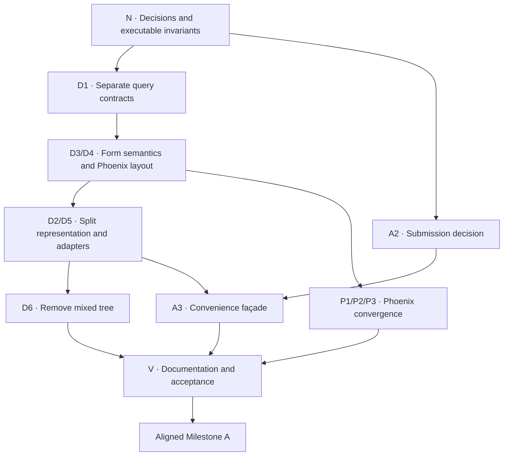

# Phase 1 — North-star alignment

## Goal

Align the nearly completed Phase 1 Milestone A implementation with
[[19-north-star-architecture|the north-star architecture]] before collections
extend its definition and runtime models.

The result is not a new end-user capability. It is a safer and simpler
foundation:

- `Definition` and `Form` are the only ordinary lifecycle concepts;
- `Definition` owns separate semantic and presentation structures;
- `Form` consumes semantics without understanding layout containers;
- Phoenix renders the `%Phoenix.HTML.Form{}` projection of a `Form` without a
  separate definition assign;
- source adapters, generic `FormData`, projection, and render plans are
  progressively disclosed advanced concerns;
- all correctness and browser-behaviour guarantees from Milestone A survive.

> [!info] Position in the roadmap
> This is an alignment gate inside Phase 1, between the current Milestone A and
> Milestone B collections. It is not Phase 1.5 and it does not replace either
> milestone.

## Why this gate exists

The working skeleton proved the difficult behaviours before a public model was
frozen. That was the correct order. It also left three prototype-shaped seams:

1. one definition tree mixes data objects and presentation groups;
2. ordinary rendering exposes `Definition → Phoenix.HTML.Form → RenderPlan`
   even though the runtime value already owns the definition;
3. the documentation presents compiler and projection concepts too early.

Collections would add repeated item templates, runtime item identities, nested
forms, and collection layouts. Adding them to the mixed tree would make the
later separation harder and would force collection code to learn the same
`nests_data?` distinction as `Form`, `Info`, `FormData`, and the projector.

The present cost is already concrete:

- `Info.data_children/1`, `Info.collect_unsupported/2`, and multiple private
  `Form` traversals independently look through presentation groups;
- `Info.collect_unsupported/2` explicitly mirrors a private `Form` traversal;
- presentation grouping can change a semantic query.

For the last point, a declaration may define properties in semantic order
`["a", "c"]` while a presentation group lists `["c", "a"]`. The current
compiler reorders the one stored child list, and `Info.fields/1` consequently
returns `["c", "a"]`. A UI hint has changed the answer to a query documented as
declaration order. Collections would multiply both the duplicated traversal
and the ordering ambiguity.

The gate moves the existing behaviour onto the intended boundaries first.

## Baseline

This plan was written against `main` at commit `3fccf5d` on 2026-07-26, after
PRs #12, #14, and #13 landed.

### Already aligned

The following work is an asset to preserve, not refactoring debt to discard:

- `%Formentation.Form{}` is already the authoritative native runtime value.
- Form transitions are pure and Phoenix-independent.
- Raw transport facts, decoded operations, candidate data, usage, and issues
  are distinct.
- Whole-instance validation dispatches through `ValidationPlan` and does not
  name a source adapter.
- Nested-object presence is derived from surviving content.
- Read-only, unknown, and unsupported original values are preserved.
- Unsupported constructs produce concrete derived submission blockers.
- `Formentation.Info` already provides most of the semantic query seam:
  `fields/1`, `node_at/2`, `required?/2`, `role/2`, and unsupported-node
  traversal.
- Semantic and presentation identities are already namespaced: `NodeId.group/2`
  produces `/#electrical` while `NodeId.from_path/1` produces `/voltage`, so
  D2's identity-confusion invariant starts from a working convention.
- The nested `Phoenix.HTML.Form` produced by `FormData.to_form/4` already
  carries its instance subpath in a private option, so a projected form knows
  which subtree it represents.
- `Phoenix.HTML.FormData` is a projection of state rather than the form engine.
- `Phoenix.StateView` provides a source-neutral read seam for semantic
  submission and issue visibility.
- The reference components have strong accessibility and transport assertions.
- LiveView and browser-real tests cover behaviour that unit tests cannot infer.
- Both source adapters and their differential fixtures protect an IR migration.

### Architectural mismatch

The remaining mismatch is concentrated:

- `Definition.root` stores one mixed node tree.
- `Node.Group` represents both an object and a presentation group through
  `nests_data?`.
- `Node.Field` combines semantic facts with label, help, widget, hidden intent,
  and presentation-group membership.
- `Form` walks the mixed tree and must interpret presentation-only groups.
- `Info` must derive nominally semantic answers from a layout-mutated mixed
  tree; in some fixtures its field order is therefore presentation order.
- the Phoenix projector walks the same mixed tree to recover layout;
- `Phoenix.fields/1` requires a definition beside a Phoenix form;
- `Projector`, `RenderPlan`, and the reference “theme” appear as normal public
  stages or vocabulary.

This is one structural migration plus a public API consolidation, not a rewrite
of validation, state, or rendering behaviour.

## Scope

This gate includes:

- a written and executable behavioural baseline;
- semantic and presentation query seams;
- migration of `Form` to semantic queries;
- migration of Phoenix preparation to presentation traversal plus semantic
  lookup;
- split definition representation produced by both current adapters;
- removal of the mixed root tree and `nests_data?`;
- a submission API that exposes the application decision and a convenience
  compile-and-initialize façade;
- ordinary rendering from the Phoenix projection of `%Formentation.Form{}`
  without a duplicate definition assign;
- an explicitly advanced arbitrary-`FormData` path;
- beginner-facing documentation rewritten around `Definition` and `Form`;
- a definition-format version bump and migration notes.

## Non-goals

This gate does not include:

- collections or collection identity;
- new JSON Schema keywords;
- grids, tabs, steps, or other expanded layout primitives;
- a configurable UI contract or a second UI implementation;
- a prepared-view compatibility promise;
- a complete state-adapter contract for Ecto or Ash;
- implicit or protocol-based source dispatch;
- compiler-pass architecture, full provenance, fingerprints, or caching;
- support reports or capability negotiation;
- definition serialization compatibility;
- changes to authoritative validation policy;
- changes to browser transport or issue-visibility semantics.

`Techdocs` and `Userguide` remain current-state documentation during the early
refactoring PRs. They are updated only when the new public path exists.

## Target state

Conceptually:

```elixir
%Formentation.Definition{
  semantic: semantic_root,
  presentation: presentation_root,
  validation: validation_plan,
  diagnostics: diagnostics
}
```

Ordinary lifecycle:

```elixir
{:ok, definition} = Formentation.compile(source, adapter: :map)

form = Formentation.Form.new(definition, data)
form = Formentation.Form.validate(form, params)
```

Ordinary Phoenix rendering:

```elixir
phoenix_form =
  Phoenix.Component.to_form(form,
    as: "asset[payload]",
    id: "asset_payload"
  )
```

```heex
<Formentation.Phoenix.fields form={@phoenix_form} />
```

Advanced Phoenix integration:

```heex
<Formentation.Phoenix.fields
  definition={@definition}
  form={@ecto_or_ash_phoenix_form}
/>
```

The exact struct names and function return shapes remain implementation
decisions. The ownership and progressive-disclosure model are fixed by
[[19-north-star-architecture|the north star]].

## Mikado graph

Arrows mean “must be available before this change can safely be completed.”
`N` combines the accepted decisions, the documentary inventory, and the two
layout-invariance characterizations that protect the first behavioural cut.



## Node specifications

### N — North-star baseline

**Outcome:** the target ownership, vocabulary, invariants, current behaviour,
and acceptance expectations are recorded before implementation begins.

N consists of:

- N0: freeze the decisions in
  [[19-north-star-architecture|North-star architecture]] and
  [[18-decisions#D-029 — Definition and Form are the ordinary public model|D-029]];
- N1a: inventory existing behavioural evidence and record characterization
  gaps in this document;
- N1b: add executable tests proving that two layouts over the same semantics
  produce the same transition/candidate behaviour and that presentation
  regrouping does not change nested-object presence.

The documentation PR delivers N0 and N1a. A small executable-baseline PR closes
N1b before D1 changes query ordering. Other matrix gaps remain prerequisites on
the implementation nodes that can affect them.

### D1 — Separate semantic and presentation query contracts

**Outcome:** consumers can ask semantic and presentation questions without
pattern matching on the stored mixed tree.

`Formentation.Info` is the starting asset, not a throwaway API or a missing
module. D1:

- freezes semantic declaration order for `Info.fields/1`;
- extends the existing semantic query surface only where `Form` needs facts it
  cannot yet ask for;
- introduces a distinct presentation traversal contract;
- lets the first implementation interpret the current mixed representation.

The semantic-order rule intentionally changes the current result when a
presentation group reorders declared fields. This is the gate's explicit
public-behaviour correction; presentation traversal continues to return the
requested layout order.

The correction has an existing home in the suite. `source/map_test.exs` already
carries a test named "fields/1 keeps declaration order across the group
boundary", which asserts exactly this contract but cannot observe the
violation: its fixture lists the group's `fields` in declaration order. A
separate fixture in the same file does reorder (`properties` `["a", "c"]`, a
group listing `["c", "a"]`) but only asserts the group's *children* order,
which stays correct. D1 should therefore widen the existing declaration-order
test to a reordering fixture rather than add a parallel test, so the assertion
lands where the contract is already claimed.

Semantic queries need to support at least:

- root and nested object traversal;
- field traversal in semantic order;
- lookup by template or instance path;
- requiredness, type, role, constraints, participation, and preservation;
- unsupported-node enumeration;
- origins and diagnostics.

Presentation queries need to support at least:

- deterministic root-layout traversal;
- field references;
- nested object/layout boundaries;
- presentation groups;
- label, help, hidden intent, and widget preference;
- resolution from a layout reference to its semantic node.

The queries should be behavioural contracts. Tests should avoid asserting the
temporary compatibility implementation.

### D2 — Split IR types

**Outcome:** semantic nodes and presentation layout nodes can represent the
Milestone A subset without `nests_data?`.

D2 defines types and invariants, but should not land as a large unused
architecture island. It is implemented as part of the D2+D5 cutover slice once
D1, D3, and D4 have proved the consumer seams.

Required invariants:

- every layout field reference resolves to exactly one semantic occurrence;
- semantic paths do not depend on layout grouping;
- semantic and layout identities are typed or namespaced so one cannot be
  mistaken for the other;
- default layout derivation is deterministic;
- origins remain attached to the facts they explain;
- unsupported semantic occurrences remain discoverable;
- a definition cannot be constructed with an invalid root or dangling
  reference through supported constructors.

### D3 — `Form` consumes semantic structure only

**Outcome:** decoding, materialization, validation, usage, and blocker
classification do not traverse presentation layout and do not know about
presentation groups.

Before changing traversal, characterize:

- flat and nested replace transitions;
- read-only and unknown-key preservation;
- nested content-derived presence;
- usage accumulation;
- decode deferral and validation dispatch;
- unsupported-node blocker ownership and precedence.

The first PR can use D1 over the old representation. This proves the semantic
query surface before the storage cutover.

### D4 — Phoenix preparation consumes layout

**Outcome:** Phoenix traverses presentation layout and resolves semantic
references for fields and nested objects.

It must preserve:

- field order and presentation grouping;
- data-nesting names and IDs;
- whole-form and subtree rendering;
- widget resolution and diagnostics;
- issue visibility through `StateView`;
- root and object issue summaries;
- unsupported-node omission and blocker summaries;
- pure, deterministic preparation.

The first PR can use D1 over the old representation. It must not introduce a UI
contract.

### D5 — Both adapters emit split definitions

**Outcome:** the map source and JSON Schema source both produce separate
semantic and presentation structures directly.

Acceptance includes:

- differential equivalence across both adapters apart from origins;
- annotations and UI-hint precedence preserved;
- deterministic default layout without UI hints;
- data nesting independent of presentation grouping;
- unsupported nodes and validation plans preserved;
- no compatibility conversion back into the mixed tree.

Implement D2 and D5 together unless an implementation spike demonstrates a
smaller executable slice.

### D6 — Remove the mixed tree

**Outcome:** `Definition.root`, `Node.Group.nests_data?`, and presentation
membership stored on semantic fields are removed.

This node includes:

- deleting compatibility traversal;
- updating struct-oriented tests to public query assertions;
- removing dead constructors and helpers;
- bumping `Definition.format_version`;
- updating architectural dependency checks;
- documenting the breaking representation change.

No permanent dual representation remains.

### A2 — Submission decision API and demo correctness

**Status:** Done 2026-07-26.

**Outcome:** ordinary submission exposes success versus redisplay using the
complete `submission_status/1`, including blockers.

`Form.new/3`, `validate/2`, and `submit/2` already provide the LiveView-shaped
lifecycle. `validate/2` remains named `validate`; adding `change/2` would buy no
new behaviour and would lose alignment with the conventional
`phx-change="validate"` handler.

The missing behaviour is the application decision. The current demo helper
hand-rolls success as “no issues and a decodable candidate.” That is incorrect:
a map-source form with a required unsupported node can have `issues == []` and
a candidate while `submission_status/1` is `{:blocked, blockers}`.

The existing pure transition machinery, submission status, candidate
materialization, and issues must implement the result API rather than being
duplicated.

Acceptance includes:

- `validate/2` retains raw invalid input and stores issues;
- `submit/2` exposes success versus redisplay directly as
  `{:ok, candidate, submitted_form} | {:error, submitted_form}`;
- `:undecodable`, `{:blocked, blockers}`, and `{:invalid, issues}` all take the
  redisplay path;
- `:ready` returns the decoded candidate;
- the demo uses the public submission decision rather than inspecting
  `issues/1` and `candidate/1` independently;
- a required unsupported map-source fixture proves the current false-success
  bug is closed;
- application persistence remains outside Formentation;
- low-level `Params` and `transition/2` remain advanced if still useful;
- lifecycle operations remain pure.

A2 is independent of the definition storage cutover.

### A3 — Convenience façade

**Outcome:** `Formentation.form/2` compiles a source and initializes a `Form`
without hiding compilation diagnostics or ambiguity.

A3 keeps explicit `adapter:` selection for ambiguous sources. It depends on the
submission/lifecycle decision and the split definition produced by both
adapters, not on implicit source dispatch. No source type is guessed.

Stable built-in keys — `adapter: :map` and `adapter: :json_schema` — are
accepted by `Formentation.compile/2` as well as by the façade. Restricting them
to `Formentation.form/2` would make the compile-once-and-reuse path, which
getting-started material needs, the only ordinary path that requires naming an
adapter implementation module. Module selection remains valid everywhere and is
what a third-party adapter uses.

### P1 — Phoenix derives the definition from a projected `Form`

**Outcome:** the common `fields` and `field` components continue to accept a
typed `%Phoenix.HTML.Form{}`, and when its source is `%Formentation.Form{}` they
derive the definition from that source.

The application remains responsible for:

```elixir
Phoenix.Component.to_form(form_state,
  as: "asset[payload]",
  id: "asset_payload"
)
```

The component remains responsible for layout preparation and rendering. It
does not accept `%Formentation.Form{}` polymorphically, and it does not take
`as` or `id`. This preserves:

- the existing typed component attribute;
- caller ownership of Phoenix name and ID;
- mixing generated fields with hand-written
  `<.input field={@phoenix_form[:x]}>`;
- one Phoenix form value for the payload form and all of its child controls.

The common API must not require callers to pass the same definition both
explicitly and through the Phoenix form's source.

#### Derivation must recover the subtree, not just the definition

A nested `%Phoenix.HTML.Form{}` built by `FormData.to_form/4` keeps the *root*
`%Formentation.Form{}` as its `source` and records its instance subpath in a
private option. Whole-form projection, by contrast, starts at the semantic root
with an empty path.

Deriving only the definition from `form.source` would therefore render the
entire root form whenever a caller passes a nested form:

```heex
<.inputs_for :let={nested} field={@phoenix_form[:address]}>
  <Formentation.Phoenix.fields form={nested} />
</.inputs_for>
```

P1 does not create this trap — passing a root `definition` beside a nested form
is equally wrong today — but it removes the visual cue, because the mismatched
pair is no longer written out by the caller. Derivation must therefore read
both facts from the projected form:

- the `Definition`, from the `%Formentation.Form{}` source;
- the projection root, from the recorded instance subpath.

The existing subtree projection already traverses from an instance path, so
this is a routing decision rather than new traversal machinery.

Acceptance includes:

- a nested projected form renders only its own subtree, with the names, IDs,
  and issue visibility it already produces today;
- an equivalent assertion for the subtree component;
- a `%Phoenix.HTML.Form{}` whose source is not a `%Formentation.Form{}` and
  which carries no explicit definition fails with a clear error rather than
  rendering something arbitrary.

### P2 — Preserve the generic `FormData` path

**Outcome:** arbitrary `Phoenix.HTML.FormData` sources remain renderable through
an explicitly advanced definition-plus-form API and `StateView`.

The advanced path must be covered by a non-`Formentation.Form` fixture so it is
not nominally generic but accidentally native-only.

This path is permanent low-level interoperability, not merely a transition
until first-class integrations exist. First-class Ecto or Ash integrations
should eventually wrap backing state through `%Formentation.Form{}` and use P1;
an integration that intentionally does not adopt that wrapper may keep using
the explicit definition-plus-form path.

### P3 — Hide preparation stages

**Outcome:** projector, render plan, render nodes, and the built-in reference
component set no longer appear as required beginner-facing lifecycle stages.

For Phase 1:

- no UI behaviour or registry is added;
- the reference markup may be renamed to
  `Formentation.Phoenix.ReferenceComponents` or an equivalent honest name;
- advanced preparation structs stay internal or explicitly unstable;
- independently valuable preparation tests remain.

### V — Documentation and acceptance

**Outcome:** the implementation, examples, and documentation tell one coherent
story and all retained behavioural contracts pass.

This includes:

- update the demo to the ordinary lifecycle and projected-Form render path;
- update README, `Userguide`, and `Techdocs` to implemented reality;
- make the getting-started page name exactly four Formentation modules:
  `Formentation`, `Formentation.Definition`, `Formentation.Form`, and
  `Formentation.Phoenix` — which the symbolic `adapter:` keys from A3 make
  reachable, since the compile-once path would otherwise have to name an
  adapter implementation module;
- update planning notes whose older diagrams or vocabulary conflict;
- run unit, property, LiveView, architecture, documentation, and browser suites;
- record any intentionally retained advanced APIs;
- remove migration callouts that no longer apply.

## Implementation waves

The graph allows parallel work, but the repository should remain green after
each PR.

### Wave 0 — Decisions and executable baseline

Wave 0 has two deliberately small slices:

1. **Planning PR:** N0 and N1a; this document, the north-star note, decision
   log, roadmap/index links, and no production-code changes.
2. **Characterization PR:** N1b; add:
   - equivalent transition/candidate semantics under two presentation layouts;
   - presentation regrouping does not change nested-object presence.

The second slice changes tests only and must land before D1. Other
characterization gaps remain local prerequisites for the nodes that can affect
them.

### Wave 1 — Prove seams and façade direction

Initial issues:

1. D1 — separate semantic and presentation query contracts, including the
   semantic declaration-order correction.
2. D3 — migrate `Form` onto semantic queries.
3. D4 — migrate Phoenix preparation onto presentation traversal.
4. A2 — submission decision API and demo false-success bug.

D3 and D4 depend on D1 and can then proceed independently. A2 can proceed
independently of the D branch.

### Wave 2 — Structural cutover

- D2+D5 — introduce the split representation and make both adapters produce it;
- D6 — remove the mixed tree and bump the definition format version.

The representation should change only after both principal consumers have
stopped depending on its old shape.

### Wave 3 — Public convergence

- A3 — compile-and-initialize façade;
- P1 — derive the definition from the Phoenix projection of a `Form`;
- P2 — retain and prove the advanced generic path;
- P3 — hide or rename preparation-stage implementation details.

### Wave 4 — Verification and documentation

- V — update current-state documentation and examples;
- run the complete acceptance matrix;
- declare Aligned Milestone A.

Actual PR boundaries may split these nodes further. Graph nodes are dependency
and outcome units, not mandatory one-to-one issues or PRs.

## Characterization and acceptance matrix

The current suite already protects most behaviour. “Gap” means an executable
characterization must be added before or with the implementation node that can
change it.

| Behaviour or invariant | Current evidence | Alignment expectation | Gap |
| --- | --- | --- | --- |
| Both sources describe the same supported form | `differential_test.exs`, `pump_inspection_test.exs`, shared fixtures | Equivalent semantic facts and presentation layout apart from origins | Extend equivalence assertions to both split structures |
| Compilation is deterministic and map-order independent | `json_schema_property_test.exs`, `source/map_property_test.exs` | Split structures and derived default layout remain deterministic | Add layout determinism assertions |
| Invalid and unsupported declarations are diagnosed | source-adapter tests, `info_test.exs` | Diagnostics and source locations survive the cutover | Add split-location coverage where representation changes |
| No atoms from source keys; budgets terminate | adapter property tests | Query seams and new constructors preserve both guarantees | No known gap |
| Paths and IDs round-trip safely | path, pointer, node-ID, and naming property tests | Semantic occurrence paths stay independent of typed/namespaced presentation identities | Add dangling-reference and namespace-confusion properties |
| Semantic field order is independent of layout order | A map-source declaration-order test exists but its fixture cannot reorder; a reordering fixture exists but asserts only group children | `Info.fields/1` returns declaration order while presentation traversal returns group order | Widen the existing declaration-order test to a reordering fixture in D1 and document the behaviour correction |
| Raw transport and decoded operations remain distinct | `transport_test.exs`, `codec_test.exs`, `form_test.exs` | Existing `validate/2` and submission transition retain the same semantics | No new lifecycle alias required |
| No complete candidate while decoding fails | `form_test.exs`, `form_property_test.exs` | Unchanged | No known gap |
| Source-neutral validation dispatch | `form_validation_dispatch_test.exs`, validator tests | Semantic traversal supplies the same candidate to the same plan | Add before/after query-seam equivalence |
| Nested-object presence is content-derived | `form_nested_presence_test.exs`, submission integration tests | Layout groups cannot manufacture or suppress object presence | Add the layout-regrouping invariance test in Wave 0 |
| Read-only and unknown original data are preserved | `form_property_test.exs`, form tests | Presentation changes cannot change participation | Add equivalent transition/candidate semantics under two layouts in Wave 0 |
| Unsupported blockers are derived and observable | `form_submission_test.exs`, `submission_blocker_test.exs` | Semantic unsupported traversal produces identical status and ownership | Extend to split semantic queries |
| Submission success includes blockers | Submission-status and blocker tests; demo helper currently checks only issues plus candidate | Only `:ready` reaches application success | Add a required unsupported map-source demo/integration fixture in A2 |
| Usage is accumulated and controls visibility | `transport_test.exs`, `used_input_contract_test.exs` | Lifecycle and projected-Form render path preserve it | Add component coverage without a separate definition assign |
| `FormData` preserves names, values, nesting, and raw failures | `form_data_test.exs`, `naming_property_test.exs` | Native and advanced rendering use the same Phoenix conventions | Add explicit advanced non-native fixture |
| A projected form renders the subtree it represents | Nested projection tests; component tests always pass a definition explicitly | A nested projected form renders only its own subtree, and a source carrying no definition fails clearly | Add nested-form derivation coverage for both components in P1 |
| Projection is source-neutral and pure | `state_view_test.exs`, `projector_test.exs`, boundary tests | Layout traversal names no concrete state source | Extend boundary check to new preparation module |
| Markup is accessible and transport-correct | component, reference-theme, and snapshot tests | Reference-component rename or rewiring changes no semantics | Regenerate snapshots only after reviewed diff |
| LiveView lifecycle works end to end | demo LiveView tests | Demo uses the complete submission decision and projected-Form render path | Update fixture and handlers |
| Real browser preserves unused gating, raw numeric text, focus, and valid submit | browser tests | All remain green after public-path migration | Required final run |
| Ordinary target API is coherent | No current test; API does not yet exist | North-star examples compile and render | Add public API acceptance test |
| Getting started has a bounded noun budget | Current guide exposes implementation stages | The getting-started page names exactly `Formentation`, `Formentation.Definition`, `Formentation.Form`, and `Formentation.Phoenix` among Formentation modules | Add a documentation assertion or focused review check in V |
| Old mixed representation is absent | Current implementation requires it | No `Definition.root`, `nests_data?`, or semantic field group membership | Add architecture/static checks in D6 |

## Migration policy

### Query before storage

Introduce consumer-facing queries over the current representation before
changing storage. This allows:

- `Form` to move without waiting for adapter changes;
- Phoenix to move independently;
- the split representation to replace only the query implementation;
- behavioural tests to compare old and new results.

### One authoritative representation

Temporary compatibility readers are allowed. Two authoritative stored
representations are not.

During the cutover:

- adapters should emit the new representation directly;
- no long-lived “compile old, convert new” path remains;
- no consumer falls back to reading old fields after D6;
- a format-version bump marks the breaking definition change.

### Preserve public behaviour, not accidental structs

Tests and migrations prioritize:

- query answers;
- transition results;
- diagnostics;
- rendered semantics;
- browser behaviour.

One query answer changes deliberately: `Info.fields/1` returns semantic
declaration order even when the current mixed tree was reordered by a UI hint.
Presentation traversal retains the hinted order. This exception must be
documented in migration notes and pinned by D1 tests.

Struct-literal equality is retained only where the struct itself is an intended
contract.

### Current-state documentation changes last

`Techdocs`, `Userguide`, README examples, and demo instructions change when the
new API exists. Planning and Development notes may describe the accepted target
before implementation.

## Risks and controls

### Semantic and presentation facts are assigned to the wrong side

**Risk:** moving too aggressively produces artificial boundaries, such as
treating read-only participation as mere styling or labels as validation facts.

**Control:** use the ownership matrix in
[[19-north-star-architecture#Ownership|the north-star note]] and require a reason
for cross-structure references.

### Query seams merely reproduce the old tree

**Risk:** D1 becomes a renamed mixed-tree API, making the structural cutover no
easier.

**Control:** specify questions by consumer needs. `Form` must be implementable
from semantic queries alone; Phoenix layout traversal must not infer data
nesting from presentation groups.

### Adapter drift

**Risk:** the map and JSON Schema adapters choose subtly different layouts or
semantic occurrence rules.

**Control:** extend differential fixtures before deleting the old
representation and test default-layout derivation independently.

### Invalid cross-references

**Risk:** separating trees introduces dangling layout references or collisions.

**Control:** validated constructors or finalization checks, property tests, and
structured compiler diagnostics.

### Submission façade duplicates runtime logic

**Risk:** the application-decision result reimplements candidate, issue, or
blocker classification and drifts from `submission_status/1`.

**Control:** retain `validate/2`; make submission delegate to the existing pure
transition and status machinery; test every status branch.

### Generic Phoenix support regresses

**Risk:** deriving a definition from the ordinary projected `Form` path
accidentally hard-wires all projection to the native state.

**Control:** preserve the advanced path and prove it with a non-native
`FormData`/`StateView` fixture plus architecture checks.

### UI work leaks into alignment

**Risk:** renaming “theme” prompts premature behaviours, registries, or
capability abstractions.

**Control:** retain one hard-wired reference set. Only rename and hide it as
needed; defer the contract until a second substantially different UI exists.

### Documentation leads implementation for too long

**Risk:** accepted target examples are mistaken for released API.

**Control:** target notes are labelled Planning/Development; current-state
documentation remains unchanged until V; implementation-status callouts link
to this gate.

## Definition of Aligned Milestone A

- [ ] North-star ownership and vocabulary are accepted and linked from the
      vault indexes.
- [ ] Current behaviour is characterized; gaps in the matrix are closed where
      their implementation nodes can affect behaviour.
- [ ] Wave 0 proves equivalent transition/candidate semantics under different
      layouts and layout-invariant nested-object presence.
- [ ] `Definition` stores separate semantic and presentation structures.
- [ ] Both current adapters produce those structures directly.
- [ ] Default presentation layout is deterministic.
- [ ] Layout references are validated and resolve to semantic occurrences.
- [ ] `Form` traverses semantic structure only.
- [ ] Phoenix preparation traverses layout and resolves semantic references.
- [ ] The old mixed root tree, `nests_data?`, and presentation membership on
      semantic fields are removed.
- [ ] The definition format version is bumped and the breaking change is
      documented.
- [ ] `Info.fields/1` returns semantic declaration order while presentation
      traversal returns layout order; the intentional behaviour correction is
      documented.
- [ ] Existing `new/3` and `validate/2` remain the ordinary construction and
      change-event operations.
- [x] Submission exposes success versus redisplay through
      `submission_status/1`, including blockers, and the demo no longer
      hand-rolls readiness.
- [ ] `Formentation.form/2` provides the agreed convenience path, and both it
      and `Formentation.compile/2` accept the stable built-in `adapter:` keys.
- [ ] Phoenix components accept the `%Phoenix.HTML.Form{}` projection of a
      `%Formentation.Form{}` and derive its definition without a separate
      assign; `as` and `id` remain caller-owned.
- [ ] A nested projected form renders its own subtree, because derivation
      recovers the projection root as well as the definition.
- [ ] Arbitrary `FormData` plus `StateView` remains a tested, permanent
      low-level interoperability path.
- [ ] Projector/render-plan/reference-component details are absent from the
      getting-started lifecycle.
- [ ] The getting-started page names exactly `Formentation`,
      `Formentation.Definition`, `Formentation.Form`, and
      `Formentation.Phoenix` among Formentation modules.
- [ ] Current unit, property, LiveView, architecture, and documentation checks
      pass.
- [ ] Browser-real acceptance tests pass.
- [ ] README, demo, `Userguide`, and `Techdocs` describe the implemented API.
- [ ] Collections remain the only material Phase 1 capability not yet
      implemented.

## Exit and what follows

After this gate, Phase 1 resumes with Milestone B:

- choose the stable item-identity and indexed-path contract;
- add semantic collection/item-template structures;
- add presentation collection layout;
- implement add/remove/reorder state transitions;
- project collections through `FormData` and Phoenix;
- prove stable identity in LiveView and browser tests.

Collections should not require reintroducing a mixed semantic/presentation
container.

When Milestone B is complete, [[phase-2-compiler-diagnostics|Phase 2]] can
restructure the compiler around the split definition rather than around a
representation already known to be transitional.

## Related notes

- [[19-north-star-architecture|North-star architecture]]
- [[phase-1-walking-skeleton|Phase 1 — Walking skeleton]]
- [[phase-2-compiler-diagnostics|Phase 2 — Compiler pipeline and diagnostics]]
- [[13-roadmap|Roadmap]]
- [[18-decisions#D-029 — Definition and Form are the ordinary public model|D-029]]
- [[11-testing-strategy|Testing strategy]]
- [[Formentation|Back to the entry point]]
