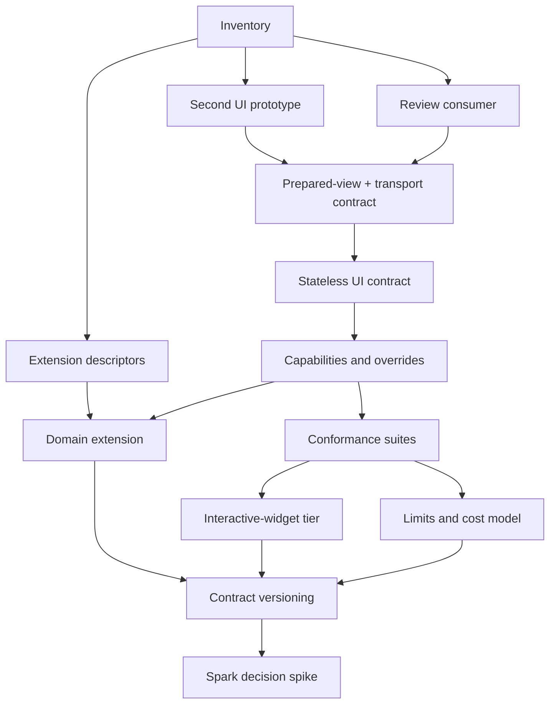

# Phase 3 — Extensibility and UI integrations

## Goal

Allow applications, definition adapters, domain extensions, and independent UI
packages to extend Formentation without copying the compiler, forking render
preparation, or pattern-matching on unstable internals.

The phase turns the boundaries developed in the first two phases into public,
versioned extension contracts. Its UI work follows
[[20-renderer-ui-model|the renderer and UI model]]:

> A UI does not interpret a form. It renders a prepared, source-neutral view of
> a form using a particular component library.

And:

> A UI does not choose transport or decoding semantics. It faithfully emits the
> controls described by a prepared, renderer-owned transport contract.

The phase is complete only when independent implementations prove both sides of
the extension model:

1. a second, substantially different editable UI integration is implemented in
   a separately compiling Mix project outside the built-in reference
   components;
2. an application extension adds a semantic role, codec, compiler rule,
   verifier, diagnostics, and a UI widget through public contracts.

Read-only review rendering is an additional proof consumer. It does not replace
the second editable UI because it cannot exercise input transport.

A CSS-class variation of the reference components is not a sufficient second
UI. The proof must challenge markup structure, component APIs, defaults, and
customization assumptions.

## Prerequisites

Phase 3 begins after:

- Phase 1 separates semantic structure from presentation layout;
- collections provide representative repeated-occurrence and identity needs;
- Phase 2 provides ordered compiler passes, verifiers, support reports,
  provenance, and stable structured diagnostics;
- the ordinary `Definition`/`Form`/Phoenix path no longer exposes projector or
  render-plan details;
- the reference UI's accessibility and browser-real behaviour are covered by
  tests.

The current projector, render plan, render nodes, and reference components are
inputs to discovery. They are not automatically the public contracts.

## Risk being retired

The risk is an extension story that looks clean in types and behaviours but
requires internal knowledge in practice.

For the compiler side, an extension may appear modular yet still depend on
private pass order, node layout, or diagnostic conventions.

For the UI side, an integration may appear configurable yet still need to:

- traverse source schemas;
- inspect private definition nodes;
- recreate issue visibility or path handling;
- know the built-in reference markup;
- fork preparation for a different component library;
- silently weaken unsupported widgets;
- invent control names, omission/blank behaviour, or auxiliary inputs;
- localize issues or format edit values inconsistently;
- use LiveComponents or hooks for every control because the baseline contract
  is too stateful;
- require complete-tree preparation on every keystroke;
- exceed safe resource budgets for user-authored definitions.

The proof implementations must reveal and remove those accidental assumptions.

## Scope

Add public contracts for:

- extension descriptors and contract versions;
- compiler passes and verifiers approved for third-party use;
- semantic roles and, where justified, custom node kinds;
- codecs;
- predicates with declared dependencies;
- definition-adapter registration or typed dispatch if real third-party
  adapters justify it;
- prepared-view inspection;
- a typed widget transport contract;
- issue-localization and raw-control/display-value boundaries;
- UI descriptors and stateless component contracts;
- capability publication, compatibility verification, and explicit fallbacks;
- capability-failure developer experience;
- application-wide, per-form, and local UI customization;
- extension and UI conformance tests;
- read-only review rendering;
- preparation cost, partial-preparation, and resource-limit contracts;
- one separately proven advanced interactive-widget contract.

Do not promise permanent 1.0 stability. Experimental contracts must advertise
their version and fail clearly when incompatible.

## Non-goals

Phase 3 does not:

- move source validation into Formentation widgets;
- make UI visibility an authorization mechanism;
- require a renderer target when compiling reusable definitions;
- put concrete component modules or CSS into semantic definitions;
- replace every application form component with generated markup;
- require Spark for runtime or plain-data declarations;
- require every UI to support every extension;
- guarantee that any arbitrary component override is accessible;
- make advanced LiveComponent/hook behaviour part of the stateless baseline.

## Workstreams

### 1. Inventory the reference implementation

Create a responsibility inventory for the current:

- projector/preparation code;
- render plan and render-node structs;
- reference components;
- widget resolver;
- error summary;
- group and collection containers;
- accessibility helpers;
- browser transport behaviour.

For every current field or assign, record:

- which layer owns the fact;
- whether both UI implementations require it;
- whether read-only review rendering requires it;
- whether it is Phoenix-specific;
- whether it carries semantic, presentation, transport, localization, or
  accessibility meaning;
- whether it is stable enough to expose;
- whether it can be derived instead of stored.

The inventory prevents both accidental omission and wholesale publication of
Phase 1 internals.

### 2. Prototype a second UI concurrently

Choose a UI with meaningfully different conventions from the reference
components. Suitable examples include:

- DaisyUI;
- Bootstrap;
- an application-native `CoreComponents` design system.

Build the prototype against the smallest temporary seam available. Do not
finalize a prepared-view or behaviour contract first and then force the second
UI through it.

The prototype must live in a separate Mix project/package with Formentation as
a dependency. A path dependency is sufficient during development. Add an
executable module-boundary check with `mix xref`, Reach, or both that rejects
references to:

- source adapters and source-specific modules;
- `Formentation.Node.*` or private `Definition` representation;
- private semantic traversal/query helpers such as `Formentation.Definition.Semantic.*`;
- private projector/render-plan/render-node modules;
- implementation modules not explicitly classified as supported UI API.

That check runs in the UI package, not in this repository: `.reach.exs` layers
only constrain modules compiled here and cannot see a separately compiled
dependent package.

The prototype must cover:

- scalar inputs;
- choices;
- labels, help, and field issues;
- groups and nested objects;
- collections and stable item IDs;
- hidden, read-only, and unsupported presentation;
- form-level error summary;
- whole-form, subtree, and individual-field rendering;
- one application-local widget or container override.

### 3. Prototype read-only review rendering

Build a read-only consumer for confirmation, print, or email-safe output. It
uses the same definition and accepted values but no editable controls.

It must exercise:

- localized display formatting separate from editing values;
- choice value-to-label mapping;
- absent, hidden, preserved, unsupported, and read-only values;
- layout/container mapping without input wrappers;
- source-neutral operation without schema traversal.

This consumer helps keep the prepared contract from becoming merely an
abstraction over input markup. It is additional evidence, not the second-UI
gate.

### 4. Stabilize the prepared-view boundary

Extract the smallest source-neutral, Phoenix-appropriate prepared read model
used by both UIs.

It must:

- identify semantic, layout, and runtime occurrences explicitly;
- contain all facts needed for rendering without source traversal;
- preserve `%Phoenix.HTML.Form{}` bindings, names, and IDs where appropriate;
- carry typed primary/auxiliary control requirements and parameter shape;
- keep raw `control_value` distinct from localized `display_value`;
- expose normalized issue visibility and accessibility relationships;
- distinguish abstract widget intent from concrete component selection;
- carry explicit compatibility/fallback results;
- support whole-form and subtree preparation;
- remain deterministic and inspectable.

Decide whether the public boundary is:

- prepared structs;
- typed query functions over an opaque prepared view;
- lazily derived typed facts;
- edit/review view profiles;
- a hybrid of these;
- a renderer-neutral core plus Phoenix bindings.

The decision must be based on both implementations and recorded in
[[18-decisions|the decision log]].

Do not add an open-ended callback through which a UI can request arbitrary
derived semantics. Every exposed fact must be named, typed, owned, and covered
by conformance tests.

### 5. Define UI descriptors and stateless component contracts

Define a small, versioned UI descriptor that can publish:

- identity and contract version;
- supported widgets and containers;
- feature capabilities;
- component implementations;
- UI-owned defaults;
- visual configuration schema;
- optional conformance metadata.

Define typed contracts for the component categories actually shared by both
implementations. Avoid:

- one giant untyped assign map;
- one unconstrained `render(node, opts)` callback;
- callbacks that require private-struct pattern matching;
- a mandatory component callback for facts one shared shell can handle.

The baseline must be implementable with pure Phoenix function components and
must work for controller/static rendering followed by an ordinary HTML POST.
Document the degraded issue-visibility policy when no LiveSocket `_unused_`
evidence exists.

### 6. Define widget, transport, and capability verification

Separate:

- semantic role;
- normalized type/options/constraints;
- abstract widget requirement or preference;
- UI default;
- concrete component.

Define the renderer-owned transport shape for every baseline widget:

- primary and auxiliary controls;
- names, raw values, and cardinality;
- unchecked, absent, blank, and null semantics;
- repeated/list and compound parameter shapes;
- action/metadata fields;
- environment interaction markers.

Derive static capability requirements when possible and verify visible,
runtime-dependent requirements during preparation.

The model must specify:

- required versus preferred widgets;
- strict failure versus explicit fallback;
- fallback equivalence;
- diagnostic severity and origin;
- how unsupported custom roles are reported;
- whether capabilities compose at UI, component, or renderer level;
- how capability identity affects support reports and fingerprints.

A missing capability must never cause a field or semantic requirement to
disappear silently.

During this workstream, decide the developer experience for structured
preparation failures, development-time configuration errors, and safe
production diagnostics. Apply the same policy in the high-level component and
demo.

### 7. Define selection and overrides

Prove:

- one renderer default UI;
- application-wide selection;
- per-form/per-render selection;
- UI-owned visual theme/configuration;
- an abstract widget override by stable semantic/template path;
- a concrete component or container override at render time;
- manual rendering of one prepared field or subtree.

Specify deterministic precedence and explainability. Definition presentation
may carry abstract intent; concrete application component modules must remain
outside reusable semantic definitions.

Avoid process-global configuration that prevents two UIs from coexisting in one
application.

### 8. Publish conformance suites

Extract reusable ExUnit helpers for:

- extension descriptors;
- compiler passes and verifiers;
- codecs;
- prepared views;
- stateless UI integrations;
- capability and fallback behaviour;
- source adapters if that boundary is mature enough.

UI conformance must cover:

- escaping;
- label/input/help/error association;
- fieldsets and legends;
- form-level error-summary links;
- hidden/read-only/disabled distinctions;
- collection controls and stable IDs;
- raw-invalid-input preservation;
- used/unused issue visibility;
- unsupported requirements;
- whole-form versus subtree agreement.

Transport conformance must render the real component, obtain the emitted names
and control values, submit or construct the corresponding params envelope, run
it through `Form`, and assert raw state, decoded operations, candidate data,
usage, and submission result. Include unchecked booleans, blank choices,
multiple values, invalid raw scalars, nested fields, collections, and the
compound `:money` example.

Keep browser-real helpers for behaviour component tests cannot observe.
Shared conformance uses typed facts, structural DOM assertions, accessibility
relationships, round trips, and behaviour. It does not require exact cross-UI
HTML goldens; individual packages may use narrow snapshots for their own
markup.

### 9. Prove the advanced interactive-widget tier

Choose one representative widget that genuinely requires state or browser
behaviour, such as:

- async option search;
- a file upload;
- a hook-backed rich control.

Define separately:

- event ownership and routing;
- parent `LiveView` versus `LiveComponent` state;
- hook lifecycle;
- async loading/cancellation;
- transport normalization;
- fallback/degradation;
- accessibility;
- browser-real conformance.

The advanced tier must not make the stateless UI contract depend on
LiveComponents, hooks, uploads, or client-side state.

### 10. Build one vertical domain extension

A `money` example is a strong candidate. It should include:

- source annotation or declaration recognition;
- semantic role derivation;
- currency verification;
- raw amount decoding;
- structured diagnostics and origins;
- abstract widget intent/default;
- a concrete widget in the supporting UI;
- a support report against a non-supporting UI;
- explicit fallback or failure;
- submitted issue translation.

This proves how semantic/compiler extensions and UI capabilities meet without
letting the widget own validation.

Follow the end-to-end
[[20-renderer-ui-model#Worked example: a money field across UIs|money walkthrough]]:
prove one supporting UI, a non-supporting UI, explicit fallback
or failure, raw invalid input, localized issue text, scalar transport, a
compound-control variant, and read-only display formatting.

### 11. Establish limits and preparation cost

Define and test engine-owned safety budgets for:

- source bytes;
- semantic/presentation node count and nesting;
- options and diagnostics;
- visible occurrences and collection items;
- decoded bytes;
- preparation/output work.

Establish a benchmark fixture with large collections and document the expected
complexity of whole-form, subtree, and field preparation. Preserve stable keys
across reorder/patch operations and avoid repeated linear semantic/layout
lookups. Decide what is cached, which definition/form/context revision
invalidates it, and what remains deliberately full-tree work.

### 12. Version the contracts

Include contract/API versions separate from package versions for:

- extension descriptors;
- prepared-view/UI contracts;
- capability descriptors;
- advanced interactive widgets if separately versioned.

Reject incompatible versions with structured diagnostics before executing
passes or components.

### 13. Decide on Spark

Prototype the same extension configuration with plain data/builders and
[Spark](https://github.com/ash-project/spark). Evaluate:

- source annotations;
- generated documentation and autocomplete;
- extension composition;
- transformer/verifier integration;
- dependency and learning cost;
- runtime/dynamic configuration;
- whether the DSL merely mirrors now-proven descriptors.

The output is a decision record. Any DSL must compile into the same descriptors
available through ordinary Elixir data, and core runtime use must not require
Spark.

## Implementation sequence

The UI and general extension work share descriptor/versioning needs but should
not be forced into one large PR.

Expected PR-sized slices:

1. reference inventory, separate-project boundary harness, and second-UI spike;
2. read-only review consumer;
3. prepared-view, localization, transport, and stateless UI contracts used by
   all proof consumers;
4. capability, failure/fallback, selection, and override model;
5. reusable prepared-view/UI/transport conformance helpers;
6. preparation limits, benchmarks, and partial-preparation contract;
7. advanced interactive-widget proof;
8. compiler extension descriptors and domain extension;
9. contract versioning and compatibility diagnostics;
10. optional Spark comparison and decision record;
11. documentation and package examples.

The exact slicing should follow discoveries from the first spike. Do not merge
dead public abstractions with no independent consumer.

## Testing strategy

### Extension registry

- deterministic registration;
- duplicate identity/version errors;
- namespaced metadata;
- pass ordering across extensions;
- fingerprint changes where appropriate;
- incompatible contract-version diagnostics.

### Prepared view

- source-adapter equivalence;
- semantic invariance under presentation regrouping;
- semantic invariance under UI selection;
- whole-form/subtree agreement;
- stable paths and IDs;
- raw control values distinct from localized read-only display values;
- prepared transport shapes for scalar, repeated, and compound controls;
- no source-adapter artifacts;
- deterministic capability and fallback results.

### Capability model

- exact supported combination succeeds;
- missing required widget produces an actionable diagnostic;
- preferred-widget fallback is explicit and explained;
- explicit unsupported widget does not silently disappear;
- runtime branch/collection requirements are checked when visible;
- capability values are deterministic.

### Codec conformance

- success and failure shapes;
- raw-input preservation;
- path prefixing in nested collections;
- canonical round-trip where promised;
- no raising for ordinary user errors.

### Stateless UI conformance

- required component/view contracts;
- escaping;
- label/input/help/error association;
- fieldsets and legends;
- summary links;
- read-only, disabled, and hidden behaviour;
- collection controls and stable IDs;
- render-to-params-to-decode round trips;
- unchecked, absent, blank, repeated, and compound control semantics;
- controller-rendered ordinary POST behaviour without LiveSocket usage markers;
- unsupported-node policy;
- application override responsibilities.

### Interactive conformance

- event ownership;
- LiveView/LiveComponent transitions;
- hook survival across patches;
- async loading, cancellation, and error states;
- raw-value round trips;
- keyboard and focus behaviour in a real browser;
- accessible fallback.

### Cross-product tests

Keep a small but meaningful matrix:

- representative definitions against both UIs;
- representative accepted values against the read-only review consumer;
- both built-in definition sources against equivalent prepared views;
- the domain extension against supporting and non-supporting UIs;
- default selection, per-form selection, and one local override;
- stateless and advanced-widget examples.

### Architecture boundaries

- the second UI compiles as a separate Mix project;
- `mix xref`, Reach, or both reject dependencies on forbidden internal/source
  modules, including private semantic query helpers;
- that check runs where the UI compiles, since this repository's policy cannot
  see it;
- the public API inventory is explicit and versioned;
- no test-only access to private render nodes is required by the second UI.

### Limits and performance

- every configured safety budget fails with a bounded structured diagnostic;
- preparation is linear in the visible subtree for representative baseline
  definitions;
- collection benchmarks record full and localized update scaling;
- whole-form and subtree results agree;
- reorder operations preserve stable occurrence/DOM identity.

Shared UI conformance deliberately avoids exact cross-UI golden HTML.

## Deliverables

- a responsibility inventory of the reference rendering implementation;
- a stable prepared-view inspection/preparation contract;
- a versioned stateless UI descriptor and component contract;
- the built-in reference components migrated to that contract;
- a substantially different second UI package or example;
- an independently compiling Mix-project boundary test for that UI;
- a read-only review/confirmation consumer;
- a typed renderer-owned widget transport contract;
- application-supplied issue localization plus explicit control/display-value
  contracts;
- machine-readable capabilities and structured compatibility results;
- documented high-level capability-failure behaviour;
- explicit fallback and override policies;
- reusable prepared-view, transport, and UI conformance suites;
- resource-limit policy and preparation performance fixtures;
- one advanced interactive-widget proof;
- a vertical domain extension;
- versioned extension descriptors;
- a decision on typed source dispatch based on real third-party adapters;
- a documented Spark adoption/deferral/rejection decision;
- updated Techdocs and Userguide after the implementation lands.

## Definition of done

- [ ] The built-in and second UIs consume the same public prepared-view
      contract.
- [ ] The second UI requires no compiler/projector fork and no source-schema
      traversal.
- [ ] The second UI compiles in a separate Mix project and executable module
      graph checks reject private/source-specific dependencies.
- [ ] The read-only review consumer uses the same supported preparation
      boundary without pretending to be the second editable UI.
- [ ] UI selection cannot change candidate data, paths, issues, blockers, or
      semantic query results.
- [ ] The prepared view contains no JSON Schema-, map-, Ash-, or native-state
      artifacts.
- [ ] A stateless UI can be implemented entirely with Phoenix function
      components.
- [ ] Component contracts are typed and smaller than exposing private render
      nodes wholesale.
- [ ] Every baseline widget has an explicit prepared transport shape, and both
      UIs pass render-to-decode round-trip tests.
- [ ] Blank choices, unchecked booleans, list values, compound values, nested
      fields, and collections preserve identical semantics across UIs.
- [ ] Structured issues are localized during preparation and invalid raw
      `control_value` is never overwritten by formatted `display_value`.
- [ ] Controller/static rendering plus ordinary POST follows the documented
      issue-visibility degradation without changing validation semantics.
- [ ] Capabilities are machine-readable and checked before unsupported
      component execution.
- [ ] Missing required support produces a structured diagnostic with origin and
      hint.
- [ ] Development and production behaviour for capability/configuration
      failures is documented and demonstrated in the high-level component.
- [ ] Every fallback is explicit, deterministic, inspectable, and covered by
      tests.
- [ ] Application-wide, per-form, local widget, and local container
      customization are demonstrated without traversal forks.
- [ ] Accessibility and browser-transport conformance runs against both UIs.
- [ ] Shared conformance uses structural and behavioural assertions rather than
      exact cross-UI HTML goldens.
- [ ] Engine-owned node/nesting/options/collection/diagnostic/preparation limits
      are enforced with bounded failures.
- [ ] A documented preparation cost model and collection benchmark cover
      whole-form and subtree work plus stable patch identities.
- [ ] One advanced widget proves events/hooks/state through a separate contract.
- [ ] A domain extension adds role, codec, widget, pass, verifier, and
      explanation through public contracts.
- [ ] Extension contributions affect deterministic fingerprints where their
      semantics require it.
- [ ] Contract versions reject incompatible extensions before execution.
- [ ] UI extensions cannot redefine source validation or submission semantics.
- [ ] A decision record settles prepared-view/UI contracts and another records
      the Spark result.

## Notes of caution

- Two implementations are evidence; one implementation plus configurable CSS
  is not.
- Do not publish current render-node structs merely because they already exist.
- Do not require a selected UI to compile a reusable definition.
- Do not let capabilities become a second validation system.
- Do not hide fallbacks; explain them.
- Do not put concrete Phoenix component modules in semantic definitions.
- Do not use a single unconstrained callback as the complete UI model.
- Do not make stateful widgets the baseline.
- Do not let slots force callers to recreate traversal, issue association, or
  stable identity.
- Do not use visual theme as another name for UI integration.
- Do not make a Spark DSL the only construction path.

## Exit and next phase

With proven extension and UI boundaries,
[[phase-4-dynamic-schemas|Phase 4]] can add conditional and compositional
features without hard-coding every branch interaction into a component library.
Dynamic work may extend prepared views and capability requirements, but it
should not reopen the ownership boundary established here.

## Related notes

- [[20-renderer-ui-model|Renderer and UI model]]
- [[08-extension-model|Extension model]]
- [[19-north-star-architecture|North-star architecture]]
- [[05-compiler-pipeline|Compiler pipeline]]
- [[06-runtime-projection|Runtime projection]]
- [[07-phoenix-integration|Phoenix integration]]
- [[11-testing-strategy#Extension conformance tests|Extension conformance tests]]
- [[12-ecosystem-and-dependencies#Spark|Spark]]
- [[13-roadmap|Back to the roadmap]]
