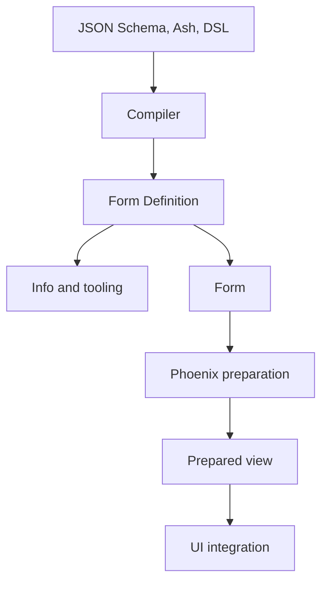

# Form definition

The form definition is the conceptual heart of Formentation.

> A `Formentation.Definition` is an immutable, compiled, source-independent description of every form state that may be presented, before it is combined with a particular user’s values, parameters, errors, or UI renderer.

It is Formentation’s source-neutral intermediate representation: the stable
boundary between declarations such as JSON Schema or Ash metadata and consumers
such as `Form`, Phoenix render preparation, documentation generators, and
compatibility checkers. It contains separate semantic structure and
presentation layout as decided by
[[19-north-star-architecture|the north-star architecture]].

> [!note] Implementation status
> Slice 1 of [[phase-1-walking-skeleton|Phase 1]] implements the core of this note: `Formentation.Definition`, per-kind node structs — `Formentation.Node.Field`, `.Group`, `.Unsupported` ([[18-decisions#D-015 — One struct per node kind|D-015]]), compact origin tags ([[18-decisions#D-003 — Simplified provenance first|D-003]]), `Formentation.Diagnostic`, and the first `Formentation.Info` queries. The rest — decisions with superseded candidates, conditions, capability requirements, indexes, fingerprints — is the target model, and is marked as such below.

## Its position in the system



The compiler answers:

> What form is described by these declarations?

Renderer preparation answers:

> What part of that form should be presented for this particular runtime state?

The UI answers:

> How should that concrete plan become HTML and components?

Those are deliberately different questions.

## The essential character of a form definition

A form definition should be:

* **Static:** It does not change as the user edits the form.
* **Immutable:** Compilation produces a value; later stages derive new values from it.
* **Semantic:** It describes fields, groups, choices, collections, conditions, roles, and relationships—not HTML tags.
* **Source-independent:** Consumers should not need to know whether it originated in JSON Schema, Ash, or another declaration format ([[18-decisions#D-004 — Two declaration sources from the start|D-004]]).
* **Occurrence-aware:** It describes form locations, not merely reusable schema fragments.
* **Introspectable:** Public queries can explain its structure and decisions.
* **Provenance-preserving:** Important facts retain their origins ([[18-decisions#D-003 — Simplified provenance first|D-003]]).
* **Deterministic:** Equivalent declarations and compiler configuration produce equivalent definitions.
* **Versioned:** The representation can evolve deliberately.
* **Potential rather than concrete:** It contains all possible conditional branches and collection templates, not only the currently visible form.

“Static” does not mean “simple.” A definition can describe dynamic behaviour. It contains the rules and possible branches; it does not contain the result of evaluating those rules for current data.

## What it contains

Its contents divide into four conceptual layers.

### 1. The semantic form graph

This is the essential part.

A definition has a root node and a graph of semantic nodes. Candidate node kinds:

| Node kind      | Meaning                                                                                                                          |
| -------------- | -------------------------------------------------------------------------------------------------------------------------------- |
| `:field`       | A scalar value that can be displayed or edited. A scalar `enum`/`const` is a field with a fixed option set, not a choice ([[18-decisions#D-005 — Scalar enums are fields, not choice nodes|D-005]]) |
| `:group`       | An object-like container or a purely presentational grouping — one kind, distinguished by `nests_data?` ([[18-decisions|D-006]]) |
| `:collection`  | A repeated item template or tuple-like sequence                                                                                  |
| `:choice`      | Structural alternatives such as `oneOf` or union selection between subtrees                                                      |
| `:conditional` | Content controlled by a predicate                                                                                                |
| `:content`     | Help text, heading, or other non-input content                                                                                   |
| `:reference`   | A reusable or recursive reference boundary                                                                                       |
| `:custom`      | An extension-defined semantic construct                                                                                          |
| `:unsupported` | A construct preserved for diagnostics or custom handling                                                                         |

Slice 1 implements `:field`, `:group`, and `:unsupported`; collections arrive with Phase 1 milestone B, `:choice` and `:conditional` with [[phase-4-dynamic-schemas|Phase 4]], `:custom` with [[phase-3-extensibility|Phase 3]].

> [!note] One struct per node kind
> Each kind is a separate struct (`Formentation.Node.Field`, `.Group`, `.Unsupported`) rather than one tagged struct — decided as [[18-decisions#D-015 — One struct per node kind|D-015]] once the shared struct filled with kind-only fields. A new kind gets its own struct when its shape differs from the existing kinds.

A node describes form meaning rather than source syntax.

For example, these different sources might all compile to the same semantic field:

```elixir
%Formentation.Node.Field{
  id: "/birth_date",
  name: "birth_date",
  label: "Birth date",
  role: :date,
  widget: :date_input,
  required?: true,
  template_path: %Formentation.TemplatePath{segments: ["birth_date"]},
  origins: [
    role: {:inference, :date_format},
    widget: {:ui_hints, "/birth_date/ui:widget"}
  ]
}
```

One source might have been:

```json
{
  "type": "string",
  "format": "date"
}
```

Another might have been an Ash `:date` attribute. The renderer should not care. (The `format`-derived role arrives with the JSON Schema adapter; the map source declares roles directly or infers them from the scalar kind.)

#### Nodes describe occurrences

For forms, the occurrence of a field is generally more important than the reusable schema fragment from which it came.

Consider an address schema referenced twice:

```text
billing_address → Address
shipping_address → Address
```

The two occurrences may have:

* different labels;
* different UI ordering;
* different visibility;
* different requiredness;
* different Phoenix names;
* different UI overrides.

Therefore, the form graph should normally represent the two form occurrences separately while retaining a shared schema origin or reference target.

Recursive references should remain explicit graph edges rather than being expanded forever.

### 2. Semantic properties and decisions

Nodes contain or reference facts needed to understand their form behaviour.

Examples include:

* value kind;
* semantic role;
* presence and cardinality;
* nullability or absence policy;
* labels and descriptions;
* collection item templates;
* ordering;
* read-only or disabled semantics;
* abstract [[20-renderer-ui-model#Widget resolution|widget key]] preference —
  never a concrete component;
* codec identity;
* constraints useful to interaction;
* choice alternatives;
* conditions and their dependencies;
* validation reference;
* extension metadata.

Some of these are facts; others are decisions.

Formentation should retain important decisions explicitly:

```elixir
%Formentation.Decision{
  key: :widget,
  value: :date_input,
  source: origin_of_ui_override,
  superseded: [
    {:text_input, origin_of_string_default}
  ]
}
```

This permits Formentation to answer:

> Why is this rendered as a date input?

rather than merely returning `:date_input`.

> [!note] Implementation status
> This is the target model. Slice 1 records only the winning value plus a compact origin tag such as `{:ui_hints, "/birth_date/ui:widget"}` on the node's `origins` list; superseded candidates and derivation chains arrive with [[phase-2-compiler-diagnostics|Phase 2]]. See [[18-decisions#D-003 — Simplified provenance first|D-003]].

#### Constraints in the definition

The definition should contain normalized constraints useful to form semantics and presentation:

* minimum and maximum;
* string length;
* required presence;
* enum choices;
* collection size;
* read-only state;
* format-derived semantic role.

Slice 1 carries these as the node's `required?`, `options`, and `constraints` fields (`:min`, `:max`, `:min_length`, `:max_length`).

But the definition should not become a second JSON Schema validator.

The authoritative validation semantics remain with the validator or backing form engine. Nodes should carry a `validation_ref` or equivalent link to the authoritative compiled validator artifact (target — this arrives with the JSON Schema adapter and validator integration).

This distinction is important:

```text
Normalized constraint in Form Definition
    → supports introspection, HTML hints and presentation

Authoritative validation artifact
    → determines whether submitted data is valid
```

For example, an HTML `pattern` attribute may be derived when safe, but server-side schema validation remains authoritative.

### 3. Origins, dependencies, and requirements

A definition must explain how its semantic graph was produced.

#### Origins

Slice 1 stamps every resolved value with one of four compact origin tags ([[18-decisions#D-003 — Simplified provenance first|D-003]]):

```text
{:map_source, path}    {:json_schema, pointer}
{:ui_hints, pointer}   {:inference, rule_name}
```

The full origin model may additionally identify:

* a JSON Schema document and pointer;
* a UI-hints document and pointer;
* an Ash resource, action, and attribute;
* an Elixir module, file, and line;
* a named inference rule;
* an extension;
* a source-neutral presentation or UI default, with its owning phase recorded;
* a call-site override.

Origins can then form derivation chains ([[phase-2-compiler-diagnostics|Phase 2]]):

```text
JSON Schema format "date"
    → inference rule :date_format
    → semantic role :date
    → UI rule :default_date_widget
    → widget :date_input
```

#### Dependencies

Dynamic nodes should declare the data paths that can affect them (target — conditions arrive with [[phase-4-dynamic-schemas|Phase 4]]):

```elixir
%Formentation.Condition{
  expression: {:equals, ["country"], "DE"},
  dependencies: MapSet.new([["country"]])
}
```

Dependencies enable:

* correct condition evaluation;
* explanation of visibility;
* dependency diagrams;
* eventually, partial LiveView reprojection.

#### Capability requirements

The definition should record source-neutral semantic/presentation requirements
a consumer may need to support (target—support reports arrive with
[[phase-2-compiler-diagnostics|Phase 2]], UI contracts with
[[phase-3-extensibility|Phase 3]]):

```elixir
%Formentation.Requirements{
  node_kinds: MapSet.new([:field, :group, :collection]),
  roles: MapSet.new([:text, :date, :money]),
  widgets: MapSet.new([:date_input]),
  features: MapSet.new([:add_remove, :conditional_visibility])
}
```

This permits compatibility checking before template execution.

### 4. Derived indexes and compilation information

A practical definition needs efficient indexes:

* node by stable ID;
* node by template path;
* node by instance path;
* nodes by schema origin;
* dependencies by affected path;
* fields in presentation order;
* required capabilities;
* diagnostics by node or source;
* origin and decision tables.

It should also carry:

* definition format version;
* compiler version;
* deterministic fingerprint;
* source adapter identity;
* dialect or source versions;
* extension identities;
* compiler warnings;
* namespaced adapter artifacts.

The implemented outer shape today is deliberately smaller — `root` holds the node tree directly and is always present:

```elixir
%Formentation.Definition{
  format_version: 2,
  root: %Formentation.Node.Group{...},
  diagnostics: [%Formentation.Diagnostic{...}],
  validation: %Formentation.Definition.ValidationPlan{} | nil
}
```

Slice 1 keeps no derived indexes; `Formentation.Info` walks the node tree. Indexes, fingerprints, and caching arrive with [[phase-2-compiler-diagnostics|Phase 2]]. A possible target outer shape is:

```elixir
%Formentation.Definition{
  format_version: 1,
  id: "person-form",
  fingerprint: "...",

  root: node_id,
  nodes: %{node_id => node},

  sources: %{},
  origins: %{},
  decisions: %{},

  indexes: %Formentation.Indexes{},
  dependencies: %{},
  requirements: %Formentation.Requirements{},

  diagnostics: [],
  extensions: [],
  artifacts: %{}
}
```

This is illustrative, not an API commitment.

## What it does not contain

Preventing `Formentation.Definition` from becoming a god object is as important as deciding what it contains.

| Does not belong in `Formentation.Definition` | Belongs in                      |
| -------------------------------------------- | ------------------------------- |
| Current field values                         | Form state                      |
| Raw submitted parameters                     | Form state                      |
| Validation errors for the current submission | Form state/issues               |
| Touched or submitted status                  | Form state                      |
| Active conditional branch                    | `Form`/prepared view            |
| Concrete collection items                    | `Form` and prepared view        |
| Collection item runtime identity             | Form state                      |
| Phoenix form names                           | Phoenix renderer preparation    |
| DOM IDs                                      | Prepared view/renderer          |
| CSS classes                                  | UI integration/theme            |
| Phoenix components                           | UI integration                  |
| Translated issue strings                     | Renderer preparation            |
| LiveView event state                         | LiveView/state engine           |
| Persistence or submission workflow           | Backing form engine/application |
| Authorization guarantees                     | Application/Ash action          |
| Complete validation implementation           | Validator/backing engine        |

A definition may contain a rule saying a branch is visible when `country == "DE"`. It does not contain whether that branch is currently visible.

It may contain a collection item template. It does not contain the current three collection items.

It may require a `:money_input` widget. It does not contain the Phoenix component that renders it.

## The role of `Formentation.Definition`

### It is the compiler’s product

The compiler’s primary responsibility is to produce a valid definition (the `Formentation.Definition.Source` adapter contract — [[18-decisions#D-004 — Two declaration sources from the start|D-004]]):

```elixir
{:ok, definition, diagnostics} | {:error, diagnostics}
```

This gives compilation a concrete completion criterion. It is not merely preprocessing for a renderer.

### It is the system’s common language

Source adapters translate into it. `Form` consumes its semantics. Renderers
prepare concrete views from it. UI integrations consume those views. Tooling
queries it.

That prevents a proliferation of direct integrations:

```text
JSON Schema → Tailwind renderer
JSON Schema → Bootstrap renderer
Ash → Tailwind renderer
Ash → Bootstrap renderer
```

Instead:

```text
Sources → Formentation.Definition → Form/render preparation → UI integrations
```

Adding another source does not require changing every renderer. Adding another renderer does not require learning every source language.

### It is the stable architectural boundary

Most internal source-processing details can change without affecting renderers, provided the definition and `Info` contracts remain compatible (see [[04-architecture|Architecture]]).

Similarly, a renderer can be replaced without recompiling the source into a different conceptual representation.

### It centralizes interpretation

Without a definition, different consumers may independently interpret the same declaration:

* renderer decides field order;
* error mapper independently derives paths;
* documentation generator independently derives labels;
* accessibility checker independently decides node roles.

Those interpretations will eventually diverge.

With a definition, the compiler makes those semantic decisions once and records why.

## What this abstraction enables

### Multiple declaration sources

The same semantic definition can be produced from ([[18-decisions#D-004 — Two declaration sources from the start|D-004]]):

* JSON Schema and UI hints;
* Ash resources and actions;
* an Elixir builder;
* a Spark DSL;
* an application form manifest;
* possibly OpenAPI or another schema language.

Sources do not have to be semantically identical. Their adapters translate the form-relevant meaning they possess.

### Multiple state engines

A definition can be combined with:

* Formentation’s JSON-backed state;
* `Ecto.Changeset`;
* `AshPhoenix.Form`;
* another `Phoenix.HTML.FormData` implementation;
* a read-only data view.

This is why state is kept outside the definition. See [[07-phoenix-integration|Phoenix integration]].

### Multiple renderers and UI integrations

The same definition can drive:

* plain accessible Phoenix components;
* Tailwind;
* Bootstrap;
* a design-system component library;
* a read-only summary;
* potentially a non-HTML renderer.

The semantic role `:date` survives even if one renderer uses a native date input and another uses a JavaScript date-picker component.

### Static verification

Before there is any submitted data, Formentation can detect:

* UI configuration targeting nonexistent fields;
* incompatible widget requests;
* unsupported semantic nodes;
* missing renderer capabilities;
* contradictory overrides;
* invalid extension configuration;
* unsafe remote-reference policy;
* inaccessible component mappings.

### Explainability

Because decisions and origins are retained, development tools can answer (see [[09-diagnostics-provenance-introspection|Diagnostics, provenance, and introspection]]):

* Why is this field required?
* Why is this field a select?
* Which source declaration created it?
* Which UI override replaced its default?
* Which paths control its visibility?
* Why can this renderer not display it?

### Derivation

A definition can generate:

* a default UI-hints document;
* a form outline;
* documentation;
* a support matrix;
* an accessibility report;
* a dependency graph;
* a renderer compatibility report;
* test fixture descriptions;
* eventually, definition diffs and migrations.

### Caching

Compilation may involve reference resolution, normalization, inference, and verification. A deterministic definition can be fingerprinted and cached independently of current form interactions.

### Better testing

Compiler tests can assert semantic/presentation definitions. Preparation tests
can use fake state. UI tests can consume fixed prepared views. See
[[11-testing-strategy|Testing strategy]].

This avoids requiring every test to begin with JSON Schema and end with a complete HTML snapshot.

## A useful membership test

When deciding whether something belongs in the form definition, ask:

1. Is it derived from declarations rather than the current interaction?
2. Is it stable while the user edits the form?
3. Is it meaningful to more than one possible consumer?
4. Is it needed for inspection, projection, verification, or derivation?
5. Can it be represented without committing to a particular renderer or state engine?

If yes, it probably belongs in the definition.

If it depends on current values, it probably belongs in `Form` or the prepared
view.

If it describes HTML or concrete components, it belongs in the UI integration.
If it describes visual styling, it belongs in that UI's theme/configuration.

If it determines authoritative validity or persistence, it belongs in the validator or backing form engine.

## The shortest useful formulation

The module documentation should eventually read:

> `Formentation.Definition` is the compiled, source-neutral model of a form. It
> contains separate semantic structure and presentation layout plus
> constraints, dependencies, origins, and requirements. It contains no current
> user data, concrete component, or renderer-specific output. Introspection
> tools query it; `Form` and renderer preparation combine it with one
> interaction to produce a concrete
> [[20-renderer-ui-model#Prepared view|prepared view]].

Or, even more compactly:

> A form definition describes what a form can mean and how it may be laid out;
> `Form` records one interaction, and a prepared view describes what one
> renderer/UI needs to output now.

That distinction is the heart of Formentation.

## Related notes

- [[03-conceptual-model|Conceptual model]]
- [[04-architecture|Architecture]]
- [[06-runtime-projection|Runtime projection]]
- [[20-renderer-ui-model|Renderer and UI model]]
- [[09-diagnostics-provenance-introspection|Diagnostics, provenance, and introspection]]
- [[16-open-questions|Open questions]]
- [[18-decisions|Decision log]]
- [[phase-1-walking-skeleton|Phase 1 — Walking skeleton]]
- [[Formentation|Back to the entry point]]
