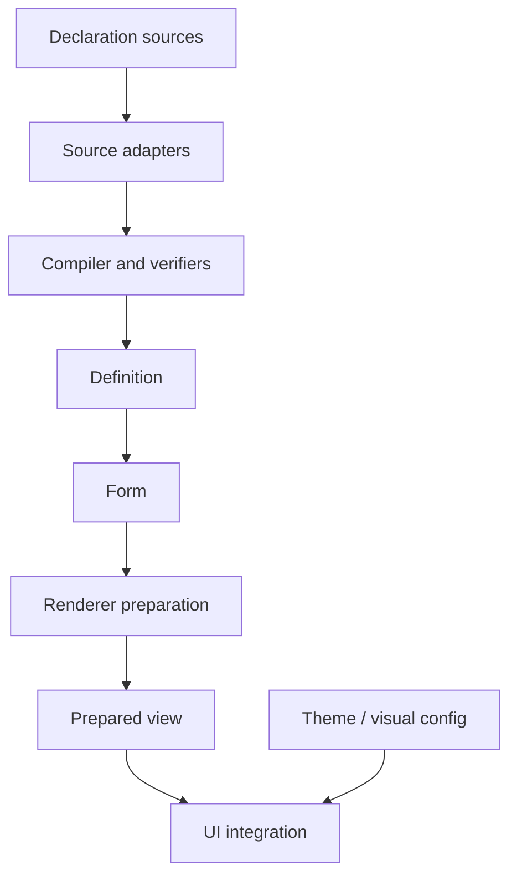

# Architecture

Formentation is best understood as a compiler plus runtime form and rendering
system, with adapters at the source, state, renderer, and UI boundaries.



## Architectural layers

### Source adapters

Source adapters know the vocabulary and location system of their source. The JSON Schema adapter understands dialects, references, schema locations, annotations, and validation keywords. The plain Elixir data source lives in core with no dependencies and doubles as the reference adapter and cheapest fixture format ([[18-decisions#D-004 — Two declaration sources from the start|D-004]]). A future Ash adapter would use Ash introspection APIs.

Source adapters should not render components or implement LiveView events.

Candidate behaviour:

```elixir
@callback load(source :: term(), options :: keyword()) ::
  {:ok, Formentation.Compiler.Input.t()}
  | {:error, [Formentation.Diagnostic.t()]}
```

Remote I/O belongs behind an explicit resolver/loader abstraction so that compilation can otherwise remain deterministic.

### Compiler

The compiler normalizes declarations into semantic nodes, applies named transformations, resolves configuration precedence, and builds indexes. It returns a versioned definition and warnings or structured errors.

```elixir
Formentation.compile(source,
  adapter: :json_schema,
  ui: ui_schema,
  extensions: [...]
)
```

A reusable definition does not require a renderer or UI. Optional
target-specific support inspection may add a report but must never change
compiled semantics—otherwise the same declaration would produce different
definitions per UI.

See [[05-compiler-pipeline|Compiler pipeline]].

### Verifiers

Verifiers inspect the compiled definition without mutating it. They check cross-node invariants, source/UI compatibility, renderer support, unique identities, and extension requirements.

This separation is inspired by [Spark transformers](https://hexdocs.pm/spark/Spark.Dsl.Transformer.html) and [Spark verifiers](https://hexdocs.pm/spark/Spark.Dsl.Verifier.html).

### Definition and Info API

The definition is the project's durable in-memory product, examined in depth in [[031-form-definition|Form definition]]. `Formentation.Info` provides stable queries while allowing internal representation to evolve.

Definitions should include a format version and a deterministic fingerprint. Persistence or serialization can be considered later; do not promise safe long-term serialization before module references and extension metadata are understood.

### Form and advanced state view

`Formentation.Form` is the ordinary runtime object and owns or wraps values,
parameters, decoding, issues, usage, blockers, and backing state. Phoenix
projects it through `FormData`.

The permanent advanced path accepts an arbitrary `%Phoenix.HTML.Form{}` plus an
explicit definition and the smallest state-view interface render preparation
actually needs.

### Render preparation

Renderer preparation evaluates runtime conditions, selects active alternatives,
materializes collection items, maps instance paths to form fields, resolves
widgets/capabilities, derives transport and localized presentation facts, and
produces a prepared view.

Preparation does not emit HEEx and does not mutate submitted data merely
because a field is hidden. The current `Formentation.Phoenix.Projector` and
`Render.Plan` are Phase 1 implementation names. See
[[06-runtime-projection|Runtime projection]].

### Renderer, UI, and theme

The Phoenix renderer prepares Phoenix bindings and transport facts. A UI
integration maps the prepared view to concrete components and markup. A theme
configures the visual appearance of one UI. Renderer and UI capabilities are
checked by optional support inspection or concrete runtime preparation.

See [[20-renderer-ui-model|Renderer and UI model]] and
[[08-extension-model#Renderer and UI capabilities|Renderer and UI capabilities]].

## Package boundaries

The conceptual packages are:

| Package or namespace | Responsibility |
| --- | --- |
| `formentation` | Definition, compiler contracts, introspection, diagnostics, projection concepts. |
| `formentation_json_schema` | JSON Schema source adapter and validator integration. |
| `formentation_phoenix` | `FormData` support, Phoenix preparation, reference UI/components, LiveView helpers. |
| `formentation_ash` | Ash declaration and `AshPhoenix.Form` integration. |

These should begin as namespaces in one repository unless independent release cycles or dependency graphs become painful. Prematurely publishing four Hex packages would increase maintenance without proving the boundaries.

The core must not depend on Phoenix. The JSON Schema adapter must not depend on Ash. The Phoenix package may depend on core and optionally expose integrations without requiring Ash.

## Compile-time versus runtime

Schemas can be known at compile time, application startup, or request time. The architecture should support all three without forcing one.

- **Compile time:** fast runtime and early diagnostics, but remote sources and dynamic configuration are awkward.
- **Startup:** good for application-owned schemas and cache warming.
- **Request time:** necessary for tenant/user-provided schemas, but requires budgets, caching, and safe failure handling.

The compiler API should therefore be an ordinary runtime function. An optional macro or Spark DSL may invoke it at compile time later.

## Cache boundaries

Cache the static definition using a fingerprint of:

- canonicalized declaration inputs;
- source adapter and supported dialect;
- compiler version;
- extension identities and relevant options;
- selected capability contract, if renderer-specific verification is included.

Do not cache prepared views globally: they contain runtime values, active
branches, concrete collection identity, locale, UI selection, and overrides.

## Failure boundaries

The system should distinguish:

1. source loading and reference resolution failures;
2. invalid declaration failures;
3. unsupported but valid declaration diagnostics;
4. runtime decoding failures;
5. submitted-instance validation issues;
6. renderer capability failures;
7. unexpected internal failures.

See [[09-diagnostics-provenance-introspection|Diagnostics, provenance, and introspection]].

## Architectural invariants

- Rendering never changes validation meaning.
- Validation never chooses visual components.
- Projection never destroys hidden data by default.
- Every rendered input maps to a semantic node and runtime field path.
- Every externally visible compiler decision is explainable.
- Every extension participates through declared contracts and capabilities.
- Source-specific paths do not leak as the only path representation.

## Related notes

- [[03-conceptual-model|Conceptual model]]
- [[031-form-definition|Form definition]]
- [[05-compiler-pipeline|Compiler pipeline]]
- [[06-runtime-projection|Runtime projection]]
- [[07-phoenix-integration|Phoenix integration]]
- [[10-algorithms|Algorithms and invariants]]
- [[Formentation|Back to the entry point]]
