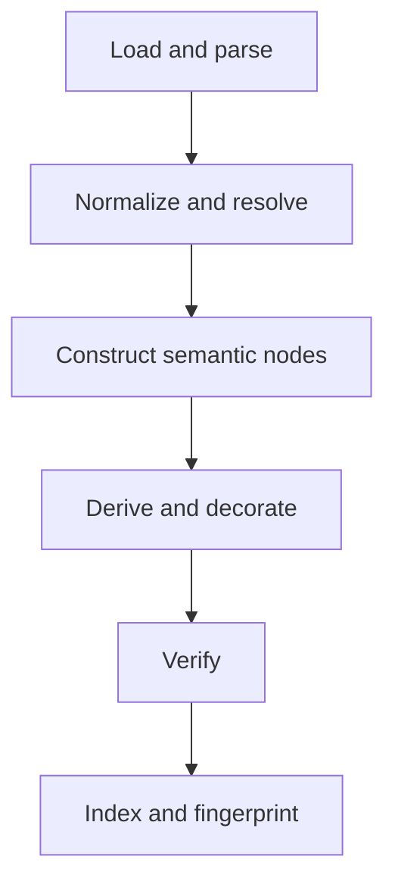

# Compiler pipeline

The compiler turns source-specific declarations into a static [[03-conceptual-model#Form definition|form definition]]. It performs expensive and declaration-dependent work once, leaving current-value decisions to [[06-runtime-projection|runtime projection]].

## Contract

A useful high-level result shape is:

```elixir
@spec compile(term(), keyword()) ::
  {:ok, Formentation.Definition.t(), [Formentation.Diagnostic.t()]}
  | {:error, [Formentation.Diagnostic.t()]}
```

Warnings are successful output because a valid schema may contain annotations or rendering constructs that are not fully supported. Strict mode can promote selected warning classes to errors.

## Pipeline



### Load and parse

Responsibilities:

- identify the source adapter and declaration dialect;
- load local or remote documents through an explicit policy;
- parse source data without losing source identity;
- validate UI-hints syntax;
- establish resource limits before recursive work.

Remote reference fetching should be disabled by default or constrained by an allow-list, timeout, byte limit, and cache. Runtime-provided schemas are untrusted input even when the form values themselves are harmless.

### Normalize and resolve

Responsibilities:

- normalize source booleans and equivalent shorthand forms;
- establish canonical document URIs and schema locations;
- build a reference registry;
- resolve references while preserving reference boundaries and cycles;
- record dialect and vocabulary capabilities.

Resolution should build a graph, not blindly expand references into a tree. Recursive schemas otherwise expand forever and repeated definitions waste memory.

The chosen validation library should remain the authority for JSON Schema reference and validation semantics. The form compiler may maintain its own navigable graph, but it should not disagree about resolution.

### Construct semantic nodes

The source adapter maps schema constructs to source-independent nodes. Examples:

- object properties become child nodes in a group;
- primitive types become fields with semantic value kinds;
- enum/const constraints become choices or fixed values;
- array items become collection templates;
- annotations become labels, descriptions, examples, and initial presentation hints;
- composition and conditions remain explicit nodes or predicates.

Avoid mapping directly to HTML controls. `format: "date"` should first derive semantic role `:date`; a renderer later maps `:date` to a component.

### Derive and decorate

Named compiler passes add information that follows from existing declarations:

- field roles and codecs;
- abstract widget defaults;
- HTML-compatible constraints;
- dependency sets for dynamic nodes;
- generated UI-hint defaults;
- layouts and groups from explicit UI configuration;
- extension-owned metadata.

Precedence should be explicit. A reasonable starting order is:

1. schema meaning and annotations;
2. named inference rules;
3. theme defaults, if theme-aware compilation is requested — whether themes should influence compilation at all is [[16-open-questions#Rendering|an open question]]; if they do, theme identity must join the fingerprint and the definition loses some presentation-independence;
4. explicit UI hints;
5. call-site overrides.

Resolved choices should retain [[03-conceptual-model#Decision|decision]] and [[03-conceptual-model#Origin|origin]] information.

### Verify

Verifiers are read-only. They check:

- node and path uniqueness;
- valid parent/child relationships;
- UI-hint paths that do not exist;
- widget-role compatibility;
- renderer capabilities;
- unresolved or forbidden references;
- recursion and depth policy;
- conflicting overrides;
- required extension availability;
- accessibility requirements that can be checked statically.

A verifier should return diagnostics, not silently repair the model. Repair belongs in a named transformer so that it can be explained and tested.

### Index and fingerprint

The finalizer creates indexes by node ID, schema location, instance template path, and extension-specific keys. It stores dependency information and computes a deterministic fingerprint.

Indexes are derived data. Tests should prove that rebuilding them from the node graph produces equivalent results.

## Pass model

Compiler passes need a stable name, phase, declared ordering constraints, and capability metadata:

```elixir
@callback name() :: atom()
@callback phase() :: :normalize | :derive | :decorate | :finalize
@callback before() :: [module()]
@callback after() :: [module()]
@callback transform(Definition.t(), Context.t()) :: pass_result()
```

Do not copy the entire Spark DSL state API initially. A small immutable definition plus context is sufficient. If pass interactions become complex, [Spark's transformer ordering](https://hexdocs.pm/spark/Spark.Dsl.Transformer.html) is useful prior art.

Pass ordering can be calculated with a topological sort. Cycles are compiler-configuration errors with diagnostics naming the involved passes.

## Compile context

The context should carry inputs that affect compilation but do not belong in the semantic result:

```elixir
%Formentation.Compiler.Context{
  mode: :strict,
  adapter: Formentation.JSONSchema,
  validator: Formentation.Validator.JSV,
  extensions: [],
  capabilities: nil,
  budgets: %Formentation.Budgets{},
  locale: nil
}
```

Locale should affect compilation only if labels are intentionally localized at compile time. Prefer retaining translatable message identifiers where possible.

## Idempotence and determinism

Not every pass is mathematically idempotent, but repeated compilation must not duplicate nodes or compound defaults. Given equivalent canonical inputs and compiler configuration, output and fingerprint must be deterministic.

Avoid timestamps, random identifiers, process-dependent enumeration, and anonymous functions in fingerprinted data.

## What does not belong in compilation

- current field values;
- deciding the active `oneOf` branch for a particular submission;
- collection item indexes or DOM IDs;
- translated user-input error messages;
- LiveView authorization that can change between users;
- destructive application of JSON Schema `default` annotations.

## Related notes

- [[04-architecture|Architecture]]
- [[06-runtime-projection|Runtime projection]]
- [[08-extension-model|Extension model]]
- [[09-diagnostics-provenance-introspection|Diagnostics and provenance]]
- [[10-algorithms#Pass ordering|Pass ordering algorithm]]
- [[phase-2-compiler-diagnostics|Phase 2]]

