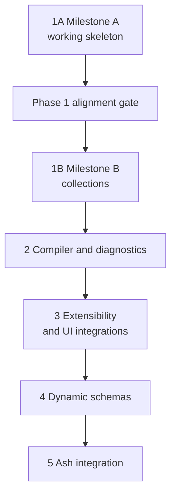

# Roadmap

The roadmap is organized as vertical capabilities, not only internal layers. Each phase should leave a demonstrable, tested result and a clean stopping point. Phase 1 merges the formerly separate foundation and Phoenix-runtime phases into a single walking skeleton — see [[18-decisions#D-002 — Phase 1 is a walking skeleton|D-002]].

The working Milestone A proved the behaviour before the public architecture was
frozen. Before Milestone B collections, Phase 1 therefore passes through
[[phase-1-north-star-alignment|the north-star alignment gate]]. The gate aligns
the implementation with
[[19-north-star-architecture|the two-noun `Definition`/`Form` model]]; it is not
a separate product phase.

The alignment work also preserves the boundary described in
[[20-renderer-ui-model|the renderer and UI model]]. It does not implement UI
selection or capabilities yet: it ensures that presentation remains
UI-independent and that the reference components do not become an accidental
extension contract before Phase 3.

> [!warning] Later phases are sketches
> The notes for Phases 2–5 are written before any implementation exists. They record direction and known hazards, not commitments; expect Phase 1 experience to revise them. Resist the sunk-cost pull of their polish.

## Phase summary

| Phase | Primary risk retired | Demonstrable result |
| --- | --- | --- |
| [[phase-1-walking-skeleton\|1 — Walking skeleton]] | Whether a source-independent definition is real (two sources) and composes with Phoenix state, components, and LiveView. | An expert-defined payload form from [[00-use-case\|the use case]] compiles from JSON Schema *and* plain Elixir data, renders, validates, and submits; collections complete the use case. |
| [[phase-1-north-star-alignment\|Phase 1 alignment gate]] | Whether Milestone A can adopt the intended public model and split semantic/presentation definition without losing proven behaviour. | `Definition` and `Form` are the ordinary concepts; both adapters emit split definitions; a Phoenix form projected from `Form` renders without a duplicate definition assign; collections can begin on that foundation. |
| [[phase-2-compiler-diagnostics\|2 — Compiler and diagnostics]] | Whether complexity can grow without opaque passes and errors. | Ordered passes, verifiers, full provenance, explanation, support reports, and caching. |
| [[phase-3-extensibility\|3 — Extensibility and UI integrations]] | Whether applications, definition adapters, and UI libraries can extend the system without compiler, transport, or preparation forks. | A separately compiling second editable UI, read-only review rendering, public transport/accessibility conformance, an advanced interactive widget, resource/performance evidence, and a custom semantic role/widget implemented externally. |
| [[phase-4-dynamic-schemas\|4 — Dynamic schemas]] | Whether composition and conditional behaviour can remain correct during editing. | `oneOf` and conditional fields react to data while preserving state and errors. |
| [[phase-5-ash-integration\|5 — Ash integration]] | Whether definition, state, and renderer are genuinely decoupled. | Render an `AshPhoenix.Form` and derive useful definitions from Ash metadata. |

## Dependency direction

Phase numbers indicate implementation order, not mandatory package dependencies. In particular:

- the definition never depends on Phoenix form state;
- semantic structure does not depend on presentation layout;
- JSON-backed state is not required by an Ash-backed renderer;
- dynamic condition AST work can begin earlier if a real use case demands it;
- Ash exploration can run as a spike before Phase 5, but production integration waits for stable boundaries.

## Release ideas

- `0.1` after aligned Phase 1 Milestone A: first end-to-end Phoenix forms through the intended `Definition`/`Form` public model.
- `0.2` after Phase 1 Milestone B: collections; the [[00-use-case|use case]] becomes servable.
- `0.3` after Phase 2: structured compiler API suitable for broader experimentation.
- `0.4` after Phase 3: supported third-party extension, prepared-view, and UI
  integration contracts.
- `0.5` after Phase 4: dynamic/compositional schema preview.
- `0.6` after Phase 5: optional Ash integration.
- `1.0` only after the supported feature matrix, compatibility promises, migration story, and extension contracts have real users.

These numbers are illustrative. Do not let a version scheme force incomplete features into a release.

## Cross-cutting work in every phase

- maintain the feature/support matrix;
- add minimal regression fixtures;
- document unsupported behaviour;
- preserve source origins;
- update `Info` rather than encouraging internal pattern matching;
- preserve semantic behaviour across presentation and UI changes;
- treat rendered control shape as a tested transport contract;
- keep raw edit values distinct from localized display values;
- review security budgets and escaping;
- benchmark only after correctness is established;
- keep the entry note, roadmap links, and [[18-decisions|decision log]] current.

## Scope control

Before accepting a feature, ask:

1. Does it serve [[00-use-case|the motivating use case]] or a recorded second use case?
2. Is it source semantics, form semantics, state behaviour, projection, or rendering?
3. Can it be expressed through an existing boundary?
4. Does it belong in the current phase's risk?
5. Can unsupported behaviour be diagnosed until a later phase?
6. Does it create an API commitment before a second implementation proves the seam?

## Phase documents

- [[phase-1-walking-skeleton|Phase 1 — Walking skeleton]]
- [[phase-1-north-star-alignment|Phase 1 — North-star alignment]]
- [[phase-2-compiler-diagnostics|Phase 2 — Compiler pipeline and diagnostics]]
- [[phase-3-extensibility|Phase 3 — Extensibility and UI integrations]]
- [[phase-4-dynamic-schemas|Phase 4 — Dynamic and compositional schemas]]
- [[phase-5-ash-integration|Phase 5 — Ash integration and optional declarative DSL]]

## Related notes

- [[00-use-case|Motivating use case]]
- [[19-north-star-architecture|North-star architecture]]
- [[20-renderer-ui-model|Renderer and UI model]]
- [[18-decisions|Decision log]]
- [[11-testing-strategy|Testing strategy]]
- [[16-open-questions|Open questions]]
- [[Formentation|Back to the entry point]]
