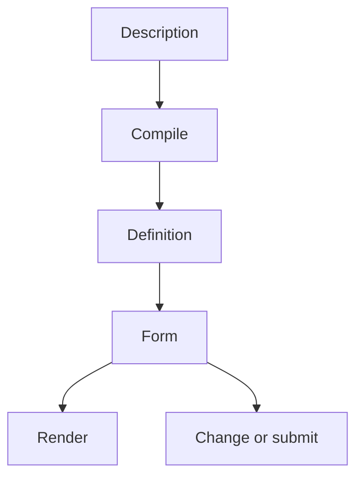

# North-star architecture

This note defines the intended public model and the architectural direction for
Formentation before `0.1.0`.

> [!important] Architectural authority
> This note and
> [[18-decisions#D-029 — Definition and Form are the ordinary public model|D-029]]
> supersede older forward-looking descriptions where they conflict. The
> [[Techdocs|technical documentation]] and [[Userguide|user guide]] continue to
> describe the implementation that exists today. They change only when the
> corresponding implementation changes land.

The north star is:

> Formentation compiles a description into a `Definition`; a `Form` executes
> that definition through user interaction; renderers read the `Form`.

That sentence should be sufficient to explain ordinary use. Compiler passes,
source adapters, state adapters, Phoenix form projections, prepared views, and
UI integrations remain available through progressive disclosure, but they are
not additional mandatory stages in the user's mental model.

## Why this model

Formentation's current implementation has already discovered much of the hard
behaviour:

- static form meaning must remain separate from interaction state;
- raw transport input must remain separate from decoded operations;
- authoritative validation belongs to the source or backing state engine;
- touched/used state affects visibility but not whether issues exist;
- unsupported and read-only values must be preserved honestly;
- rendering must not interpret source-specific declarations;
- paths, diagnostics, provenance, and capability limits must remain explicit.

Those distinctions are the project's value. The problem is not that the
internals have structure; it is that ordinary users currently have to see too
much of that structure and that the current definition tree mixes two different
questions:

1. What data and behaviour does this form describe?
2. How should its controls be arranged?

The conflation is already observable. A map-source declaration may declare
properties in the order `["a", "c"]` while a presentation group lists them as
`["c", "a"]`. The current compiler physically reorders the mixed tree to satisfy
the group, so `Info.fields/1` returns presentation order even though it claims
to return declaration order. A UI hint therefore changes a semantic query.
That is an architectural contradiction, not merely an implementation
inconvenience.

The north-star architecture preserves the correctness machinery while giving
users a small, idiomatic Elixir surface.

## The ordinary model

Ordinary application code should encounter two values.

### `Formentation.Definition`

A `Definition` is an immutable, compiled, source-independent description of a
form. It owns static meaning:

- semantic data structure;
- presentation layout;
- normalized constraints and roles;
- decoding participation and preservation rules;
- authoritative validation linkage;
- diagnostics and origins;
- later, dependencies and capability requirements.

It contains no current values, raw parameters, issues for a particular
interaction, Phoenix names, or DOM identifiers.

### `Formentation.Form`

A `Form` is the runtime context for one interaction. It owns or wraps:

- its `Definition`;
- original and current candidate data;
- raw transport facts;
- decoded operations;
- issues and submission blockers;
- action and usage state;
- any backing state and state adapter required by a non-native integration.

A user should not need to pass a definition beside its form in the common path.
The form provides access to the definition it executes.



## Target lifecycle

The explicit path remains useful when a definition is compiled once and reused:

```elixir
{:ok, definition} = Formentation.compile(source, adapter: :map)

form =
  definition
  |> Formentation.Form.new(existing_data)
  |> Formentation.Form.validate(params)
```

A convenience façade may combine compilation and initialization:

```elixir
{:ok, form} =
  Formentation.form(source,
    adapter: :map,
    data: existing_data
  )
```

Submission should expose the application decision without requiring ordinary
users to interpret a transport envelope or internal status lattice:

```elixir
case Formentation.Form.submit(form, params) do
  {:ok, candidate, form} ->
    save(candidate)

  {:error, form} ->
    {:noreply, assign(socket, form: form)}
end
```

The tuple shape is intentionally exact: success is `{:ok, candidate,
submitted_form}` and redisplay is `{:error, submitted_form}`. The existing
`new` and `validate` operations remain ordinary form-returning operations,
and submission exposes the application decision directly.
`validate` deliberately keeps Phoenix's conventional `phx-change="validate"`
vocabulary. Lower-level transition and parameter-envelope APIs may remain as
advanced interfaces.

## Definition separates semantics from presentation

The `Definition` has two source-neutral structures.

```text
Definition
├── semantic structure
│   ├── object
│   ├── field
│   ├── collection
│   ├── choice
│   └── unsupported
└── presentation layout
    ├── field reference
    ├── object reference
    ├── group
    └── later layout primitives
```

The semantic structure answers:

- What data exists?
- How is it nested?
- What is its type and role?
- How is it decoded?
- Which values participate in submission?
- Which values must be preserved?
- What is required?
- Which constraints and validation references apply?

The presentation layout answers:

- Which semantic fields are shown?
- In what order are they shown?
- Which fields appear together?
- Which label, help, and abstract widget preference applies?
- Which presentation-only containers surround them?

### Ownership

The migration assignment below is exhaustive over the current
`Node.Field`/`Node.Group` representation. No current property may disappear
without being assigned or explicitly eliminated.

| Current property | Target ownership | Migration rule |
| --- | --- | --- |
| `Node.Field.id` | Semantic | Becomes semantic occurrence identity. A layout node has a distinct layout identity and refers to the semantic occurrence. |
| `Node.Field.name` | Semantic | Remains the data key within its semantic parent. |
| `Node.Field.value_type` | Semantic | Remains the normalized scalar type. |
| `Node.Field.role` | Semantic | Remains source-neutral semantic meaning. |
| `Node.Field.required?` | Semantic | Remains a data/validation fact. |
| `Node.Field.constraints` | Semantic | Remain normalized semantic constraints. |
| `Node.Field.options` | Semantic | Remain the allowed scalar values; later display labels may be presentation metadata. |
| `Node.Field.default` | Semantic | Remains a source annotation affecting initialization semantics. |
| `Node.Field.examples` | Semantic | Remain source annotations; a layout or UI may choose whether to expose them. |
| `Node.Field.read_only?` | Semantic | Remains submission participation and preservation policy, not styling. |
| `Node.Field.template_path` | Semantic | Remains the semantic occurrence path. Layout references do not redefine it. |
| `Node.Field.label` | Presentation | Moves to the layout reference or its presentation metadata. |
| `Node.Field.help` | Presentation | Moves to the layout reference or its presentation metadata. |
| `Node.Field.widget` | Presentation | Remains trusted, abstract widget intent, not a component reference. |
| `Node.Field.hidden?` | Presentation | Becomes hidden-control intent; it does not change semantic participation. |
| `Node.Field.group` | Eliminated | Group membership is represented by layout containment, never stamped onto a semantic field. |
| `Node.Field.origins` | Split by fact | Each semantic or presentation fact keeps the origin that explains it. |
| `Node.Group.id` | Split by node kind | Data objects receive semantic identity; presentation groups receive a distinct layout identity namespace. |
| `Node.Group.name` | Split by node kind | A data-object name is semantic. A presentation group has only layout identity/metadata and contributes no data name. |
| `Node.Group.required?` | Semantic for data objects | Remains object requiredness. It has no meaning on a presentation-only group. |
| `Node.Group.template_path` | Semantic for data objects | Becomes the semantic object path. Presentation groups use a distinct layout-local path or identity if one is needed. |
| `Node.Group.label` | Presentation | Moves to object-reference or group presentation metadata. |
| `Node.Group.help` | Presentation | Moves to object-reference or group presentation metadata. |
| `Node.Group.nests_data?` | Eliminated | Separate semantic object and presentation group types make the discriminator unnecessary. |
| `Node.Group.children` | Split by node kind | A semantic object contains semantic children; a layout container contains layout children/references. No mixed child list remains. |
| `Node.Group.origins` | Split by fact | Semantic-object and presentation-group facts retain their respective origins. |
| `Definition.validation` | Semantic/runtime linkage | Remains the source-neutral authoritative validation plan for the semantic instance. |
| `Definition.diagnostics` | Definition-level | Remain structured compilation results; related origins point to the owning facts. |
| `Definition.format_version` | Definition-level | Bumps when the stored representation changes. |

Origins stay with the facts they explain. A source-owned `required` origin is
semantic; a UI-hint label origin is presentational. Provenance must not be lost
merely because the two structures refer to each other.

### Minimal Phase 1 vocabulary

The alignment work does not need to anticipate every future layout.

The semantic side needs the currently supported equivalents of:

- root and nested objects;
- scalar fields;
- unsupported, preserve-only constructs.

The presentation side needs only:

- a root layout;
- field references;
- object references or an equivalent nested-layout boundary;
- presentation groups.

Collections add a semantic item template and collection layout after the
alignment gate. Grids, tabs, steps, conditional layout, content nodes, and
custom layout primitives remain later work.

### Default layout

A source does not have to provide presentation metadata. A deterministic default
layout is derived from semantic declaration order. UI hints may then decorate or
replace parts of that layout according to documented precedence.

The default layout is a compilation result, not a renderer guess. All renderers
therefore see the same ordering and grouping decisions.

### Two independent order contracts

Semantic traversal returns semantic declaration order. Presentation traversal
returns layout order. Regrouping or reordering controls must not change:

- `Info.fields/1` or its eventual delegated equivalent;
- template or instance paths;
- decoding and materialization;
- nested-object presence;
- validation input;
- submission blockers.

Changing current `Info.fields/1` behaviour for reordered groups is an
intentional pre-`0.1.0` public-behaviour correction and the explicit exception
to the alignment policy of otherwise preserving query answers.

### Illustrative outer shape

The exact structs remain an implementation decision, but the ownership should
be visible in the outer model:

```elixir
%Formentation.Definition{
  format_version: 3,
  semantic: %Formentation.Definition.Semantic.Object{},
  presentation: %Formentation.Definition.Presentation.Root{},
  validation: %Formentation.Definition.ValidationPlan{} | nil,
  diagnostics: []
}
```

This is not a commitment to the names `Semantic.Object` or
`Presentation.Root`. It is a commitment that the mixed `root` tree and
`nests_data?` distinction are transitional rather than the target.

## Definition adapters and state adapters

The advanced architecture has two adapter categories. They answer different
questions and must not be collapsed into one contract.

### Definition adapter

A definition adapter answers:

> What form does this source describe?

Examples:

- JSON Schema plus UI hints;
- plain Elixir declarations;
- Ash resource or action declarations;
- a future Spark DSL;
- application-specific manifests.

It compiles source vocabulary into the source-neutral semantic structure,
presentation layout, validation plan, diagnostics, and origins.

### State adapter

A state adapter answers:

> How does this backing system represent values, changes, issues, and
> interaction state?

Examples:

- Formentation's native JSON/map state;
- `Ecto.Changeset`;
- `AshPhoenix.Form`;
- application-specific state.

The canonical `%Formentation.Form{}` may wrap backing state and a state adapter
while exposing one runtime API. Ordinary users still work with a `Form`.

The existing Phoenix `StateView` is a useful narrow seam at the projection
boundary, not yet a complete general state-adapter contract.

## Source selection

Explicit adapter selection remains the ordinary Phase 1 compilation contract.
Built-in sources have stable symbolic selectors:

```elixir
Formentation.compile(schema, adapter: :json_schema, ui: ui_hints)

Formentation.form(source, adapter: :map, data: existing_data)
```

Module selection stays valid everywhere and is what a third-party adapter uses:

```elixir
Formentation.compile(schema,
  adapter: Formentation.Source.JSONSchema,
  ui: ui_hints
)
```

Symbolic keys are still explicit selection, not inference from an ambiguous
map. They apply to `compile/2` as well as to the façade because compiling once
and reusing the definition is an ordinary path, not an advanced one; restricting
the keys to `Formentation.form/2` would leave getting-started material unable to
show definition reuse without teaching an adapter implementation module.

Typed source dispatch may become useful when independent adapters exist. It is
not required to separate semantics from presentation, to finish collections,
or to provide `Formentation.form/2`; that convenience function may continue to
accept `adapter:`. Protocol or equivalent dispatch is therefore deferred to
[[phase-3-extensibility|Phase 3]]. Plain maps will remain ambiguous unless a
future API introduces wrapper types.

## Phoenix rendering

Phoenix is a renderer. In ordinary use the application projects the
`Formentation.Form` through Phoenix's normal `FormData` boundary, retaining
ownership of the form name and DOM ID:

```elixir
form_state = Formentation.Form.new(definition, existing_data)

phoenix_form =
  Phoenix.Component.to_form(form_state,
    as: "asset[payload]",
    id: "asset_payload"
  )
```

```heex
<Formentation.Phoenix.fields form={@phoenix_form} />
```

The component keeps a typed `%Phoenix.HTML.Form{}` contract. It:

1. obtains the `Definition` from the `%Formentation.Form{}` in
   `phoenix_form.source`;
2. obtains the projection root from the instance path that same projected form
   already records;
3. prepares the visible layout and resolves semantic references;
4. renders the built-in reference components.

Those operations remain testable, but they are not mandatory public lifecycle
stages. The same `@phoenix_form` can be mixed with hand-written
`<.input field={@phoenix_form[:name]}>` calls. The fields component does not
become polymorphic and does not take `as` or `id`.

Step 2 is not incidental. A nested Phoenix form keeps the root
`%Formentation.Form{}` as its source, so a renderer that derived only the
definition would render the whole form wherever a caller passed a nested form.
A projected form identifies both a definition and the subtree it stands for,
and both must be recovered together.

### Advanced `FormData` integration

The source-neutral integration path remains valuable:

```heex
<Formentation.Phoenix.fields
  definition={@definition}
  form={@ecto_or_ash_phoenix_form}
/>
```

This is a permanent low-level interoperability path for arbitrary
`Phoenix.HTML.FormData` plus the required state-view integration. It does not
compete with `%Formentation.Form{}` as the ordinary API.

First-class Ecto and Ash integrations should eventually wrap their backing
state and state adapter in `%Formentation.Form{}`. They should then use the
ordinary projection path. The explicit `definition + form + StateView` route
remains available for integrations that intentionally do not adopt that
wrapper.

### Prepared view

Projection or preparation is real architectural work. Hiding it from ordinary
usage does not require deleting it.

A later stable advanced API may expose a source-neutral, component-ready view:

```elixir
{:ok, view} =
  Formentation.Phoenix.prepare(form,
    ui: MyAppWeb.FormUI,
    locale: "de"
  )
```

The shape and stability of that view are deliberately deferred until UI
integration work. During Phase 1, projector, render-plan, and render-node
structures may remain internal implementation seams.

## Renderer, UI, and theme

Rendering has distinct responsibilities.

### Renderer

A renderer produces output for an environment. `Formentation.Phoenix` knows
Phoenix and HEEx concepts:

- `%Phoenix.HTML.Form{}`;
- names and IDs;
- LiveView transport conventions;
- function components and later LiveComponents or hooks;
- Phoenix validation attributes.

### UI

A UI is a component-library integration used by a renderer.

Examples:

- built-in plain reference components;
- a DaisyUI integration;
- a Bootstrap integration;
- an application's `CoreComponents`.

A UI maps prepared, source-neutral field and layout views onto concrete
components and markup. It does not traverse JSON Schema, decode values, choose
active branches, validate submissions, or own persistence.

### Theme

If retained, `theme` means visual configuration within a UI:

- light or dark;
- compact or comfortable;
- brand colours;
- control sizing;
- a named DaisyUI theme.

It should not be the primary name for a UI-library adapter.

> [!note] Deferred contract
> Phase 1 keeps one built-in reference component set. UI behaviours,
> descriptors, registries, capability negotiation, conformance suites, and a
> second UI belong to a later phase. The canonical ownership, motivation,
> transport, localization, and proof model is
> [[20-renderer-ui-model|Renderer and UI model]]; implementation belongs to
> [[phase-3-extensibility|Phase 3]].

The governing rule for that phase is:

> A UI does not interpret a form. It renders a prepared, source-neutral view of
> a form using a particular component library.

It also does not choose transport or decoding semantics. It faithfully emits
the renderer-prepared transport contract. This refinement is recorded by
[[18-decisions#D-030 — Renderer, UI, theme, and transport responsibilities are separate|D-030]].

## Widget resolution

Semantic meaning, abstract interaction, and concrete components remain separate:

1. A semantic role describes meaning, such as `:boolean`, `:date`, or `:money`.
2. An abstract widget key describes preferred interaction, such as
   `:checkbox`, `:date_input`, or `:money_input`.
3. A UI maps the resolved widget key to a concrete component.

The definition may carry semantic roles and explicit abstract widget intent. It
must never carry arbitrary source-provided component modules.

Final widget resolution belongs in render preparation, where the renderer and
UI capabilities are known. Resolution combines:

- explicit widget requirements or preferences;
- semantic role;
- normalized options and constraints;
- renderer and UI defaults;
- declared capabilities and fallbacks.

Phase 1 may retain its current hard-coded resolver while the component set is
not configurable. The ownership rule guides its later extraction.

## Progressive disclosure

The public API should form a responsibility ladder.

1. Compile and render automatically.
2. Reuse a compiled definition.
3. Choose an application UI.
4. Override one widget or container.
5. Render one field or subtree manually.
6. Inspect or render a prepared view.
7. Implement a definition adapter, state adapter, UI, or renderer.

Each step adds responsibility without forcing users at an earlier step to learn
the later concepts.

## Public surface categories

### Ordinary public API

- `Formentation.compile/2`;
- `Formentation.form/2`;
- `Formentation.Definition`;
- `Formentation.Form.new/2`;
- `Formentation.Form.validate/2`;
- `Formentation.Form.submit/2`;
- `Formentation.Phoenix.fields/1` with the Phoenix projection of a `Form`;
- stable definition and form queries.

### Advanced public API

- explicit definition-adapter selection;
- lower-level transition and transport envelopes;
- arbitrary `Phoenix.HTML.FormData` integration;
- state-view or future state-adapter contracts;
- prepared-view inspection once stabilized;
- capability and conformance APIs in later phases.

### Internal implementation

- compiler working contexts and individual built-in passes until stabilized;
- compatibility traversal over the mixed Phase 1 tree;
- projector and render-plan details before the UI contract proves their shape;
- built-in reference-component wiring.

An internal struct may be numerous when it prevents invalid states. Public noun
count, not raw struct count, is the accessibility constraint.

## Invariants that survive the alignment

The north-star work must retain:

- static meaning separated from runtime interaction state;
- authoritative, source-owned validation;
- raw input separated from decoded operations;
- no complete candidate while any field is undecodable;
- used/touched state separated from error storage;
- content-derived presence for nested objects;
- semantic traversal and form behaviour invariant under presentation
  regrouping and reordering;
- preservation of unknown, unsupported, and read-only original data;
- derived, observable submission blockers;
- distinct template, instance, schema, and transport paths;
- deterministic compilation and ordering;
- provenance and structured diagnostics;
- source-neutral validation dispatch;
- Phoenix-generic projection through explicit advanced seams;
- accessibility and browser transport semantics;
- no atom creation from source or parameter keys;
- depth and node-count budgets;
- pure transitions and pure rendering preparation.

Alignment is not successful if the façade becomes simpler by weakening any of
these properties.

## Compatibility policy before `0.1.0`

Breaking changes are expected and permitted.

- The definition format version changes when the stored representation changes.
- Compatibility query seams may temporarily interpret both representations.
- Temporary shims are migration tools, not permanent API promises.
- Tests should prefer public queries and behavioural assertions over struct
  literals.
- Semantic query order changes once, deliberately, from accidental layout order
  to declaration order where current UI hints reorder the mixed tree.
- Old mixed-tree fields are removed once both adapters and consumers use the
  split representation.
- `Techdocs` and `Userguide` change with implementation, not ahead of it.

The goal is a coherent `0.1.0`, not compatibility with an unreleased prototype.

## Decisions frozen here

The following are architectural decisions:

- `Definition` and `Form` are the two ordinary concepts.
- Static `Definition` and runtime `Form` remain separate.
- `Definition` separates semantic structure from presentation layout.
- `Form` is the sole ordinary runtime context.
- `Info.fields/1` returns semantic declaration order; layout traversal returns
  presentation order.
- `validate/2` remains the ordinary change-event operation.
- Submission exposes the application decision, including blockers.
- Phoenix fields render a `%Phoenix.HTML.Form{}` projected from a `Form` and
  derive both its definition and its projection root from that form.
- Built-in sources have stable symbolic `adapter:` keys on both `compile/2` and
  the façade; module selection stays valid and is what third-party adapters use.
- Generic `FormData` integration remains an advanced path.
- First-class state integrations eventually wrap backing state in `Form`; the
  generic definition-plus-form path remains a permanent low-level escape hatch.
- Preparation and render-plan structures are not beginner-facing stages.
- Definition adapters and state adapters are different extension categories.
- Phoenix is a renderer; a UI is a component-library integration.
- A visual theme is configuration within a UI, not the UI contract itself.
- UI markup implements renderer-owned transport facts; it does not choose
  decoding semantics.
- Existing correctness invariants remain mandatory.
- Breaking representation and API changes are allowed before `0.1.0`.

## Decisions intentionally left open

The alignment work may decide:

- exact semantic and presentation struct names;
- tree, graph, index, or hybrid storage;
- whether `Info` moves into `Definition` or delegates temporarily;
- the private compiler context used during the cutover;
- the eventual prepared-view shape.

Later UI work must decide the contracts inventoried in
[[20-renderer-ui-model#Decisions intentionally left open|Renderer and UI model]].
Typed source dispatch remains a separate extensibility question.

Those open choices cannot reverse the frozen ownership boundaries.

## Alignment gate

[[phase-1-north-star-alignment|Phase 1 — North-star alignment]] migrates the
current implementation to this model before collections deepen the definition
and runtime structures.

The gate is reached when:

- both current sources compile to separate semantic and presentation
  structures;
- `Form` consumes semantic queries rather than presentation containers;
- Phoenix preparation traverses presentation layout and resolves semantic
  references;
- a Phoenix form projected from `%Formentation.Form{}` renders without a
  separate `definition` assign, whole or nested;
- the ordinary compile/form/render lifecycle matches this note;
- the old mixed root tree is removed;
- current behavioural and browser acceptance tests remain green.

Collections then complete Phase 1 on the aligned foundation.

## Related notes

- [[03-conceptual-model|Conceptual model]]
- [[031-form-definition|Form definition]]
- [[04-architecture|Architecture]]
- [[06-runtime-projection|Runtime projection]]
- [[07-phoenix-integration|Phoenix integration]]
- [[08-extension-model|Extension model]]
- [[20-renderer-ui-model|Renderer and UI model]]
- [[13-roadmap|Roadmap]]
- [[18-decisions|Decision log]]
- [[phase-1-north-star-alignment|Phase 1 — North-star alignment]]
- [[Formentation|Back to the entry point]]
