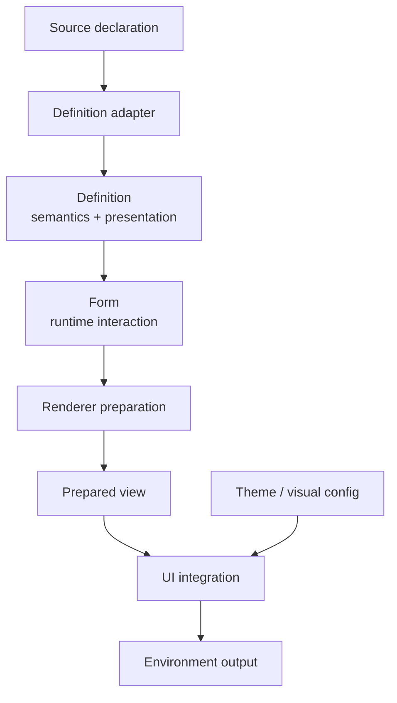

# Renderer and UI model

This note records the intended boundary between form meaning, runtime state,
render preparation, component-library integration, and visual styling. It
extends [[19-north-star-architecture|the north-star architecture]] without
freezing the concrete Phase 3 APIs before two independent UI implementations
have tested them.

The governing rule is:

> A UI does not interpret a form. It renders a prepared, source-neutral view of
> a form using a particular component library.

Its transport corollary is equally important:

> A UI does not choose transport or decoding semantics. It faithfully emits the
> controls described by a prepared, renderer-owned transport contract.

That rule is the center of the model. A JSON Schema form, a map-declared form,
and a future Ash-backed form should reach the same UI through the same prepared
facts. A UI may decide markup and component composition; it may not acquire
source-specific knowledge to reconstruct form semantics. Its markup still
participates in the environment's transport protocol, so interchangeability
requires more than visual similarity: emitted names, auxiliary controls,
cardinality, omission behaviour, and raw values must preserve the prepared
contract.

> [!important] Planning, not current-state documentation
> The current reference components, projector, render plan, and render nodes
> are Phase 1 implementation seams, documented in [[Techdocs]]. This note
> describes the target ownership model. Names and public contracts remain
> provisional until [[phase-3-extensibility|Phase 3]] proves them with a second
> substantially different UI.

## Why this boundary matters

Automatic form rendering can look deceptively simple: inspect a type, select an
input, and recurse. That approach works for a demo but makes the component layer
responsible for questions it cannot answer reliably:

- whether a node participates in submitted data;
- whether a value is absent, invalid, read-only, hidden, or unsupported;
- which nested object or collection occurrence a field belongs to;
- which issues exist and which are currently visible;
- which conditional branch is active;
- whether an abstract widget request is required or merely preferred;
- whether a fallback preserves the intended interaction and accessibility;
- which source owns validation;
- which names, IDs, auxiliary inputs, and transport markers the runtime
  environment requires;
- whether a displayed value is the user's raw attempted input or a formatted
  read-only value;
- how structured issues and runtime-authored text become localized output.

If each component library answers those questions independently, Formentation
does not have interchangeable UIs. It has several partially independent form
engines that happen to share a compiler.

The prepared-view boundary puts those decisions in one place. It lets UI
packages remain focused on the job they are qualified to do: render an already
understood form through their component vocabulary.

This separation also prevents the built-in reference markup from becoming an
accidental permanent contract. Phase 1's components are evidence about what a
UI needs, but one implementation cannot distinguish an essential assign from a
local convenience. A second UI with meaningfully different markup is the
architecture test.

## The layered model



Each layer answers a different question.

| Layer | Governing question | Owns | Must not own |
| --- | --- | --- | --- |
| Semantic structure | What data and behaviour exist? | Data nesting, type, role, requiredness, constraints, participation, preservation, validation linkage | Control order, component modules, CSS |
| Presentation layout | How should controls be arranged in abstract terms? | Order, groups, labels, help, hidden-control intent, abstract widget intent | Data nesting, decoding, validation, concrete UI components |
| `Form` | What is true in this interaction? | Original/current data, raw input, decoded operations, issues, usage, blockers, backing state | Markup and component selection |
| Renderer | How does this environment bind and prepare the form? | Environment form bindings, names, IDs, visibility, resolved widgets, transport requirements, localization/formatting orchestration, capability checks, component-ready facts | Source-schema interpretation, persistence, visual design |
| Prepared view | What does a UI need to render this occurrence? | Immutable, source-neutral, normalized rendering and transport facts, raw control values, formatted display values | Source declarations, adapter artifacts, undecided business policy |
| UI integration | How does a component library express the prepared view? | Concrete components, markup composition, supported widget/container mapping, faithful emission of the prepared transport contract | Decoding, validation, transport-policy choices, branch selection, submission decisions |
| Theme | How should one UI look? | Tokens, density, colour mode, brand variants, component-library theme selection | Component contract, semantic meaning, capabilities |

The boundaries are directional. Presentation refers to semantic occurrences;
it does not redefine them. A prepared view refers to runtime and layout facts;
the UI does not call back into source adapters to fill gaps.

## Source-neutral does not mean environment-neutral

A prepared view must be neutral with respect to the declaration source and
backing state engine. A UI must not care whether a field originated in JSON
Schema, a map declaration, Ash metadata, `Ecto.Changeset`, or native
`Formentation.Form` state.

It need not be neutral with respect to the output environment. A Phoenix
prepared view may legitimately contain:

- `%Phoenix.HTML.FormField{}` bindings;
- Phoenix-compatible input names and IDs;
- normalized validation attributes;
- control and auxiliary-input facts required by Phoenix and LiveView transport
  conventions;
- environment-specific event or hook descriptors once that tier exists.

This is why `Formentation.Phoenix` is a renderer and a DaisyUI or application
`CoreComponents` package is a Phoenix UI integration. A future renderer for a
different environment may prepare a different view while consuming the same
`Definition` and runtime semantics.

The stable promise should therefore be source neutrality and explicit
environment ownership, not a premature universal render-node format.

## Responsibilities by layer

### Semantic structure

The semantic structure remains authoritative for:

- root, object, field, collection, and choice meaning;
- semantic declaration order;
- template and instance-path derivation;
- value types and roles;
- requiredness and normalized constraints;
- options as allowed values;
- decoding participation;
- read-only and preserve-only policy;
- source-owned validation linkage;
- origins for semantic facts.

Semantic queries and form transitions must be invariant under presentation
regrouping, reordering, and UI selection.

### Presentation layout

The presentation structure remains source-neutral and UI-independent. It may
describe:

- layout order;
- field and object references;
- presentation-only groups;
- label and help metadata;
- hidden-control intent;
- abstract widget requirements or preferences;
- later, layout primitives such as sections, columns, tabs, or steps.

It must not name a Phoenix component module, a DaisyUI class, a Bootstrap
partial, or an application callback. A reusable definition can outlive or be
rendered by more than one UI.

The default layout is derived during compilation from semantic declaration
order. It is not guessed separately by every UI.

### Runtime `Form`

The `Form` owns or wraps the interaction semantics needed before rendering:

- current values and original data;
- raw attempted values;
- decode results and candidate materialization;
- issues and submission blockers;
- submitted and used/unused state;
- stable collection identities;
- active branch state;
- backing state and state-adapter access for first-class integrations.

The `Form` does not choose HTML components. UI selection must not change
candidate data, issues, blockers, nested presence, or active semantic
occurrences.

### Renderer preparation

The renderer combines:

- the `Definition`;
- the current `Form` or permanent low-level state-view seam;
- the renderer environment;
- runtime context such as locale;
- the chosen UI's descriptor and capabilities;
- explicit application overrides.

Preparation resolves questions that require more than static presentation:

- concrete occurrence traversal;
- field bindings, names, IDs, and paths;
- issue association and visibility;
- active branches and collection items;
- abstract widget resolution;
- control/parameter shape and auxiliary-control requirements;
- constraint-to-environment attribute translation;
- localization of structured issues through an application-supplied
  translation facility;
- preservation of raw editing values separately from localized display values;
- required capability checks;
- explicit fallback selection;
- normalized assigns for the UI.

Preparation should be pure for the same definition, state, context, UI
descriptor, and overrides. Adding an item, choosing a branch, or changing a
value remains a `Form` transition, not a render side effect.

### Prepared view

The prepared view is a renderer-owned, component-ready read model. Its exact
shape is intentionally open, but it should satisfy these properties:

- source-neutral;
- explicit about paths and occurrence identity;
- complete enough that the UI performs no semantic traversal;
- immutable and deterministic for equivalent inputs;
- safe to inspect and test;
- explicit about missing capabilities and chosen fallbacks;
- structured by kind rather than an unconstrained bag of assigns;
- suitable for whole-form, projected-subtree, and individual-field rendering.

A likely field view needs facts in these categories:

| Category | Examples |
| --- | --- |
| Identity | semantic/template path, absolute instance path, layout identity, DOM ID |
| Binding | Environment field binding, primary and auxiliary names, raw control value, formatted read-only value |
| Meaning | normalized type and read-only state today; role and schema requiredness are owned by [GitHub issue #37](https://github.com/kioopi/formentation/issues/37) |
| Presentation | label, help, resolved abstract widget |
| Interaction | Used/unused state, submitted state, disabled/hidden intent, omission and blank semantics |
| Feedback | visible field issues, described-by IDs, summary target |
| Constraints | normalized limits and safe environment attributes |
| Transport | Scalar/list/structured shape, auxiliary controls, cardinality, blank option, upload/reference metadata |
| Capabilities | Selected component key, fallback/diagnostic facts |

That list is a requirement inventory, not a commitment to one struct or one
flat assign map.

### UI integration

A UI integration owns:

- concrete function components and, in the advanced tier, interactive
  components;
- mapping prepared widget/container keys to those components;
- markup hierarchy and wrapper composition;
- component-library attributes and safe classes;
- slots or explicit callbacks that are part of its public customization model;
- visual configuration accepted by that UI;
- a machine-readable capability description;
- conformance with accessibility and interaction requirements.

A UI integration may:

- choose between equivalent markup patterns supported by its library;
- add decorative wrappers and icons;
- expose documented slots;
- render a generic fallback when the policy explicitly permits it;
- reject a prepared requirement it cannot implement.

A UI integration must not:

- traverse JSON Schema, Ash resources, or map declarations;
- decode raw values;
- invent or simplify parameter shape, omission, unchecked, or blank semantics;
- validate candidate data;
- decide requiredness or data participation;
- infer nested-object presence;
- choose an active semantic branch;
- discard unknown or unsupported data;
- decide whether a submission is allowed;
- mutate the `Form`;
- treat visibility as authorization;
- silently replace a required widget with a semantically weaker control.

### Theme

`Theme` is a deliberately narrow term. It may describe:

- light and dark variants;
- brand colour tokens;
- compact or comfortable density;
- control sizing;
- radius, spacing, and typography;
- a named theme supported by the component library.

A theme configures one UI. It is not another word for:

- a component registry;
- a renderer;
- a widget capability set;
- an adapter from form semantics to a UI library.

If a component library itself calls its design system a "theme," Formentation
can preserve that library's vocabulary in its package without using `Theme` as
the architectural extension category.

## Widget resolution

Widget selection crosses several layers and therefore needs an explicit
resolution model.

```text
semantic role
    + normalized type/options/constraints
    + abstract widget intent
    + UI defaults and capabilities
    + application overrides
    = resolved abstract widget + concrete UI component
```

The three important concepts are distinct:

1. A semantic role describes meaning: `:boolean`, `:date`, `:email`,
   `:money`.
2. An abstract widget describes interaction: `:checkbox`, `:date_input`,
   `:select`, `:money_input`.
3. A concrete component implements that widget in one UI:
   `MyAppWeb.CoreComponents.input/1` with particular assigns, or a dedicated
   DaisyUI module/function.

The same role may support several widgets. A boolean might render as a
checkbox, switch, radio choice, or read-only value. Conversely, a generic text
input may support several roles when the environment has no specialized
control.

The definition may contain abstract widget intent. It must not contain an
arbitrary source-supplied module/function. Concrete component selection belongs
to renderer preparation after the UI is known.

### Requirement, preference, and fallback

The eventual contract should distinguish at least:

- **required widget** — substitution would change an explicitly requested
  interaction and must fail compatibility unless a declared equivalent exists;
- **preferred widget** — the UI may use a documented fallback;
- **derived default** — selected from role/type/options when no intent is
  explicit.

Fallback must be:

- explicit in policy;
- deterministic;
- visible through diagnostics or inspection;
- accessibility-preserving;
- unable to weaken validation or data semantics.

Exact terminology and representation remain open for Phase 3. The important
rule is that lack of support never becomes silent disappearance.

## Widget transport contract

A widget is not only a visual choice. Its emitted controls determine the shape
of the parameter envelope consumed by `Formentation.Form`. That makes transport
part of the renderer/UI contract even though decoding remains outside the UI.

The current checkbox is the simplest proof. The reference markup emits both a
hidden `false` value and the visible checkbox. That pair implements
[[18-decisions#D-011 — Booleans use the hidden-input transport contract|D-011]]:
when unchecked, the browser still submits a value that the boolean codec can
decode. A visually convincing toggle that omits the hidden control silently
changes application semantics.

The same concern appears in:

- multiple selects and checkbox groups whose names and cardinality must encode
  a list;
- select placeholders where “no selection,” absent, `nil`, and `""` are not
  interchangeable;
- split date/time or money controls that submit several parameters for one
  semantic value;
- collections whose names include stable occurrence identity and whose action
  controls must not be decoded as data;
- hidden controls that preserve a value or participate in normal decoding;
- file inputs that submit upload references rather than ordinary strings;
- Phoenix `_unused_` markers that carry interaction state beside values.

### Ownership

| Layer | Transport responsibility |
| --- | --- |
| Semantic field and codec | Define the accepted raw value shape, absence/blank semantics, decoding, and canonical encoding where promised. |
| `Form` | Normalize the params envelope, preserve raw attempts, derive operations, and own used/submitted state. |
| Phoenix renderer preparation | Derive concrete control names, cardinality, auxiliary controls, marker behaviour, and the control values required by Phoenix transport. |
| Prepared view | Expose those requirements as typed, immutable facts associated with the semantic occurrence. |
| UI integration | Emit all required controls faithfully and preserve their names, values, ordering constraints, and accessibility. |

The UI may choose equivalent markup, but it may not choose whether an unchecked
boolean means `false`, omission, or deletion. It may not remove a blank option,
append `[]`, split one field into several submitted names, or invent a hidden
companion unless the prepared contract calls for that shape.

The exact representation remains a Phase 3 prototype decision. It should be
able to express at least:

- one primary control and zero or more auxiliary controls;
- scalar, repeated/list, or structured parameter shape;
- environment field name plus any derived child names;
- omission, unchecked, blank, and explicit-null behaviour;
- raw control value or values;
- option values and whether a blank/placeholder option exists;
- which controls participate in data and which carry actions or metadata;
- upload or browser-hook metadata where the advanced tier requires it;
- environment markers such as `_unused_` without exposing them as semantic
  data.

This is a renderer-owned protocol, not a promise that the definition itself
contains HTML-shaped information. A non-Phoenix renderer may derive a different
transport contract from the same semantic field and codec.

### Round-trip conformance

Structural HTML tests alone cannot prove transport equivalence. The reusable
suite must exercise the real component:

1. prepare a representative occurrence;
2. render the selected UI;
3. inspect the emitted control names, values, cardinality, and auxiliary
   controls;
4. construct or submit the parameter envelope those controls produce;
5. pass it through the ordinary `Form` transition;
6. assert the expected raw state, decoded operation, candidate value, usage,
   and submission result.

The matrix should include checked and unchecked booleans, blank and selected
choices, multiple values, invalid raw scalar input, nested fields, collection
items, and the representative compound widget. Browser-real tests remain
necessary where native controls, LiveSocket markers, uploads, hooks, or DOM
patching affect the actual envelope.

## Localization, issues, and display values

“Locale is renderer context” is not enough by itself; each localization job
needs an owner.

### Structured issues

The semantic/runtime layers retain structured issue codes, paths, variables,
origins, and severity. Renderer preparation turns an issue into
presentation-ready localized content through an application-supplied
translation facility. The UI places and marks up that content; it does not
interpret issue codes or decide which message template applies.

This preserves the rule from
[[09-diagnostics-provenance-introspection|diagnostics and introspection]] that
an issue is not reduced to a string at its source, while still keeping
translation logic out of the component library.

### Definition-authored text

Expert-authored compile-time definitions can commonly use application message
references. Runtime/user-authored definitions may instead need literals,
locale-keyed maps, or another serializable message representation. Phase 3 must
prototype the representation and its fallback rules. It must not assume every
runtime label can be passed through compile-time Gettext extraction.

### Raw control value versus formatted display value

Editing and display have different correctness requirements:

- `control_value` preserves the user's latest raw attempt where one exists;
- `display_value` is a localized or domain-formatted representation for
  read-only, review, print, or email output;
- a canonical encoded value may exist separately for machine-oriented
  transport.

Rerendering an invalid input such as `"1.234,56"` must not replace it with a
localized, normalized, or partially decoded value. Locale-sensitive decoding,
where supported, belongs to an explicit codec/context contract. A UI must not
parse or reformat editing values on its own.

## UI selection and customization

The ordinary path should make a good default UI inexpensive:

```heex
<Formentation.Phoenix.fields form={@phoenix_form} />
```

Selecting another application-wide or per-render UI should remain one
additional responsibility:

```heex
<Formentation.Phoenix.fields
  form={@phoenix_form}
  ui={MyAppWeb.FormUI}
/>
```

These examples are illustrative. Phase 3 decides the exact API after
prototyping.

### Customization levels

The model should support progressive disclosure:

1. renderer default UI;
2. application-wide UI selection;
3. per-form UI selection;
4. UI-owned visual theme/configuration;
5. abstract widget override for one semantic/template path;
6. concrete component or container override at render time;
7. explicit rendering of one prepared field or subtree;
8. implementation of a new UI or renderer.

Each level adds responsibility without forcing earlier levels to know the
later vocabulary.

### What belongs in a reusable definition

A reusable definition may carry:

- label/help and abstract layout;
- an abstract widget requirement or preference;
- domain-neutral presentation metadata with documented meaning.

It should not carry:

- concrete component modules;
- application CSS;
- a process-global UI selection;
- opaque callbacks tied to one Phoenix application.

Concrete component overrides and application UI selection belong to rendering
configuration. This keeps cached definitions reusable across applications,
brands, and UI packages.

### Override identity and precedence

Local overrides should target stable semantic/template or layout identities,
not incidental child positions. Collection occurrences additionally need
instance identity at runtime.

The exact precedence remains open, but it must be:

- deterministic;
- inspectable;
- local rather than dependent on registration order;
- explicit about whether an override changes abstract intent or only the
  concrete component;
- able to explain which layer won.

A plausible order is explicit render-time override, definition presentation
intent, selected UI mapping/default, then renderer-owned safe fallback. Phase 3
must validate that order against real packages before freezing it.

## Capability model

A UI should describe what it can render without relying on scattered
`function_exported?` checks.

Capabilities may need to cover:

- prepared node/container kinds;
- abstract widgets;
- semantic-role and widget combinations;
- options/choice representations;
- error and help presentation;
- hidden and read-only controls;
- collections, add/remove/reorder controls, and stable IDs;
- form-level summaries;
- interactive features such as async options, uploads, or hooks;
- constraints or limits relevant to safe rendering.

An illustrative descriptor might look like:

```elixir
%Formentation.Phoenix.UI{
  id: :daisy_ui,
  contract_version: 1,
  module: MyAppWeb.DaisyFormUI,
  widgets: MapSet.new([:text_input, :checkbox, :select]),
  containers: MapSet.new([:root, :object, :group, :collection]),
  features: MapSet.new([:errors, :help, :error_summary]),
  metadata: %{}
}
```

This is not a committed struct. The prototype must answer whether capabilities
belong to the UI, renderer, individual component, or a composed descriptor.

### Compatibility timing

Some requirements are static and can be checked when a target UI is known.
Others depend on runtime branch selection, collection state, or overrides and
can only be checked during preparation.

The model should permit both:

- definition-level support reports for likely/static requirements;
- preparation-time compatibility for concrete visible occurrences.

Compilation must not require a UI when definitions are compiled and cached
independently. A target-specific support report may be an optional compilation
or inspection operation, not a condition of definition validity.

### Capability limits

Capabilities describe rendering support. They do not:

- own validation semantics;
- authorize data;
- prove that custom markup is accessible;
- replace conformance tests;
- justify dropping an unsupported node.

Capability claims and conformance evidence belong together.

### Capability-failure developer experience

Phase 3 must settle the failure contract during the first capability spike,
before the demo and a second UI grow separate conventions. At minimum the
preparation API needs a structured result that distinguishes:

- a supported requirement;
- an explicit equivalent/fallback, with an explanation;
- an unsupported required capability;
- an invalid or contradictory UI descriptor;
- a component failure after successful preparation.

The high-level component then needs a documented development and production
policy. Candidate behaviours include raising for programmer/configuration
errors in development, returning a structured preparation failure to explicit
callers, and rendering a safe visible diagnostic block where production
continuity is preferable. Silent omission is never valid. The exact split is a
prototype decision because it must work for whole forms, subtrees, and embedded
forms.

## Resource and preparation limits

Runtime/user-authored definitions make resource budgets part of correctness,
not merely optimization. Limits should be enforced at the earliest layer that
has enough information and reported through structured diagnostics.

The policy should consider:

- source size and total semantic/presentation node count;
- maximum semantic and presentation nesting;
- options per field and total option count;
- diagnostics retained per node and per form;
- visible occurrences after branches and collections expand;
- collection item limits;
- recursion and preparation work budget;
- output size or component count where the environment needs a guard.

These are not UI capabilities: a UI must not claim that a dangerous definition
is safe. A UI may publish narrower support limits, but compiler/runtime safety
budgets remain renderer- and engine-owned. The earlier illustrative
`max_nesting` capability should therefore become part of this cross-cutting
policy rather than disappear.

## Component contracts

The initial public component contract should be small and typed. Candidate
component categories include:

- root fields/container;
- semantic object;
- presentation group;
- field shell;
- widget/input;
- choices;
- collection and collection item;
- help and field issues;
- form-level error summary;
- unsupported/read-only presentation.

The contract should avoid two extremes:

- one giant assign map copied to every component;
- one unconstrained `render(node, opts)` callback that forces each UI to
  pattern-match on private prepared-view internals.

Instead, each component kind should receive the facts it needs, with shared
typed view values for identity, binding, accessibility, and feedback.

Slots are appropriate where the application is genuinely composing content:

- actions outside the generated field traversal;
- optional form-level framing;
- collection action placement;
- controlled wrapper decoration.

Slots should not force callers to reimplement traversal, issue association,
stable IDs, or widget resolution.

### Completeness versus minimality

The prepared view must be complete enough that a UI does not reconstruct
semantics, but the public contract must remain smaller than the union of every
consumer's convenience facts. That tension is intentional and must be resolved
through prototypes rather than by continually adding fields.

The built-in UI, the second editable UI, and read-only review rendering should
inventory each derived fact they need. Phase 3 must then choose among:

- a fixed eager view containing only facts shared by supported consumers;
- typed queries over an opaque prepared view;
- lazily derived typed facts with deterministic caching;
- explicit view profiles such as `:edit` and `:review`;
- a small combination of these approaches.

An open-ended “UI requests arbitrary derived facts” callback is risky because
it can become a disguised semantic traversal API. Any extension point must
name, type, test, and assign ownership to the derived fact.

## Two implementation tiers

### Tier 1: stateless components

The baseline UI contract should be implementable with pure Phoenix function
components. It covers:

- ordinary scalar inputs;
- choices;
- labels, help, and errors;
- groups and object containers;
- hidden and read-only controls;
- collections whose transitions are handled by the parent LiveView;
- error summaries.

This tier should be deterministic, easy to test with rendered HTML, and usable
without JS hooks or extra processes. It must also support controller/static
rendering followed by a normal HTML POST.

Without a LiveSocket, Phoenix does not supply the same progressive `_unused_`
information available during a LiveView session. The supported degradation is:

- a pristine form hides issues;
- a submitted form shows them;
- per-field progressive visibility is unavailable unless the caller supplies
  equivalent usage information.

Validation, decoding, and submission semantics do not change. Only the
interaction evidence available to issue-visibility policy is less precise.

### Tier 2: advanced interactive widgets

Some widgets need more than pure rendering:

- file uploads;
- async option search and remote pickers;
- rich text or code editors;
- date/time widgets with JS behaviour;
- address or entity selectors;
- components with their own LiveView events;
- widgets backed by `Phoenix.LiveComponent`;
- hook-managed browser state.

These should be a separate advanced contract. A UI must not pretend support for
them merely because it can emit a placeholder input.

The advanced tier needs explicit ownership for:

- event routing;
- parent versus component state;
- hook lifecycle and DOM patching;
- async loading and cancellation;
- upload configuration;
- value normalization at the transport boundary;
- accessibility under client-side behaviour;
- graceful degradation and server-rendered fallback;
- testing across component, LiveView, and real-browser layers.

Phase 3 should prove one representative interactive widget separately from the
stateless second UI. The advanced tier must not make the baseline contract
depend on LiveComponents or hooks.

## Accessibility and interaction conformance

Accessibility is a renderer/UI contract, not a visual preference. Every UI must
preserve the semantic behaviour already proven by the reference implementation:

- deterministic label/input association;
- `aria-describedby` relationships for help and errors;
- `aria-invalid` when appropriate;
- fieldsets and legends for grouped choices;
- form-level summaries linked to controls;
- unique, stable IDs;
- keyboard-operable collection controls;
- visible and programmatic disabled/read-only meaning;
- safe escaping of source-authored text;
- raw-invalid-input preservation;
- correct used/unused issue visibility;
- focus movement after invalid submission where promised.

Conformance requires more than static HTML assertions. Browser-real tests remain
necessary for behaviour Phoenix component tests cannot observe, including
native input normalization, LiveView transport markers, focus, hooks, and DOM
patching.

An application override becomes responsible for the same obligations. The
system should make this explicit and provide reusable tests rather than imply
that any component function is automatically conforming.

## Conformance strategy

Phase 3 should extract reusable conformance suites while building the second
UI, not before.

### Prepared-view conformance

For equivalent semantics and runtime state:

- different source adapters produce equivalent prepared facts;
- presentation regrouping changes layout only;
- UI selection does not change semantic paths, values, issues, or blockers;
- whole-form and subtree preparation agree;
- capability failures and fallbacks are deterministic and explained;
- prepared views contain no source-adapter artifacts.

### Stateless UI conformance

- every supported prepared kind renders;
- required assigns are consumed consistently;
- text is escaped;
- labels, help, issues, and summaries are associated correctly;
- hidden/read-only/disabled distinctions are preserved;
- collection IDs and controls are stable;
- prepared transport controls round-trip through `Form`;
- choice placeholders and blank values preserve their declared meaning;
- unsupported requirements fail or fall back according to policy.

### Interactive UI conformance

- events reach the declared owner;
- raw transport values survive round trips;
- hook and component lifecycle is stable under LiveView patches;
- loading, failure, and cancellation states are accessible;
- server and client state do not silently diverge;
- real-browser keyboard and focus behaviour is verified.

### Cross-UI architecture tests

The same representative definitions should run through:

- the built-in reference UI;
- a second UI with substantially different markup/component conventions;
- an application-local override;
- a custom semantic role/widget supported by one UI and unsupported by the
  other.

The second UI must differ enough to expose accidental coupling. Merely changing
CSS classes on the reference components is not sufficient.

### Structural boundary enforcement

The second editable UI should live in a separate Mix project/package that
depends only on supported Formentation APIs. A path dependency is sufficient
while the contracts are being developed; publication to Hex is not required for
the architecture test.

CI should additionally inspect the module graph, using `mix xref`, Reach, or
both, and reject UI dependencies on:

- `Formentation.Node.*` and private `Definition` representation;
- private semantic traversal and query helpers such as
  `Formentation.Definition.Semantic.*`, which are the most tempting substitute for a
  prepared view;
- JSON Schema, map-source, Ash, or native-state adapter internals;
- private projector/render-plan/render-node structs;
- implementation modules not explicitly classified as public UI contracts.

The repository's existing `.reach.exs` architecture policy describes layers
among modules compiled *here*, so it cannot observe a UI package that compiles
separately. The boundary check therefore belongs to the UI package itself, or
to a cross-project run that loads both applications. Either way it must fail
CI rather than emit advisory output.

Keeping the prototype in-tree with unrestricted module access would make “the
second UI proved the boundary” difficult to falsify. Independent compilation
plus module-graph checks turns the rule into executable evidence.

### Assertion style

The shared suite should prefer:

- typed prepared-fact assertions;
- structural DOM queries;
- accessibility relationships;
- transport round trips;
- event and browser behaviour.

It should not require exact cross-UI HTML golden files. Golden snapshots couple
different component libraries to one markup shape and tend to turn intentional
UI variation into noise. An individual UI package may use narrowly scoped
snapshots for its own stable markup, but those are package tests rather than
the shared conformance contract.

## Benefits and use cases

The model is valuable beyond swapping CSS frameworks.

### Rapid prototypes and internal tools

A developer can compile a definition, initialize a form, and obtain accessible
default markup without hand-writing every input. The reference UI gives a
complete baseline, while the small ordinary API keeps the correctness machinery
out of the getting-started path.

### Application-native design systems

Many Phoenix applications already have `CoreComponents`. A UI integration can
map prepared widgets and containers onto those components without forking
Formentation's compiler, state engine, or traversal. The application retains
its markup conventions while reusing form semantics and behaviour.

### Reusable component-library packages

DaisyUI, Bootstrap, or another Phoenix component library can ship a UI package
that works with every definition source. The package author implements one
prepared-view contract rather than learning JSON Schema, Ash, and every future
adapter.

### Multiple brands or products

One application can select different UIs or visual themes per product, tenant,
or surface while compiling and validating the same definition. Because
component modules and CSS do not live in the semantic definition, cached
definitions remain reusable.

### User-authored or dynamic forms

CMS, survey, workflow, and low-code systems may let users define data shapes and
layouts at runtime. Keeping source input away from arbitrary component modules
limits the trusted surface. The compiler normalizes allowed presentation intent;
the UI renders only prepared, trusted facts.

### Domain-specific controls

Applications can add roles such as `:money`, `:country`, `:asset_reference`, or
`:rich_text`, then provide UI implementations for them. Capability checks make
the dependency visible: a definition requiring `:money_input` cannot be used
with an incompatible UI without an explicit failure or fallback.

### Mixed and embedded forms

Generated payload fields can coexist with hand-written Ecto or Ash fields. The
Phoenix renderer owns normal form names, IDs, and subtree projection, while the
UI focuses on the generated block. A caller can still render an individual
prepared field manually when composition requires it.

### Read-only review and confirmation

A review/confirmation renderer consumes the same definition and accepted
candidate data but emits no editable controls and normally no field issues. It
may target confirmation steps, audit views, print output, or email-safe HTML.

This is a valuable proof consumer because it needs different facts from an edit
UI:

- localized `display_value` rather than a raw attempted `control_value`;
- read-only value and choice-label mapping;
- container headings without input wrappers;
- explicit handling of absent, hidden, preserved, and unsupported values;
- print/email-safe composition;
- no accidental dependency on `%Phoenix.HTML.FormField{}` where the output
  does not need it.

It should be built alongside the second editable UI. It does not replace that
UI as the contract gate because it cannot prove editable transport,
used-input visibility, or interactive behaviour.

### Accessibility and governance

Organizations can qualify a UI integration once through shared conformance
tests and reuse it across many dynamic definitions. This does not remove the
need to test each application, but it moves recurring label, error, focus, and
transport rules into a reusable contract.

### Testing without component-library coupling

Form semantics can be tested below rendering; prepared-view decisions can be
tested without asserting final CSS; each UI can test its markup against the
same conformance suite. Failures become easier to locate:

- wrong candidate or issue: semantic/runtime layer;
- wrong widget or capability result: preparation;
- wrong classes or HTML composition: UI;
- wrong colours or density: theme.

### Future rendering environments

The separation leaves room for inspection tools, documentation previews, or
non-Phoenix renderers without making them Phase 3 requirements. Their existence
would test which prepared facts are genuinely environment-specific. The current
plan does not promise a universal renderer-independent view.

## Preparation cost and incremental rendering

Correct ownership is necessary but not sufficient if every keystroke performs
several complete traversals. Collections and dynamic schemas can turn that into
observable LiveView latency and unnecessary DOM work.

The target does not promise incremental preparation yet, but it must preserve
the option:

- the projected Phoenix form identifies both the root definition and the
  selected subtree;
- semantic and presentation lookups avoid repeated linear scans;
- preparation is \(O(n)\) in the visible prepared subtree unless a documented
  feature requires more;
- occurrence identities and DOM keys remain stable across collection edits and
  LiveView patches;
- field/subtree preparation agrees with slicing the whole prepared view;
- expensive derived facts can be cached by definition/form revision and
  relevant context;
- large-collection benchmarks record item-count and update-scope scaling;
- future stream-based rendering is not prevented by position-only identities.

Phase 3 must establish a benchmark fixture and cost model before making the
prepared view public. Phase 4 must revisit the model when conditional branches
make visibility data-dependent.

## Projection and preparation terminology

Formentation currently uses “projection” for more than one operation. The
target vocabulary is:

- **FormData projection** — `%Formentation.Form{}` becomes
  `%Phoenix.HTML.Form{}`;
- **render preparation** — the definition, projected form/root, renderer
  context, UI descriptor, and overrides become a prepared view;
- **rendering** — the selected UI turns that prepared view into output.

`Formentation.Phoenix.Render.Preparation` performs render preparation, and
[[06-runtime-projection|Runtime projection]] retains the historical term. The
module rename is recorded in
[[18-decisions#D-041 — Projected Phoenix forms are the ordinary rendering input|D-041]]. Documentation and new public APIs should prefer
the three terms above rather than introducing a second meaning of projection.

## Worked example: a money field across UIs

This example is illustrative rather than a proposed public struct. Its purpose
is to trace ownership through the complete model and expose decisions that the
Phase 3 prototypes must settle.

Assume a definition contains a semantic field:

```elixir
%{
  path: ["price"],
  role: :money,
  type: :decimal,
  required?: true,
  constraints: %{minimum: Decimal.new("0.00")},
  codec: :localized_money,
  metadata: %{currency: "EUR"}
}
```

Its presentation entry requests a money-specific interaction:

```elixir
%{
  semantic_path: ["price"],
  label: {:message, "product.price"},
  help: {:message, "product.price_help"},
  widget: {:preferred, :money_input}
}
```

Neither entry names a component. The semantic field says what the value means;
the presentation entry says which interaction is preferred.

### Interaction state

The German user enters `"1.234,5x"`. The `Form` preserves that raw value and
records a decode issue. It does not replace the input with the previous decimal
or a partially parsed value:

```elixir
%{
  raw: "1.234,5x",
  decoded: {:error, :invalid_money},
  candidate: :blocked,
  used?: true
}
```

Renderer preparation receives locale `"de-DE"`, the projected Phoenix form,
the UI descriptor, and that state. A conceptual prepared field might contain:

```elixir
%{
  identity: %{
    template_path: ["price"],
    instance_path: ["price"],
    dom_id: "product_price"
  },
  meaning: %{
    role: :money,
    required?: true,
    currency: "EUR"
  },
  presentation: %{
    label: "Preis",
    help: "Betrag einschließlich Mehrwertsteuer"
  },
  value: %{
    control_value: "1.234,5x",
    display_value: nil
  },
  widget: %{
    requested: {:preferred, :money_input},
    resolved: :money_input,
    component: :money_input
  },
  transport: %{
    shape: :scalar,
    primary: %{name: "product[price]", value: "1.234,5x"},
    auxiliary: []
  },
  feedback: %{
    issues: ["Bitte einen gültigen Geldbetrag eingeben."],
    described_by: ["product_price-help", "product_price-error"]
  }
}
```

The important distinctions are:

- the issue remains structured until preparation localizes it;
- `control_value` is the raw attempt, not the formatted previous value;
- the renderer derives the Phoenix name and transport shape;
- the prepared view records the resolved abstract widget and concrete component
  key separately;
- the UI receives no codec and no source annotation.

### Supporting UI

An application-native UI supports `:money_input` and might render:

```heex
<div class="field">
  <label for="product_price">Preis</label>
  <div class="money-control">
    <span aria-hidden="true">€</span>
    <input
      id="product_price"
      name="product[price]"
      value="1.234,5x"
      inputmode="decimal"
      aria-invalid="true"
      aria-describedby="product_price-help product_price-error"
    />
  </div>
  <p id="product_price-help">Betrag einschließlich Mehrwertsteuer</p>
  <p id="product_price-error">Bitte einen gültigen Geldbetrag eingeben.</p>
</div>
```

The component chooses wrappers and classes. It does not parse the string,
invent a normalized decimal, choose the parameter name, or decide which issue
is visible.

### Non-supporting UI

A minimal UI supports only `:text_input`. Because the money widget was
preferred rather than required, preparation may select an explicit fallback:

```elixir
%{
  requested: {:preferred, :money_input},
  resolved: :text_input,
  component: :text_input,
  fallback: %{
    reason: :unsupported_widget,
    preserves: [:scalar_transport, :raw_value, :label, :issues],
    loses: [:currency_adornment, :money_specific_input_mode]
  }
}
```

That UI can render a plain text input with the same name, raw value,
accessibility relationships, and scalar transport. Inspection and diagnostics
show that a fallback occurred.

If the request were `{:required, :money_input}`, preparation would instead
return a structured incompatibility. The high-level component would follow the
documented capability-failure policy; it would not silently render the plain
text input or omit the field.

### Compound money variant

A future money widget might use separate amount and currency controls:

```elixir
%{
  shape: {:object, [:amount, :currency]},
  primary: %{
    name: "product[price][amount]",
    value: "1.234,5x"
  },
  auxiliary: [
    %{
      kind: :choice,
      name: "product[price][currency]",
      value: "EUR",
      options: ["EUR", "USD"]
    }
  ]
}
```

This cannot be a component-local variation of the scalar widget. It changes the
parameter envelope and therefore requires an explicit prepared transport shape
accepted by the codec. A UI may claim the compound capability only if its
rendered controls pass the round-trip suite.

### Review consumer

After successful submission the accepted decimal may produce:

```elixir
%{
  control_value: "1234.56",
  display_value: "1.234,56 €"
}
```

The edit UI still uses the appropriate control value. A review renderer uses
the localized display value and emits plain text such as:

```html
<dl>
  <dt>Preis</dt>
  <dd>1.234,56 €</dd>
</dl>
```

This one field exercises the separation between semantics, widget intent,
capabilities, transport, localization, raw editing state, read-only formatting,
fallbacks, diagnostics, and markup. If either UI needs the definition, codec,
or source adapter to complete the example, the prepared boundary is too thin.
If every possible wrapper preference appears in the prepared field, it is too
fat.

## Constraints on current alignment work

The Phase 1 Definition split and Phoenix convergence must leave this model
possible:

- presentation IR describes layout and abstract widget intent, never component
  modules;
- semantic queries remain invariant under layout and UI changes;
- layout traversal preserves presentation order;
- the reference components remain an internal implementation, not the default
  shape of a public UI behaviour;
- projector/render-plan structs may remain independently testable without being
  stabilized as extension contracts;
- Phoenix preparation recovers both the definition and projection root from a
  projected `Form`;
- arbitrary `FormData` plus explicit definition/state view remains a permanent
  low-level interoperability path;
- first-class backing-state integrations eventually reach the ordinary path
  through `Form`;
- current accessibility and browser-transport behaviour stays mandatory;
- checkbox auxiliaries, hidden fields, choice names, blank semantics, and
  `_unused_` handling remain explicit transport invariants;
- safety/resource limits remain visible as a cross-cutting engine concern.

The alignment work should not add:

- UI registries;
- application-selectable component modules;
- capability negotiation;
- a second UI;
- public prepared-view structs;
- interactive widget behaviours.

Those would commit to the seam before the split definition and collections have
provided representative requirements. The pre-`0.1.0` alignment renamed the
former `Formentation.Phoenix.Projector` to reflect preparation and
`Formentation.Phoenix.UI.Reference` to remove the obsolete architectural use
of “theme”; the later D-047 restructure established
`Formentation.Phoenix.Render.Preparation` and
`Formentation.Phoenix.UI.Reference`. [[18-decisions#D-041 — Projected Phoenix forms are the ordinary rendering input|D-041]]
and [[18-decisions#D-047 — The lib tree is restructured to state the north-star architecture|D-047]]
record those vocabulary corrections, not a public UI contract.

## Phase 3 discovery and delivery

[[phase-3-extensibility|Phase 3]] should proceed through evidence:

1. inventory the reference components and current prepared facts;
2. build a deliberately different editable UI in a separate Mix project with
   executable dependency-boundary checks;
3. add read-only review rendering as a third, non-editing consumer;
4. identify the smallest shared prepared-view and component contracts;
5. stabilize stateless component categories, transport facts, and assign types;
6. introduce capability verification, failure developer experience, and
   explicit fallback policy;
7. publish structural, accessibility, and render-to-decode round-trip
   conformance tests;
8. prove application-local overrides;
9. prove one advanced interactive widget through a separate tier;
10. establish preparation limits, performance fixtures, and the partial
    preparation contract;
11. version the resulting public descriptors and contracts;
12. record the decisions that the prototypes settle.

The prepared-view contract, UI descriptor, and capability vocabulary should be
outputs of this sequence, not prerequisites invented in isolation.

## Decisions already made

- Phoenix is a renderer.
- A UI is a component-library integration used by a renderer.
- A theme is visual configuration within a UI.
- Definition presentation metadata remains UI-independent.
- Widgets have semantic, abstract-interaction, and concrete-component layers.
- A UI renders prepared facts and does not interpret source declarations or
  runtime semantics.
- A UI faithfully implements renderer-owned transport facts; it does not choose
  parameter semantics.
- Renderer preparation owns issue localization orchestration and keeps raw edit
  values separate from formatted display values.
- The baseline UI tier is implementable with stateless components.
- Stateful/hook-backed widgets require a separate advanced tier.
- Accessibility and transport behaviour are conformance requirements.
- The public contract must be proven by two substantially different UIs.
- Capabilities and fallbacks must be explicit and inspectable.

These decisions refine
[[18-decisions#D-029 — Definition and Form are the ordinary public model|D-029]]
and are recorded by
[[18-decisions#D-030 — Renderer, UI, theme, and transport responsibilities are separate|D-030]]
without freezing the unproven Phase 3 API details.

## Decisions intentionally left open

Phase 3 prototypes must decide:

- the exact prepared-view structs and stability boundary;
- whether preparation has a renderer-neutral core plus environment bindings;
- the UI descriptor and contract-version shape;
- component categories and assign contracts;
- how a prepared view balances completeness with minimality;
- whether typed queries, lazy facts, view profiles, or a hybrid support
  additional consumers;
- capability vocabulary, composition, and compatibility timing;
- required-versus-preferred widget representation;
- fallback policy, diagnostic severity, and high-level failure behaviour;
- the exact widget transport representation and compound-control protocol;
- the representation and fallback policy for runtime-authored localized text;
- the locale-aware codec/context contract;
- UI selection, inheritance, and override precedence;
- how local overrides target semantic, layout, and instance identities;
- which customization points use data, callbacks, components, or slots;
- how interactive widgets declare events, hooks, uploads, and state ownership;
- whether UI packages contribute compiler metadata or remain rendering-only;
- which extension descriptors and fingerprints include UI identity;
- concrete safety limits and preparation budgets;
- the cache/revision model and performance expectations for partial
  preparation and large collections;
- whether Spark materially improves authoring after plain descriptors exist;
- whether `value_type`, `role`, and `required?` — the flat prepared meaning
  facts on `Render.Node.Field` established by
  [[18-decisions#D-038 — Semantic value type and abstract widget are orthogonal prepared facts|D-038]]
  and [[18-decisions#D-043 — Semantic `role` and schema `required?` join `value_type` as flat prepared facts|D-043]] —
  should be grouped into a dedicated "prepared meaning" sub-struct once a
  second UI implementation exists to pressure-test the shape;
- whether a separate presentational override, e.g. `mark_as_required?`, should
  let a theme mark a field as required in the UI independent of both the
  schema `required?` fact and the HTML-constraint `validations[:required]`
  fact (deferred by D-043 alongside the sub-struct question).

These choices may refine the contract. They may not move validation, decoding,
submission, or semantic traversal into the UI.

## Related notes

- [[19-north-star-architecture|North-star architecture]]
- [[08-extension-model|Extension model]]
- [[06-runtime-projection|Runtime projection]]
- [[07-phoenix-integration|Phoenix integration]]
- [[11-testing-strategy|Testing strategy]]
- [[13-roadmap|Roadmap]]
- [[16-open-questions|Open questions]]
- [[phase-3-extensibility|Phase 3 — Extensibility and UI integrations]]
- [[18-decisions|Decision log]]
- [[Formentation|Back to the entry point]]
