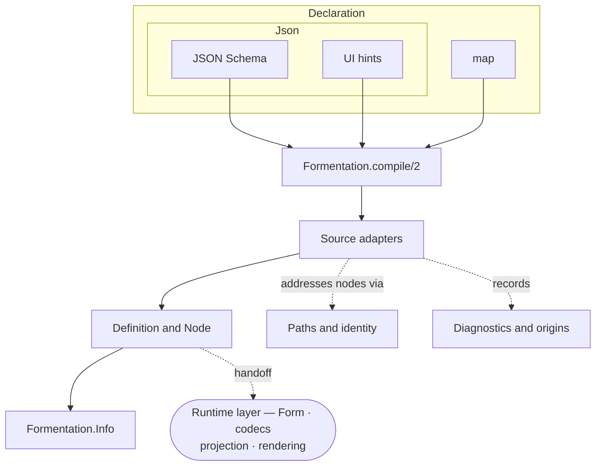

# Compile pipeline

> [!note] As of 2026-08-07 · Wave 3 façade (A3) complete
> Describes the compile pipeline as built. The `Node` representation uses one struct per kind ([[18-decisions#D-015 — One struct per node kind|D-015]]); this note stays at pipeline altitude and defers `Node` internals to [[definition-and-node|Definition and Node]].

The **compile pipeline** turns a declarative form description into a static, source-independent [[definition-and-node|`Definition`]] that can be cached, inspected, and queried — with no runtime state attached. It is the first half of Formentation: everything here runs once, ahead of any user interaction. The runtime half consumes the `Definition` and is documented in [[form-state-and-transitions|Form state and transitions]], [[phoenix-form-data|the FormData projection]], and [[rendering|Rendering]]; [[end-to-end-data-flow|End-to-end data flow]] joins both halves into one walk.

## Overview



## Stages

### 1. Entry — `Formentation.compile/2`

`compile(declaration, adapter: MyAdapter)` is the single public entry point. It resolves `:adapter` — a stable built-in selector (`:map`, `:json_schema`), or a module implementing `Formentation.Source` — passes the rest through, and delegates to that adapter. Resolution failures (a missing, unsupported, or invalid `:adapter`) raise `ArgumentError` at this boundary rather than producing a diagnostic, since no adapter has run yet. Beyond that resolution, it carries no logic of its own — source selection is the only decision made here.

`Formentation.form/2` is a compile-and-initialize façade over the same boundary: it partitions `data:`/`defaults:` for `Formentation.Form.new/3`, forwards everything else to `compile/2` unchanged, and only initializes a form after successful compilation.

Contract:

```elixir
@spec compile(term(), keyword()) ::
        {:ok, Definition.t(), [Diagnostic.t()]} | {:error, [Diagnostic.t()]}
```

A successful compile still returns diagnostics (warnings, unsupported constructs); `:error` is reserved for a declaration too malformed to yield a definition at all.

### 2. Source adapter — declaration → `Definition`

The adapter is where the real work happens. Every adapter implements the [[source-adapters|`Formentation.Source`]] behaviour (`compile/2`, the same contract as above) and performs a recursive descent over the declaration, building the node tree top-down. A shared `Formentation.Source.Shared.Context` threads the current [[paths-and-identity|template path]], the remaining depth, and a node budget through the walk, so every adapter enforces the same structural guards and stamps [[diagnostics-and-origins|origins]] the same way.

Two adapters exist today:

- **`Formentation.Source.Map`** — a plain-Elixir data source, zero dependencies. The reference adapter and the cheapest fixture format.
- **`Formentation.JSONSchema`** — the JSON Schema adapter for a pinned 2020-12 subset, gated by a JSV metaschema pre-pass (`JSONSchema.Validator`) and carrying the UI-hints vocabulary (`order`, `groups`, `fields.*.widget|help`).

Both are held to a **differential property**: compiling the same form through either adapter yields `Info`-equivalent definitions, differing only in origins. That test is what makes "source-independent" a checked claim rather than an aspiration ([[18-decisions#D-004 — Two declaration sources from the start|D-004]] — design/roadmap).

### 3. Output — the `Definition`

The adapter returns a [[definition-and-node|`%Definition{}`]]: a semantic tree,
a presentation tree, a semantic index, a `format_version`, and diagnostics. It
is deliberately inert — it holds no params, no field errors, and no DOM
identifiers, which is what makes it safe to cache and share. Its storage shape
is the subject of [[definition-and-node|Definition]].

### 4. Query — `Formentation.Info`

Consumers never pattern-match a `Definition`'s internals. They ask
`Formentation.Info`: `root/1`, `fields/1`, `node/2`, `node_at/2`,
`presentation_root/1`, `presentation_at/2`, `origins/2`, `role/2`,
`required?/2`, and `diagnostics/1`. `Info` is the stable seam between the
compiled representation and everything downstream — renderers, tooling, tests,
and applications.

## Cross-cutting concerns

Two subsystems run through every stage rather than sitting at one:

- [[paths-and-identity|Paths and identity]] — how nodes are addressed (`TemplatePath`, `InstancePath`, `NodeId`) and how origins point back into a JSON source (`JSONPointer`).
- [[diagnostics-and-origins|Diagnostics and origins]] — the structured `Diagnostic`, the origin tags every node carries, and the depth/node-budget guards that turn adversarial input into diagnostics instead of crashes.

## Where the pipeline ends

The pipeline stops at `Info`. It produces meaning, not markup: no projection, no components, no HTML. The compiled `Definition` is the **handoff point** to the runtime layer (`Formentation.Form`, `Formentation.Codec`, `Formentation.Transport`), which combines it with values, params, and usage; the projection and rendering layers then turn that pairing into HTML.

> [!info] Why the halves stay apart
> A `Definition` never learns anything from a submission, and the runtime never rewrites one. That is what lets a definition be compiled once and shared across every request, user, and form instance that uses it — and what lets each layer be tested without the next. The full chain is drawn in [[end-to-end-data-flow|End-to-end data flow]].

## Code map

| Concern | Module | File |
| --- | --- | --- |
| Entry point | `Formentation` | `lib/formentation.ex` |
| Adapter contract | `Formentation.Source` | `lib/formentation/source.ex` |
| Map adapter | `Formentation.Source.Map` | `lib/formentation/source/map.ex` |
| JSON Schema adapter | `Formentation.JSONSchema` | `lib/formentation/json_schema.ex` |
| Schema validator | `Formentation.JSONSchema.Validator` | `lib/formentation/json_schema/validator.ex` |
| Shared walk context | `Formentation.Source.Shared` | `lib/formentation/source/shared.ex` |
| Compiled definition | `Formentation.Definition` | `lib/formentation/definition.ex` |
| Semantic storage | `Formentation.Semantic.Object` · `Semantic.Field` · `Semantic.Unsupported` | `lib/formentation/semantic/` |
| Presentation storage | `Formentation.Presentation.Object` · `Presentation.Field` · `Presentation.Group` | `lib/formentation/presentation/` |
| Query surface | `Formentation.Info` | `lib/formentation/info.ex` |

## Related notes

- Deep dives: [[definition-and-node|Definition and Node]] · [[source-adapters|Source adapters]] · [[paths-and-identity|Paths and identity]] · [[diagnostics-and-origins|Diagnostics and origins]]
- Downstream: [[form-state-and-transitions|Form state and transitions]] · [[end-to-end-data-flow|End-to-end data flow]]
- Design / future (Planning): [[04-architecture|Architecture]] · [[05-compiler-pipeline|Compiler pipeline]] · [[03-conceptual-model|Conceptual model]]
- [[Techdocs]] · [[Formentation|Vault entry note]]
