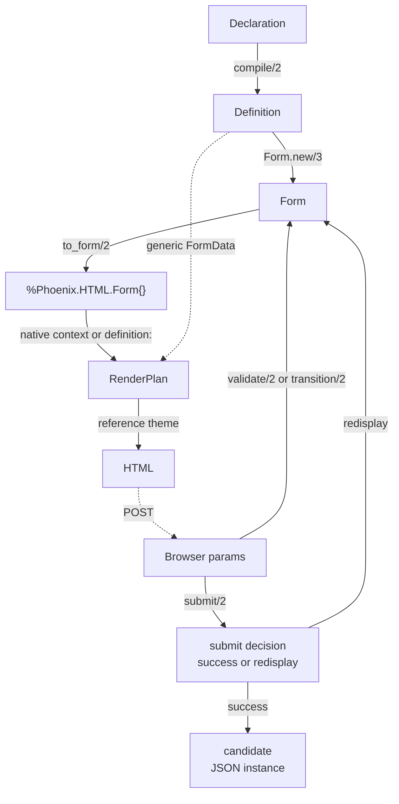

# End-to-end data flow

> [!note] As of 2026-08-05 · projected Phoenix forms and three-source rendering join (D-041), submit decision result (D-032), prepared DOM identities (D-035)
> Follows one form through every layer that exists today, and stops
> where the built system stops. Each layer has its own deep-dive note;
> this one is about the **joins between them** — what crosses each
> boundary, and what deliberately does not. The LiveView lifecycle
> (step 7) closes steps 5–6 through
> [[form-state-and-transitions#LiveView entry points|`Form.validate/2`/`Form.submit/2`]]
> rather than adding a new join.

Every other Techdocs note describes one layer. This one is the map: it
follows the [[17-end-to-end-example|pump inspection example]] from a
JSON document to rendered HTML and back to a decoded JSON instance, so
the seams between layers are visible in one place.



Two things about the shape of that graph are the whole architecture:

- **The `Definition` is on the left of every arrow and the right of
  none** (after compilation). Nothing downstream writes to it, which is
  what lets one definition be compiled once and shared by every request
  and every user.
- **The loop closes through `Form`, not through HTML.** Params re-enter
  the state layer directly; the render is a pure function of state, never
  a source of it.

## 1 · Declaration → `Definition`

**Crosses the boundary:** a raw source document plus options. **Comes
back:** `{:ok, %Definition{}, diagnostics}`.

The [[compile-pipeline|compile pipeline]] walks the declaration through
a [[source-adapters|source adapter]], stamping every node with a
[[paths-and-identity|`TemplatePath`]], a derived `NodeId`, and
[[diagnostics-and-origins|origins]] for each resolved value.

For the example, the schema's seven scalar properties become seven
semantic fields; the `ui.json` `order` reorders their presentation
references; `groups` folds `voltage` and `insulation_ok` into a presentation
group; and `fields.notes` overrides the widget and help. The result knows
what the form *means* and nothing about browser state:

```elixir
Info.role(definition, ["last_service"])   #=> :date
Info.required?(definition, ["condition"]) #=> true
```

**What does not cross:** values, params, errors, DOM ids. The
`Definition` holds a `validation` plan (`Formentation.ValidationPlan`)
for the JSON Schema source, but that plan's validator is only *built*
here — it is consumed two layers later.

## 2 · `Definition` → `Form`

**Crosses:** the definition plus the data the form opens on. **Comes
back:** a `%Form{}` whose `candidate` is that data, already validated.

`Form.new/3` is where a static description becomes a specific
filling-in. It stores the data as `original`, optionally applies declared
defaults, and runs an initial validation — so a form that opens on
invalid data knows it immediately, even though nothing will be
*displayed* until an action occurs.

This is the first join where the layering earns its keep: the state
layer imports `Definition` and knows nothing about Phoenix, so the entire
interaction model is exercisable from IEx.

## 3 · `Form` → `%Phoenix.HTML.Form{}`

**Crosses:** the form state plus `:as` and `:id`. **Comes back:** an
ordinary Phoenix form struct.

[[phoenix-form-data|The `FormData` projection]] reads already-computed
state and answers Phoenix's questions with it: `input_value` from
`display_value`, `errors` from action-gated issues, `input_validations`
from schema constraints. The private projection metadata it puts in `options`
carries the current instance-path root; the form's **source** carries the state
and, with it, the compiled definition. `Formentation.Phoenix.ProjectedForm`
recombines the two, so one flat Phoenix form struct stays anchored in a tree
and ordinary rendering needs no duplicate definition.

The example passes `as: "asset[payload]"`, and that single option is what
makes submitted names compose under a parent namespace — every name below
becomes `asset[payload][serial_number]`. Renderer-owned ids are separately
prepared from `dom_namespace`, then the Phoenix form id/name, so the same
control id is `ftn--asset_payload--field--control--serial_number`.

## 4 · `%Phoenix.HTML.Form{}` → `RenderPlan`

**Crosses:** Three things come here, from three different places: values,
errors, and per-field usage come through Phoenix's own conventions on the form
struct; the projection root comes from the private `options` key; and, for a
native Formentation form, the definition comes from `form.source`. Only the
middle one is new in D-041. A generic FormData source supplies the definition
explicitly. **Comes back:** a
`%RenderPlan{}`.

[[rendering|Render preparation]] walks the definition in declaration order and
pairs each node with the corresponding `Phoenix.HTML.FormField`,
resolving a widget, a label, and — importantly — computing
`show_errors?` **once, here**, so no theme ever has to reason about
`_unused_` markers or the form action.

This is the layer where definition and form state meet: the definition knows
`last_service` is a date; the form knows its current value is `"2026-06-30"`;
only together do they make a
`:date_input` render node.

Render preparation reads field mechanics — values, names, IDs, input
validations, per-field errors — **only through Phoenix conventions**,
which is what makes it generic over any `FormData` implementation rather
than coupled to `Formentation.Form`
([[18-decisions#D-019 — Projection is Phoenix-generic|D-019]]). Three
facts Phoenix cannot express — whether the source considers the form
submitted, a source-owned issue-visibility policy, and root/object-level
issues — dispatch through `Formentation.Phoenix.StateView` on
`form.source` instead, falling back to the conservative `Any` behaviour
for a source with no dedicated implementation
([[18-decisions#D-027 — Projection reads semantic state through a StateView protocol|D-027]]).
`Formentation.Form` implements `StateView` completely; the error
summary's object-level entries come from its `issues/2`, and degrade to
field entries only for a source whose state view reports `:unavailable`.

## 5 · `RenderPlan` → HTML

**Crosses:** render nodes. **Comes back:** markup.

The reference theme is a set of per-widget function components, called
directly — there is no theme parameter in Phase 1
([[18-decisions#D-020 — The reference theme is a markup set, not a contract|D-020]]).
By this point every decision has already been made upstream: the theme
picks no widgets, resolves no labels, and inspects no state. It emits
markup for a plan.

The example's rendered output is pinned byte-for-byte as a reviewed
snapshot at `test/support/fixtures/pump_inspection/static_render.html`,
which makes this join the one layer boundary with a literal, readable
artifact:

```html
<div class="ftn-field">
  <label for="ftn--asset_payload--field--control--serial_number">Serial number</label>
  <input type="text" id="ftn--asset_payload--field--control--serial_number"
         name="asset[payload][serial_number]" value="PX-2044"
         required minlength="4">
</div>
```

Every attribute there is traceable back through the chain: the label to
the schema's `title`, `required`/`minlength` to `input_validations`
derived from `required` + `minLength`, the value to `display_value`, and
the name and id to the `:as` option in step 3.

## 6 · Browser params → `Form`

**Crosses:** a raw params map, wrapped in a `%Params{}` envelope. **Comes
back:** a new `%Form{}`.

The return leg is [[form-state-and-transitions|a transition]]:
normalize the transport, decode every declared field, rematerialize the
candidate, revalidate. The envelope is explicit rather than a bare map
because an absent key is ambiguous and only the caller knows whether it
means "cleared" or "untouched"
([[18-decisions#D-013 — Transitions take an explicit params envelope|D-013]]).

Note what *re-enters* here: params only. The HTML is not parsed, the
render plan is discarded, and the definition is untouched. The form is
recomputed from `original` + operations every time, so there is no
incremental state to drift.

In a LiveView, `phx-change` reaches this leg through
[[form-state-and-transitions#LiveView entry points|`Form.validate/2`]],
which builds the envelope from the handler's own params subtree. A plain
controller, or advanced lifecycle code, can reach the same leg through
`transition/2` with a hand-built envelope. The render plan from step 4 is
discarded and rebuilt after each transition.

## 7 · Submitted `Form` → decision and candidate

**Crosses:** raw submit params. **Comes back:** `{:ok, instance,
submitted_form}` or `{:error, submitted_form}`.

`Form.submit/2` is the ordinary submit leg. It performs the same
`:submit` transition, then classifies the submitted form through
`submission_status/1` ([[18-decisions#D-032 — Submit returns the application decision|D-032]]).
Only `:ready` returns the success tuple with the decoded instance.
Undecodable, blocked, and invalid states return the submitted form for
redisplay.

`Form.candidate/1` remains the materialization query: the JSON instance
this form would submit, assembled from the decode operations over the
original data. It is `:none` while **any** field fails to decode
([[18-decisions#D-012 — Schema validation defers while any decode fails|D-012]]),
which is also why schema validation cannot run on half-decoded input.
Because blockers can coexist with a candidate, callers persist only the
candidate returned by `submit/2`'s `:ok` branch.

## What the flow shows that the layer notes cannot

Three properties are only visible from here:

**Each arrow is one-directional and one-typed.** No layer reaches back
into its predecessor, and no layer receives two different shapes from the
same neighbour. That is what makes each testable without the next, which
[[test-and-verification-architecture|the test architecture]] then
exploits: the compile layer is tested with no state, the state layer with
no Phoenix, the projector with any `FormData`, and the theme against a
hand-built plan.

**The definition and the state are separately cacheable.** Compilation is
per-form-type and could be done once at boot; state is per-request. The
graph has no arrow that would force them into the same lifetime.

**The Phoenix-shaped part is the last two steps and the projection.**
Everything from the declaration to the candidate is plain Elixir data.
That is the property [[phase-5-ash-integration|Phase 5]] depends on when
`AshPhoenix.Form` becomes an alternative source for step 3, and
[[phase-3-extensibility|Phase 3]] depends on when the theme in step 5
becomes replaceable.

## Boundaries — where this chain stops

The chain closes the same way whether step 6 is a plain controller
action or a LiveView `handle_event/3`: a raw params map re-enters
through the form state layer either way.
[[form-state-and-transitions#LiveView entry points|`Form.validate/2`/`Form.submit/2`]]
are the `phx-change`/`phx-submit`-shaped ordinary entry points: validate
returns a changed form, while submit returns the application decision
around the submitted form. `_persistent_id` now joins the metadata
`Transport.normalize/1` strips at every nesting level, alongside
`_unused_*`, `_csrf_token`, and `_target`. What the chain still does not
have: collections would add a dimension to steps 1, 4, and 6 (indexed
instance paths, item identity, add/remove) and arrive with Milestone B;
a theme parameter for step 5 is [[phase-3-extensibility|Phase 3]].

## Related notes

- Layer by layer: [[compile-pipeline|Compile pipeline]] · [[form-state-and-transitions|Form state and transitions]] · [[phoenix-form-data|The FormData projection]] · [[rendering|Rendering]]
- Cross-cutting: [[paths-and-identity|Paths and identity]] · [[diagnostics-and-origins|Diagnostics and origins]]
- Design (Planning): [[17-end-to-end-example|End-to-end example]] · [[04-architecture|Architecture]]
- [[Techdocs]] · [[Formentation|Vault entry note]]
