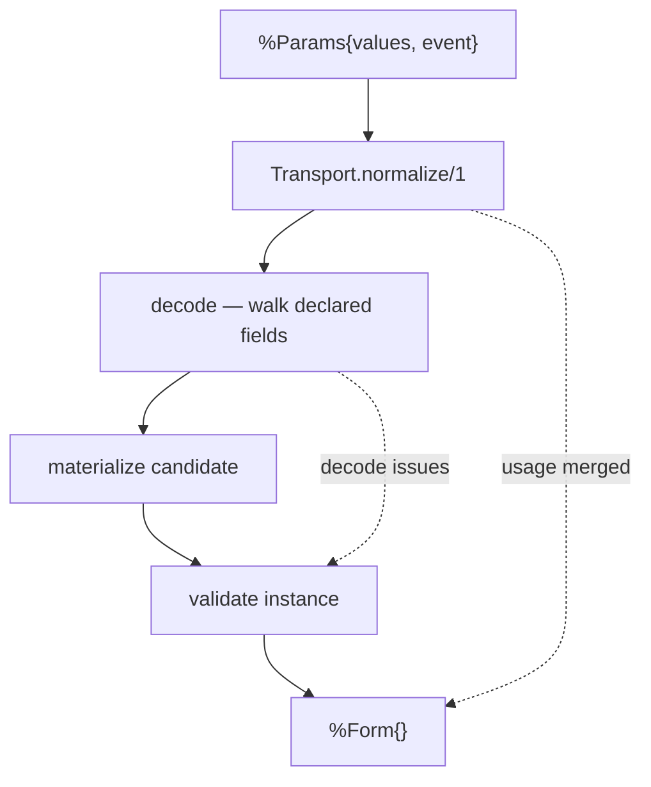

# Form state and transitions

> [!note] As of 2026-07-25 · source-neutral validation dispatch
> Describes the runtime state layer as built: `Formentation.Form`,
> `Formentation.Transport`, and `Formentation.Codec` — now including the
> `validate/2`/`submit/2` LiveView entry points. This layer has **no
> Phoenix dependency** and is fully usable from IEx. How the state is
> handed to Phoenix is [[phoenix-form-data|a separate note]]; how it
> becomes HTML is [[rendering|Rendering]].

`Formentation.Form` is the authoritative runtime state
([[18-decisions#D-009 — Form state separates transport from operation|D-009]]).
It pairs an inert [[definition-and-node|`Definition`]] with everything a
concrete filling-in of that form knows: what the browser sent, what each
value decoded to, which fields the user touched, what is wrong, and what
would be submitted. It is immutable — every transition returns a new
struct — and pure, so a whole interaction can be replayed in a test or an
IEx session with no Phoenix, no connection, and no process.

## The central separation: transport versus operation

The layer's organizing idea is that "what arrived" and "what it means"
are different facts, stored separately, per instance path.

| Axis | Values | Answers |
| --- | --- | --- |
| **Transport** | `:not_provided` \| `{:provided, raw}` | did the browser mention this path at all, and with what bytes? |
| **Operation** | `:keep` \| `:unset` \| `{:set, value}` \| `{:invalid, issue}` | what should that do to the instance? |
| **Usage** | `:used` \| `:unused` \| `:unknown` | has the user interacted with it? ([[18-decisions#D-014 — Usage is a first-class interaction axis|D-014]]) |

Keeping them apart is what makes the hard cases expressible rather than
ambiguous. An absent key and an empty string are different transports
that can decode to the same operation. A value that failed to decode has
a transport (so the raw text can be re-displayed) and an operation
(`{:invalid, _}`) that deliberately produces no instance value. A
read-only field can have a transport the server *ignores* — its operation
is `:keep` regardless of what arrived
([[18-decisions#D-016 — Participation is definition-driven, not transport-driven|D-016]]).
`:keep` is the one operation no codec ever returns; it is the absence of
a transition-supplied instruction.

```elixir
%Formentation.Form{
  definition: %Definition{},          # inert, shared, cacheable
  original: %{},                      # the data the form opened on
  params:  %{} | nil,                 # Phoenix-compatible params view
  action:  nil | :change | :submit,
  transports: %{InstancePath.t() => transport()},
  operations: %{InstancePath.t() => operation()},
  usage:      %{InstancePath.t() => :used | :unused},
  issues:     %{InstancePath.t() => [Issue.t()]},
  candidate:  {:ok, map()} | :none
}
```

Every per-path map is keyed by [[paths-and-identity|`InstancePath`]], and
every one of them is *total by default*: a path the form has never seen
answers `:not_provided`, `:keep`, `:unknown`, `[]`. Nothing needs to be
pre-populated, and no lookup can fail.

## Transport normalization

`Formentation.Transport.normalize/1` is pure string-and-map processing
with zero Phoenix dependency — the browser's conventions are decoded
here so nothing downstream has to know them. One pass produces three
views:

- **`domain_params`** — Phoenix metadata removed (`_unused_*`,
  `_csrf_token`, `_target`, `_persistent_id`), recursively. This is the
  only view decoding ever sees, so transport metadata *cannot* reach a
  codec.
- **`phoenix_params`** — the input byte-identical, stored as
  `form.params`, so `Phoenix.Component.used_input?/1` keeps working
  against it unchanged.
- **`usage`** — a per-path map extracted from LiveView's `_unused_`
  marker convention.

Metadata is stripped **by key**; its values are carried into
`phoenix_params` verbatim and never inspected. Domain keys at any depth
must be strings, and a non-string key raises rather than being coerced —
consistent with the no-atoms-from-input rule in
[[paths-and-identity#Shared rules|Paths and identity]].

The usage rule has one subtlety worth stating: **a key present without a
`_unused_` marker is `:used`** — the same answer `used_input?/1` gives,
and pinned by a contract test against Phoenix itself. For container
paths, usage **propagates upward**: an object is `:used` when any
descendant is. Usage is never fabricated — a path the params do not
mention gets no entry at all, and `:unknown` is a lookup default in
`Form`, not a stored value.

## Codecs and the decode policy

`Formentation.Codec.decode/3` turns one raw transport value into one
operation. The posture is **strict with trim**, differentiated by type
([[18-decisions#D-010 — Empty-string, null, and absent-key decode policies|D-010]]):

| `value_type` | `""` / whitespace | Valid input | Invalid input |
| --- | --- | --- | --- |
| `:string` | `{:set, ""}` — verbatim, never trimmed | any binary | — |
| `:integer` | `:unset` | trimmed full-token `[+-]?[0-9]+` | `{:invalid, :invalid_integer}` |
| `:number` | `:unset` | trimmed integer or decimal/exponent token | `{:invalid, :invalid_number}` |
| `:boolean` | `:unset` | `"true"` \| `"false"` | `{:invalid, :invalid_boolean}` |

Three rules cut across the table:

- **String controls preserve input; typed controls clean it.** For a
  string field the value *is* the data, so whitespace is content and `""`
  is a legitimate value. For a typed field whitespace is transport noise
  and a blank control means "no value" — hence `:unset`, not `{:set, ""}`.
- **Full-token parses only.** `"4x"` is an error, not `4`. Elixir's
  `String.to_integer/1`-style prefix parsing would silently accept
  garbage, so the grammars are anchored regexes.
- **Native values pass through, `nil` never does.** A native integer,
  float, boolean, or binary of the right type is accepted unchanged,
  which is what keeps `transition/2` usable from IEx without
  stringifying everything. `nil` is always rejected: null is
  explicit-only and is never *produced* by decoding.

Booleans reach the server through the hidden-input transport contract
([[18-decisions#D-011 — Booleans use the hidden-input transport contract|D-011]]) —
an editable checkbox always submits `"false"` or `"true"`, never nothing
— which is why the codec's vocabulary is exactly those two strings and
[[rendering|the reference theme]] is obliged to emit the paired hidden
input.

## A transition, end to end

`Form.transition(form, %Params{})` is the single mutation. It takes an
explicit envelope rather than a bare params map
([[18-decisions#D-013 — Transitions take an explicit params envelope|D-013]]),
because a bare map is ambiguous: an absent key could mean "cleared" or
"untouched", and only the caller knows which. `%Params{}` carries
`values`, `mode`, `scope`, and `event`; `:patch` mode and a non-root
scope are *reserved shapes* — present in the struct, rejected with an
`ArgumentError` until a real producer exists.



1. **Normalize** the envelope's values into the three views.
2. **Decode** every *declared* field — the walk descends through
   presentational groups without adding a path segment and into
   data-nesting groups with one ([[18-decisions#D-006 — One `:group` kind, flagged for data nesting|D-006]]),
   producing one transport and one operation per field. Undeclared keys
   are never decoded; `Node.Unsupported` never decodes.
3. **Materialize the candidate** — the JSON instance this form would
   submit.
4. **Validate** the candidate by dispatching `plan.module.validate(plan.artifact, instance)`,
   if the definition carries a `ValidationPlan` (`Definition.validation`).

Usage is **merged** across transitions rather than replaced, so a field
the user touched stays touched. Everything else — transports,
operations, issues — is recomputed from scratch, which is what "replace
mode" means.

### Materialization and the deferral rule

The candidate is rebuilt from the operations, not patched:

- `{:set, value}` writes the value, `:unset` omits the key, `:keep` takes
  the value from `original`.
- Keys the definition does not describe, and values behind
  `Node.Unsupported` nodes, are **preserved from the original**. A form
  that renders half of a JSON document must not silently delete the other
  half.
- If **any** operation is `{:invalid, _}`, the candidate is `:none`
  ([[18-decisions#D-012 — Schema validation defers while any decode fails|D-012]]).

That last rule is why decode failures and validation issues never
compete. Raw undecoded text can never reach the `ValidationPlan`, so a
user who types `"4x"` into an age field sees *one* error about the
integer — not that plus a cascade of type violations from a validator
handed a string it was never meant to see. Instance validation resumes
the moment every field decodes.

### Defaults

`Form.new(definition, data, defaults: :apply)` fills declared defaults
into absent keys, and only there:

- defaults **never overwrite** a provided value — including an explicit
  `nil`, which is legitimate data;
- nested objects are **created only** when a default actually lands
  inside them;
- transitions never apply defaults again, so a field the user clears
  stays cleared.

Opting in is deliberate. A default that re-asserted itself on every
transition would be indistinguishable from the user's own input and
would make clearing a field impossible.

### LiveView entry points

```elixir
def validate(%__MODULE__{} = form, values) when is_map(values) do
  transition(form, %Params{values: values, event: :change})
end

def submit(%__MODULE__{} = form, values) when is_map(values) do
  transition(form, %Params{values: values, event: :submit})
end
```

Both are sugar over `transition/2`, nothing more
([[18-decisions#D-021 — LiveView integration is wrappers plus a demo, not framework machinery|D-021]]):
they build the `%Params{}` envelope so a LiveView `handle_event/3` clause
does not have to. Extracting the caller's own subtree from the event
params — needed whenever the payload form is embedded under a
hand-written parent form — stays the handler's job, since only the
handler knows its own embedding namespace. There is no `use` macro, no
auto-wired `handle_event`, and no other LiveView-specific surface added
here: the layer is exactly as Phoenix-free as it was before these two
functions existed. The demo LiveViews (`demo/formentation_demo/`) are
the canonical callers, exercised by `test/formentation_demo/`.

## Issues and their visibility

`Issue` is the runtime counterpart to a compile-time `Diagnostic`
([[diagnostics-and-origins|Diagnostics and origins]]): a problem with a
*submitted instance*, carrying `source: :decode` or `source: :validation`.

Storage and visibility are strictly independent
([[18-decisions#D-014 — Usage is a first-class interaction axis|D-014]]):
`issues/1` and `issues/2` always return everything, and
`show_issues?/2` separately answers whether a renderer should display
it.

- A **scalar field**'s issues show on submit, or once the field is
  `:used`.
- **Group and root** issues show **only** on submit — because parent
  usage propagates from descendants, following `:used` there would
  surface a root-level "required property missing" on the first
  keystroke in an unrelated field.

Storing everything unconditionally is what keeps this a *policy* rather
than a data loss: a different presentation layer can choose differently
without the state layer having thrown information away.

## Read surface

Consumers never pattern-match the per-path maps. `Form.field/2` assembles
a `Formentation.Form.FieldState` — transport, operation, usage, issues,
and the derived **`display_value`**, which is the field's crucial output:
raw text after a failed decode (so the user sees what they typed, not a
blanked control), the original value for a read-only field, `""` for an
explicitly unset one. `candidate/1`, `issues/1,2`, `usage/2`, and
`show_issues?/2` complete the surface.

## Boundaries — what does not exist

No `:patch` transitions and no scoped (sub-tree) transitions — both are
reserved envelope shapes that raise. No collections, so every
`InstancePath` segment is currently a string, never an index. Map-source
forms carry `validation: nil` and therefore skip instance validation
entirely; only the JSON Schema adapter attaches a `ValidationPlan`, which
is recorded as an [[16-open-questions|open question]] rather than
designed away. No codec registry or per-field codec override — the four
typed codecs are
global defaults, and extensibility is [[phase-3-extensibility|Phase 3]].

## Code map

| Concern | Module | File |
| --- | --- | --- |
| Form state and transitions | `Formentation.Form` | `lib/formentation/form.ex` |
| Per-field read model | `Formentation.Form.FieldState` | `lib/formentation/form/field_state.ex` |
| Transition envelope | `Formentation.Params` | `lib/formentation/params.ex` |
| Transport normalization | `Formentation.Transport` | `lib/formentation/transport.ex` |
| Scalar codecs | `Formentation.Codec` | `lib/formentation/codec.ex` |
| Runtime issue | `Formentation.Issue` | `lib/formentation/issue.ex` |

## Related notes

- [[definition-and-node|Definition and Node]] — the inert half this pairs with
- [[phoenix-form-data|The FormData projection]] — how this state reaches Phoenix
- [[diagnostics-and-origins|Diagnostics and origins]] — `Issue` versus `Diagnostic`
- [[end-to-end-data-flow|End-to-end data flow]] — this layer in the whole chain
- Design (Planning): [[06-runtime-projection|Runtime projection]] · [[10-algorithms|Algorithms and invariants]]
- [[Techdocs]] · [[Formentation|Vault entry note]]
