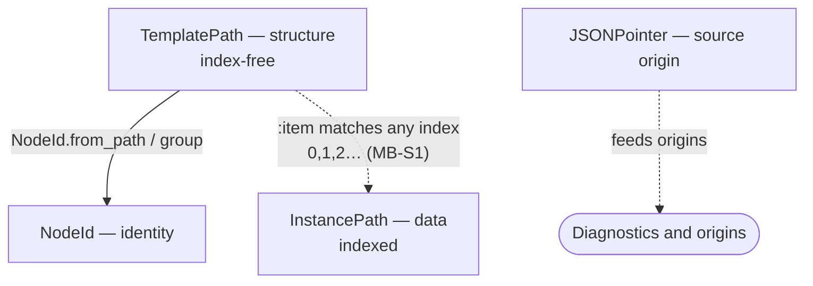

# Paths and identity

> [!note] As of 2026-08-14 · static collections in use, MB-S1 (D-053); previously `node-per-kind-complete` (2026-07-22)
> Describes the addressing types as built. The origin *model* that
> `JSONPointer` feeds is deferred to
> [[diagnostics-and-origins|Diagnostics and origins]]; node shapes and the
> two group flavors to [[definition-and-node|Definition and Node]]. This
> note stays on the addressing types themselves.

A single node lives in several spaces at once: where it sits in the form's
*structure*, what stable *handle* names it, where its value lands in
submitted *data*, and where it came from in the *source*. Formentation keeps
these from being conflated with four small, deliberately dumb value types —
each a struct or string builder with a validating constructor and nothing
else. Confusing them is a category error the type boundaries make hard.

## Four coordinate spaces

| Space | Type | Answers | Indexed? |
| --- | --- | --- | --- |
| Structure | `TemplatePath` | where in the template? | no |
| Identity | `NodeId` | what stable handle? | — (derived) |
| Data | `InstancePath` | where in submitted data? | yes |
| Source | `JSONPointer` | where in the source doc? | — |



`TemplatePath` is the compile-time hub: `NodeId` is *derived* from it, and
`InstancePath` is its runtime, data-space counterpart. `JSONPointer` stands
apart — it addresses the source document, not the form.

## `TemplatePath` — structural position

The static position of a node in the declaration *template*, independent of
any concrete data. Segments are property-name strings plus one internal
marker, `:item` — since MB-S1 the address of a collection's anonymous
item template ([[18-decisions#D-053 — Collections are a dedicated semantic node owning one item template|D-053]]);
no other atom is ever a segment. In node IDs `:item` encodes as `~3`,
extending the escape family so no property name can spoof it.

```elixir
%TemplatePath{segments: ["address", "city"]}
```

Every node carries one (`Node.template_path`). The compile
[[compile-pipeline|Context]] threads the current path down the walk and
extends it with `TemplatePath.child/2` at each property, so a node's
structural address falls out of where the descent is — never assembled after
the fact.

## `NodeId` — the derived handle

A deterministic string identity built from a `TemplatePath`
([[18-decisions#D-007 — Node-ID segments are escaped, not restricted|D-007]]).
The root is `"/"`; a nested node is `"/address/city"`; a presentation group
appends its id after a `#`:

```elixir
NodeId.from_path(%TemplatePath{segments: ["address", "city"]})  # "/address/city"
NodeId.group(%TemplatePath{segments: []}, "contact")            # "/#contact"
```

Because it is a pure function of the template path, the same form always
yields the same ids — stable across compiles, safe as a DOM identifier, and
usable as a lookup key. It becomes `Node.id`, drives `Info.node/2`, and is
what the JSON Schema `order` hint matches a group entry against. The
[[#Shared rules|escaping rules]] guarantee it stays collision-free.

## `InstancePath` — position in data

The position of a *value* in a concrete data instance. Unlike a template
path, it is **indexed**: segments are property strings or non-negative
integers (collection indexes). Never atoms — `:item` belongs to
`TemplatePath` only. Since MB-S1 an integer segment *resolves* against
the static tree: under a collection, any non-negative integer selects
the single `:item` child, so `Info.node_at(definition, ["measurements", 0])`
answers with the item template. No concrete index is ever stored in a
definition.

This is the runtime layer's addressing key. `Formentation.Form` keys its
per-field maps by it — `transports`, `operations`, `usage`, `issues` — as do
`Issue.path` and the `Transport` usage map. On the read side,
`Info.node_at/2` and the query helpers (`origins/2`, `role/2`, `required?/2`)
accept instance-path segments and resolve them to the describing node,
making `InstancePath` the bridge from *"a value's location in real data"* to
*"the node that governs it."*

## `JSONPointer` — position in the source

An RFC 6901 pointer into the *source document*, built for origins and
diagnostics — not for the form structure or its data. The JSON Schema
adapter uses it to record where each fact came from
(`{:json_schema, "/properties/city/title"}`) and to locate metaschema
violations.

```elixir
JSONPointer.join(["properties", "city", "title"])  # "/properties/city/title"
```

The map adapter has no analogue: it keeps its origins as a raw segment
*list* rather than a pointer string, so `JSONPointer` is a JSON-source
concern specifically. The [[diagnostics-and-origins|origin model]] is what
consumes both; this note documents only the pointer as an addressing type.

## Template vs. instance — the core invariant

The two path types are kept separate on purpose, and the separation is the
one invariant worth stating plainly:

- **`TemplatePath` is structural and index-free.** One per node — the shape
  of the form.
- **`InstancePath` is data-bound and indexed.** One per value — a location
  in a specific submission.

For flat objects, every node's template path and the instance paths that
reach it share the *same string segments*, so the distinction can look
academic. Collections are where it earns its keep: since MB-S1 a single
template position like `["measurements", :item]` addresses *many*
instance positions — `["measurements", 0]`, `["measurements", 1]`, … —
a one-to-many relationship the static model resolves by matching any
integer against `:item` (`TemplatePath.matches?/2`), while runtime
occurrence enumeration stays deferred to MB-T4.

The invariant also surfaces at read time. `Info.node_at/2` walks an
*instance* path but **looks through** presentational groups: a data-nesting
group contributes a segment to instance paths, a presentational one is
transparent to them ([[definition-and-node|Definition and Node]], D-006).
Consumers address by data location; `Info` maps that onto the structural
tree.

## Shared rules

Two rules hold across the addressing types:

- **Segments are never atoms.** `TemplatePath` and `InstancePath` both
  validate every segment in `new!/1` and reject atoms outright — property
  names arrive as untrusted input, and turning them into atoms would leak the
  atom table. The lone exception is `TemplatePath`'s fixed `:item` marker, a
  compile-time literal that never originates from input.
- **Escaped, not restricted (D-007).** Rather than forbid `/`, `~`, or `#`
  in names, the ID vocabulary escapes them reversibly. `JSONPointer` supplies
  the RFC 6901 foundation (`~` → `~0`, `/` → `~1`, with `~` first so `/`
  escapes are never double-escaped); `NodeId` layers `#` → `~2` for its group
  suffix on top. The payoff: no legal property or group name can spoof a path
  separator or a group marker
  ([[18-decisions#D-007 — Node-ID segments are escaped, not restricted|D-007]]).

## Code map

| Concern | Module | File |
| --- | --- | --- |
| Structural path | `Formentation.TemplatePath` | `lib/formentation/template_path.ex` |
| Node identity | `Formentation.NodeId` | `lib/formentation/node_id.ex` |
| Data path | `Formentation.InstancePath` | `lib/formentation/instance_path.ex` |
| Source pointer | `Formentation.JSONPointer` | `lib/formentation/json_pointer.ex` |

## Related notes

- [[definition-and-node|Definition and Node]] — nodes carry `template_path` and `id`
- [[source-adapters|Source adapters]] — where paths and ids are stamped
- [[diagnostics-and-origins|Diagnostics and origins]] — the origin model `JSONPointer` feeds
- [[compile-pipeline|Compile pipeline]] — the walk that threads the template path
- Design (Planning): [[09-diagnostics-provenance-introspection|Provenance & introspection]] · [[13-roadmap|Roadmap]]
- [[Techdocs]] · [[Formentation|Vault entry note]]
