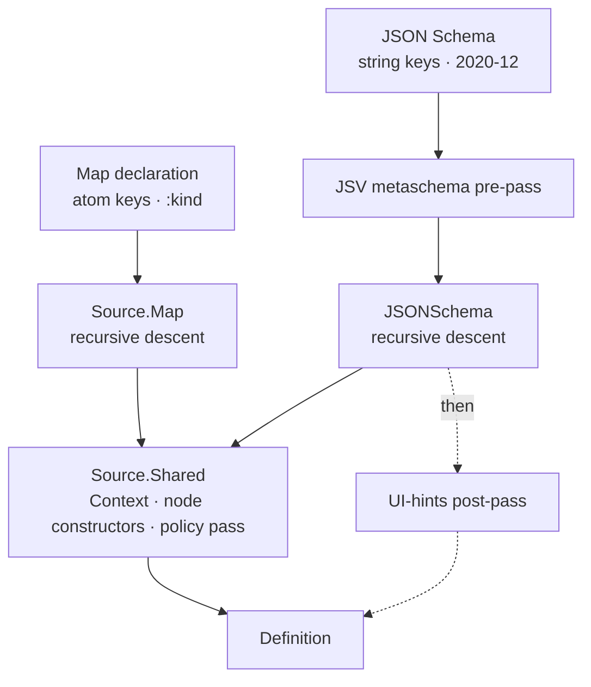

# Source adapters

> [!note] As of 2026-08-14 · static collection compilation, MB-S1 (D-053/D-054); previously: Wave C compiler cleanup (D-052); Map-source declaration totality (D-048); source-neutral validation dispatch; adapter selection (D-046); lib-tree restructure (D-047)
> Describes the two adapters as built. Node shapes are deferred to
> [[definition-and-node|Definition and Node]], the origin model to
> [[diagnostics-and-origins|Diagnostics and origins]], and the addressing
> types to [[paths-and-identity|Paths and identity]]; this note stays on
> the adapter boundary.

A **source adapter** translates one declaration vocabulary into a compiled
[[definition-and-node|`Definition`]]. Adapters are the only part of the
compile pipeline that knows what the input *looks like* — everything
downstream sees nodes, not schemas or maps. Two exist today, and a
[[#The differential-equivalence property|differential property]] holds them
to producing the same tree from the same form. This note is the deep-dive
beneath the [[compile-pipeline|Compile pipeline]] overview.

## The `Formentation.Source` behaviour

The behaviour declares one callback:

```elixir
@callback compile(source :: term(), opts :: keyword()) ::
            {:ok, Definition.t(), [Diagnostic.t()]} | {:error, [Diagnostic.t()]}
```

This is the **documented contract** and the dialyzer surface. In practice, adapter *acceptance* uses a **callable-contract check**: a module is accepted if it exports `compile/2`, without requiring `@behaviour Formentation.Source`. This means the accepted set is deliberately wider than the declaring set — which is fine, since adapters are developer-supplied code, never user input.

This is the *same* contract as the public `Formentation.compile/2`. The public
entry point takes the adapter option, resolves it to an adapter (built-in selector or module),
and delegates to that adapter — source selection is the only decision made at this stage.

A successful compile still returns diagnostics (warnings, unsupported
constructs); `:error` is reserved for input too malformed to yield a
definition at all. The behaviour is what makes "source-independent" a
structural fact rather than a slogan ([[18-decisions#D-004 — Two declaration sources from the start|D-004]]).

> [!info] A recorded gap: no shared input format
> `Formentation.Source`'s moduledoc deferred a shared *normalized
> compiler-input* format until a second source showed what it must
> contain. Both sources now exist and none was introduced: each adapter
> walks its own raw vocabulary directly. The sharing happens one level
> lower — at the walk context and node constructors below — not at an
> intermediate representation. Whether a third source justifies one is
> still open ([[08-extension-model|Extension model]]).

## Selecting an adapter

Adapters are resolved by `Formentation.compile/2` and `Formentation.form/2` from the mandatory `:adapter` option. The selection is **explicit and closed**: pass `:map` for `Formentation.Source.Map`, `:json_schema` for `Formentation.Source.JSONSchema`, or a module to use as an adapter. A plain map is ambiguous — it could be either a map-source form declaration or a decoded JSON Schema — so the source is never inferred; adapter selection is always required.

Third-party adapters are reachable by module. A module is accepted as an
adapter if `Code.ensure_compiled!/1` obtains it and it exports `compile/2` —
a callable-contract check, not a behaviour requirement. The contract is the
same as `Formentation.Source`, so modules implementing the behaviour are
valid, but the acceptance rule is wider: any module exporting a `compile/2`
will be **accepted by the resolver**, even if it never declared
`@behaviour Formentation.Source`.

Accepted is not the same as working. The resolver checks obtainability and
function name/arity — nothing about what `compile/2` returns. Unrelated
modules that happen to export `compile/2` (`Regex` and `:re` among them) pass
the check and then violate the three-element result contract, surfacing as a
`MatchError` at the call site rather than a clear rejection. That width is
intentional and accepted: adapters are developer-supplied, never user input,
and validating adapter *return shapes* is adapter-totality work belonging to
[GitHub issue #6](https://github.com/kioopi/formentation/issues/6), not to
selection.

Adapter-*selection* failures — a missing, unknown, or invalid `:adapter` — raise `ArgumentError` at the boundary, deliberately outside the diagnostic model ([[18-decisions#D-046 — Adapter resolution failures raise; compilation failures stay diagnostics|D-046]]). This distinction matters: no adapter has run, so there is no declaration position or provenance to attach a diagnostic to. Failures *compiling* a declaration remain ordinary `{:error, diagnostics}` results; only selection mistakes raise.

The primitive is `Code.ensure_compiled!/1`, and the bang carries weight.
Resolution cannot continue without the adapter, and only the bang variant
signals that to the compiler, marking the module a *required* dependency so
one still in flight in the same parallel-compiler run is waited for.
`ensure_loaded?/1` does not wait at all; `ensure_compiled/1` marks the module
optional and reports `{:error, :unavailable}` for one that is merely not
available yet, which inside a compile cycle would reject a valid in-project
adapter outright
([[18-decisions#D-046 — Adapter resolution failures raise; compilation failures stay diagnostics|D-046]]).

## The shared walk

The two adapters converge on one set of building blocks in
`Formentation.Source.Shared`, which is why two vocabularies yield
structurally identical trees.



**`Shared.Context`** threads the walk's state top-down: the current
[[paths-and-identity|`template_path`]], the `source_path` for
[[diagnostics-and-origins|origins]], the accumulating `diagnostics`, and the
`depth`/`nodes_left` [[#Guards and compile-time policy|guards]] (defaults
`max_depth: 16`, `nodes_left: 1_000`).

The shared compiler pipeline is **walk → build → (transform) → finalize**.
`Context` owns depth and budget checks, property descent
(`enter_property/2`), collection-item descent (`enter_item/1` — one
depth level, `TemplatePath.item/1`, the dialect's item source segment),
and diagnostic accumulation; `Shared.Dialect` supplies each adapter's
noun, origin builder, property source-path segment, and item source
segment (`[:item]` for Map, `["items"]` for JSON Schema). Budget
semantics for collections: the collection node consumes one node-budget
unit and its item template another; entering `:item` costs one depth
level on top of the property entry. `%Shared.Build{}` is the whole-walk value
(semantic and presentation trees, diagnostics, validation), distinct from the
per-node `%Shared.Compiled{}`. JSON Schema transforms Build for hints and
validation; Map has no transform. Finalization runs once at the adapter edge.

**Shared node constructors** — `create_group_node/4`, `attach_group/3`
(presentation grouping: it stamps membership onto member `Field`s and places
the group node at the first member's position), `origin_entries/1` (drops
`nil` origins), and `humanize/1` (label-from-name inference). Both adapters
build every node through these, so node shape never diverges by source.

## The two adapters, side by side

| Axis | `Source.Map` | `Formentation.Source.JSONSchema` |
| --- | --- | --- |
| Input | map with `:kind`, atom keys | decoded draft 2020-12 doc, string keys |
| Property container | ordered `{name, spec}` list — **order is data** | `properties` map — keys **sorted** alphabetically |
| Presentation order | declaration order, as written | `order` UI hint (else alphabetical) |
| Type detection | `:kind` atom | `"type"`, refined by `const`/`enum`/`format` |
| Presentation hints | inline (`:widget`, `:help`, `:hidden`, `:read_only`, `:groups`, `:title`) | separate `:ui` map, applied post-walk |
| Dependencies | none — lives in core | JSV |
| Instance validator | none (`validation: nil`) | built from the schema, wrapped in a `ValidationPlan` ([[18-decisions#D-008 — JSV is the JSON Schema validator|D-008]]) |
| Selector | `:map` | `:json_schema` |

**`Source.Map`** is the reference adapter and the cheapest fixture format:
plain Elixir, zero dependencies. Because properties are an ordered list of
`{name, spec}` tuples, ordering is never left to map-enumeration order.

**`Formentation.Source.JSONSchema`** compiles a decoded schema document (string
keys, as returned by `JSON.decode!/1`) over a pinned 2020-12 subset. JSON
object keys are unordered, so it sorts property names for a deterministic
walk and defers presentation order to the `order` hint. It is gated and
enriched by the two passes below.

The surface both adapters translate is the same: object schemas
become `Semantic.Object`s; `string`/`integer`/`number`/`boolean` properties
become semantic fields with presentation descriptors for label, help, widget,
and hidden intent; anything outside the subset becomes a
`Semantic.Unsupported` plus a warning, never a crash.

Since MB-S1 both adapters also compile **homogeneous collections**
([[18-decisions#D-054 — Collection source vocabularies and the degradation table|D-054]]):
the Map spelling is `kind: :collection` with a singular `item:` spec map
and `min_items:`/`max_items:`; the JSON Schema spelling is
`"type": "array"` with an object-form `items` schema and
`minItems`/`maxItems`. Both recurse into ordinary item-spec compilation
through the shared `enter_item` seam, so the compiled facts are
source-identical apart from origins. The failure philosophies stay
split: Map hard-errors on malformed collection syntax (missing/non-map
`item:`, bad bounds, a non-boolean/non-list item-level `required`) with
`:invalid_declaration`, and warns (`:collection_item_required`) on a
boolean item-level `required`; JSON Schema degrades valid-but-outside-
subset arrays (no `items`, boolean `items`, `prefixItems`) to
`Unsupported` with the `:unsupported_array_shape` warning. In both, a
valid-but-unsupported item subschema yields a supported collection with
an anonymous `Unsupported` item template, and any array below an
`:item` segment degrades with the `:nested_collection` diagnostic.

## The JSV metaschema pre-pass

`Formentation.Source.JSONSchema.Validator` is the single boundary to JSV
([[18-decisions#D-008 — JSV is the JSON Schema validator|D-008]]) and runs
two distinct gates, both offline against JSV's embedded metaschemas:

1. **Validate the schema *document*** — `validate_schema/1` checks the input
   against the draft 2020-12 metaschema *before* the walk begins. A schema
   that does not conform never reaches `compile_object/3`; JSV's recursive
   error tree is flattened to leaf units and translated into
   [[diagnostics-and-origins|diagnostics]] pointing at the offending
   pointer.
2. **Build the *instance* validator** — after the walk, `build_instance_validator/1`
   compiles the opaque validator artifact wrapped in a
   `Formentation.Definition.ValidationPlan` and stored on `Definition.validation`.
   This degrades gracefully: a dangling local `$ref` or any remote `$ref`
   (fetching is disabled) yields `validation: nil` plus a
   `:validator_unavailable` warning instead of raising.

> [!note] Boundary
> The validator is *built* here but *consumed* at runtime —
> `validate/2` (the `Formentation.Definition.Validation` callback) checks a submitted
> instance and belongs to the runtime layer, not the compile pipeline.
> This note stops at construction.

## UI hints

JSON Schema is a data-validation vocabulary, not a presentation one. Rather
than overload it, the adapter takes presentation separately as an `:ui` map
and applies it as a **post-pass** (`apply_hints/2`) over the freshly built
tree. The vocabulary:

- **`order`** — reorders top-level children by name or group id.
- **`groups`** — declares presentation groups (`id`, `fields`, optional
  `title`) in the native presentation tree.
- **`fields.*`** — per-field `widget` and `help` overrides, and the `hidden`/`read_only` participation flags ([[18-decisions#D-016 — Participation is definition-driven, not transport-driven|D-016]]). Hints address top-level fields only — the post-pass does not recurse into nested objects (recorded in [[16-open-questions|open questions]]; the map source's inline keys have no such limit).

Hints are validated up front (`check_hints/1`) so a malformed `:ui` map
errors before any work; unknown fields, widgets, and order entries each
raise a targeted warning rather than failing. Field hints apply only to
semantic fields — a hint naming a non-field property is ignored. `Source.Map`
needs no such pass: it expresses the same intent inline, which is exactly
what the differential property checks stays equivalent.

## Guards and compile-time policy

Two safeguards run through every compile, independent of source:

- **Structural guards.** The depth ceiling and node budget live in the
  shared `Context`; each adapter enforces them at its own recursion points
  with identical semantics, turning adversarial or runaway input into a
  `:max_depth_exceeded` / `:max_nodes_exceeded` diagnostic instead of a
  stack overflow. Leaves take budget inline without entering a child context.
- **Policy diagnostics.** When the walk closes, `Shared.build/2`
  walks the tree once for source-independent advisories: a property name that
  collides with a reserved transport name
  ([[18-decisions#D-014 — Usage is a first-class interaction axis|D-014]]),
  and a required string that still permits `""`
  ([[18-decisions#D-010 — Empty-string, null, and absent-key decode policies|D-010]]).
  These depend on the finished nodes, not the vocabulary, so they live in
  the shared layer and fire the same way for both sources.

## Map-source declaration validation

`Formentation.Source.Map` validates declaration shapes at the compile boundary.
Malformed values return a hard `:invalid_declaration` diagnostic with an indexed
or keyed `:map_source` origin rather than raising. Validation covers property
entry tuples and specs, `required` member types and membership, group shape,
unique binary group IDs and binary field members, `title`/`help` string values,
`role`/`widget` atom values, scalar-kind-compatible defaults, and constraint
types, applicability, and bound ordering. Validation is deterministic and
fail-fast; valid declarations retain declaration order and existing recoverable
warnings, including hint coercion and unknown group-field warnings. See
[[18-decisions#D-048 — Map-source declarations are total at the compile boundary|D-048]].

## The differential-equivalence property

`test/formentation/differential_test.exs` is what keeps the two adapters
honest. For each shared fixture it compiles the form through both sources
and asserts the trees are **Info-equivalent**: same node kind (struct
equality), the same list of semantic facts per node (`id`, `name`,
`label`, `role`, `value_type`, `options`, `constraints`, `required?`,
`hidden?`, `read_only?`, … ), the same child counts, recursively. That
fact list is the test's real interface — a new semantic field on a node
is unchecked across sources until it is added there.

The one sanctioned difference is [[diagnostics-and-origins|origins]]: each
side carries its own source's tags (`:map_source`/`:inference` versus
`:json_schema`/`:ui_hints`/`:inference`), asserted separately. That single
carve-out is what makes "source-independent" a *checked* claim rather than
an aspiration ([[18-decisions#D-004 — Two declaration sources from the start|D-004]]).
Each adapter additionally carries its own property tests
(`map_property_test.exs`, `json_schema_property_test.exs`).

## Code map

| Concern | Module | File |
| --- | --- | --- |
| Adapter contract | `Formentation.Source` | `lib/formentation/source.ex` |
| Shared walk · Context · policy | `Formentation.Source.Shared` | `lib/formentation/source/shared.ex` |
| Map adapter | `Formentation.Source.Map` | `lib/formentation/source/map.ex` |
| JSON Schema adapter | `Formentation.Source.JSONSchema` | `lib/formentation/source/json_schema.ex` |
| JSV boundary | `Formentation.Source.JSONSchema.Validator` | `lib/formentation/source/json_schema/validator.ex` |
| Differential property | `Formentation.DifferentialTest` | `test/formentation/invariants/differential_test.exs` |

## Related notes

- [[compile-pipeline|Compile pipeline]] — the overview this sits beneath
- [[definition-and-node|Definition and Node]] — the nodes adapters build
- [[diagnostics-and-origins|Diagnostics and origins]] — origins and diagnostics
- [[paths-and-identity|Paths and identity]] — `template_path`, `source_path`, ids
- [[test-and-verification-architecture|Test and verification architecture]] — the differential test among the suite's other mechanisms
- Design / decisions: [[18-decisions#D-046 — Adapter resolution failures raise; compilation failures stay diagnostics|D-046]]
- Design / future (Planning): [[05-compiler-pipeline|Compiler pipeline]] · [[08-extension-model|Extension model]]
- [[Techdocs]] · [[Formentation|Vault entry note]]
